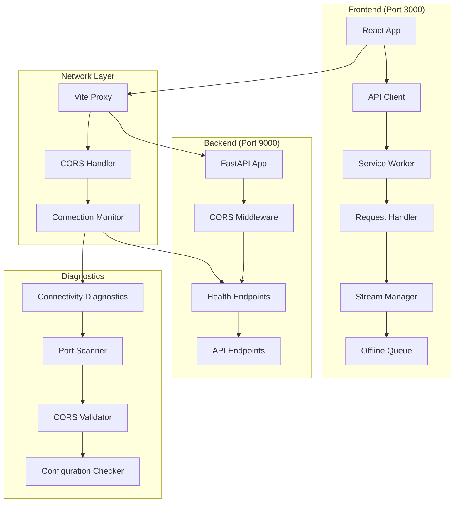

# Design Document

## Overview

This design document outlines the technical approach to fix critical network connectivity issues between the React frontend and FastAPI backend. The solution addresses service worker stream consumption errors, port configuration mismatches, CORS issues, and provides robust error handling and diagnostics.

## Architecture

### High-Level Architecture



### Component Interaction Flow

1. **Request Initiation**: React app makes API call through axios client
2. **Service Worker Interception**: Service worker intercepts request and clones it properly
3. **Proxy Routing**: Vite proxy forwards request to correct backend port
4. **CORS Validation**: FastAPI CORS middleware validates origin
5. **Response Handling**: Response flows back through the same chain
6. **Error Recovery**: Failed requests trigger diagnostics and recovery mechanisms

## Components and Interfaces

### 1. Enhanced Service Worker (`frontend/public/sw.js`)

**Purpose**: Handle offline functionality without stream consumption errors

**Key Interfaces**:

```typescript
interface RequestHandler {
  handleMutationRequest(request: Request): Promise<Response>;
  cloneRequestSafely(request: Request): Request;
  storeOfflineRequest(requestData: OfflineRequestData): Promise<void>;
}

interface StreamManager {
  isStreamConsumed(request: Request): boolean;
  recreateRequest(originalRequest: Request, body: string): Request;
  handleStreamError(error: Error, request: Request): Request;
}
```

**Implementation Strategy**:

- Clone requests before reading body streams
- Implement proper error handling for consumed streams
- Add fallback mechanisms for direct network requests

### 2. Configuration Synchronizer (`frontend/src/lib/config-sync.ts`)

**Purpose**: Ensure frontend and backend use consistent configuration

**Key Interfaces**:

```typescript
interface ConfigSynchronizer {
  validateBackendConnection(): Promise<ConnectionStatus>;
  updateProxyConfiguration(newPort: number): Promise<void>;
  syncEnvironmentVariables(): Promise<ConfigState>;
}

interface ConnectionStatus {
  isConnected: boolean;
  backendPort: number;
  frontendPort: number;
  corsEnabled: boolean;
  errors: string[];
}
```

### 3. Connectivity Diagnostics (`frontend/src/lib/diagnostics.ts`)

**Purpose**: Automated diagnosis and resolution of connectivity issues

**Key Interfaces**:

```typescript
interface ConnectivityDiagnostics {
  runFullDiagnostics(): Promise<DiagnosticReport>;
  testPortAvailability(port: number): Promise<boolean>;
  validateCorsConfiguration(): Promise<CorsStatus>;
  generateResolutionSteps(issues: Issue[]): ResolutionStep[];
}

interface DiagnosticReport {
  timestamp: string;
  overallStatus: "healthy" | "warning" | "error";
  issues: Issue[];
  resolutionSteps: ResolutionStep[];
  systemInfo: SystemInfo;
}
```

### 4. Enhanced API Client (`frontend/src/lib/api-client.ts`)

**Purpose**: Robust API communication with error handling and retry logic

**Key Interfaces**:

```typescript
interface EnhancedApiClient {
  makeRequest<T>(config: RequestConfig): Promise<ApiResponse<T>>;
  retryWithBackoff(request: () => Promise<Response>): Promise<Response>;
  handleNetworkError(error: NetworkError): Promise<Response>;
}

interface RequestConfig {
  url: string;
  method: HttpMethod;
  data?: any;
  retries?: number;
  timeout?: number;
}
```

### 5. Real-time Connection Monitor (`frontend/src/lib/connection-monitor.ts`)

**Purpose**: Continuous monitoring of frontend-backend connectivity

**Key Interfaces**:

```typescript
interface ConnectionMonitor {
  startMonitoring(interval?: number): void;
  stopMonitoring(): void;
  onConnectionChange(callback: (status: ConnectionStatus) => void): void;
  getConnectionMetrics(): ConnectionMetrics;
}

interface ConnectionMetrics {
  latency: number;
  successRate: number;
  errorRate: number;
  lastSuccessfulRequest: Date;
}
```

## Data Models

### Configuration Models

```typescript
interface NetworkConfiguration {
  frontend: {
    port: number;
    host: string;
    apiBaseUrl: string;
    proxyEnabled: boolean;
  };
  backend: {
    port: number;
    host: string;
    corsOrigins: string[];
    healthEndpoint: string;
  };
  serviceWorker: {
    enabled: boolean;
    offlineMode: boolean;
    cacheStrategy: "networkFirst" | "cacheFirst";
  };
}

interface EnvironmentConfig {
  VITE_API_URL: string;
  VITE_DEV_MODE: boolean;
  NODE_ENV: "development" | "production";
  BACKEND_PORT: number;
}
```

### Error Models

```typescript
interface NetworkError {
  type:
    | "cors"
    | "timeout"
    | "connection_refused"
    | "stream_consumed"
    | "port_mismatch";
  message: string;
  originalError: Error;
  requestDetails: {
    url: string;
    method: string;
    headers: Record<string, string>;
  };
  timestamp: Date;
}

interface ResolutionStep {
  id: string;
  description: string;
  action: "manual" | "automatic";
  command?: string;
  expectedResult: string;
  priority: "high" | "medium" | "low";
}
```

### Offline Request Models

```typescript
interface OfflineRequestData {
  id: string;
  url: string;
  method: string;
  headers: Record<string, string>;
  body: string | null;
  timestamp: number;
  retryCount: number;
  maxRetries: number;
}

interface QueuedRequest {
  data: OfflineRequestData;
  promise: Promise<Response>;
  resolve: (response: Response) => void;
  reject: (error: Error) => void;
}
```

## Error Handling

### Service Worker Stream Errors

**Problem**: `TypeError: Failed to execute 'text' on 'Request': body stream already read`

**Solution**:

1. Clone request before reading body: `const clonedRequest = request.clone()`
2. Read body from clone: `const body = await clonedRequest.text()`
3. Use original request for network call
4. Implement stream recreation for edge cases

### Port Configuration Errors

**Problem**: Frontend calling wrong port (8000 instead of 9000)

**Solution**:

1. Clear service worker cache when environment changes
2. Implement dynamic port detection via health endpoint
3. Update Vite proxy configuration programmatically
4. Force browser cache refresh on configuration changes

### CORS Configuration Errors

**Problem**: Cross-origin requests blocked

**Solution**:

1. Validate FastAPI CORS middleware configuration
2. Ensure frontend origin is in allow_origins list
3. Add preflight request handling
4. Provide specific configuration suggestions

## Testing Strategy

### Unit Tests

1. **Service Worker Tests**:

   - Test request cloning functionality
   - Verify stream handling doesn't consume original requests
   - Test offline queue management

2. **Configuration Sync Tests**:

   - Test environment variable loading
   - Verify port detection and proxy updates
   - Test configuration validation

3. **Diagnostics Tests**:
   - Test port availability checking
   - Verify CORS validation logic
   - Test resolution step generation

### Integration Tests

1. **End-to-End Connectivity**:

   - Test full request flow from React to FastAPI
   - Verify service worker doesn't interfere with requests
   - Test error recovery mechanisms

2. **Configuration Changes**:

   - Test port changes and automatic reconfiguration
   - Verify environment variable updates
   - Test service worker cache clearing

3. **Error Scenarios**:
   - Test CORS error handling
   - Verify timeout and retry logic
   - Test offline queue functionality

### Performance Tests

1. **Connection Monitoring**:

   - Test monitoring overhead
   - Verify heartbeat frequency doesn't impact performance
   - Test connection recovery speed

2. **Request Handling**:
   - Measure service worker overhead
   - Test request cloning performance
   - Verify retry logic doesn't cause excessive delays

## Implementation Phases

### Phase 1: Service Worker Fix (High Priority)

- Fix stream consumption errors in `handleMutationRequest`
- Implement proper request cloning
- Add error handling for consumed streams
- Test with existing API endpoints

### Phase 2: Configuration Synchronization

- Implement dynamic port detection
- Add environment variable synchronization
- Update Vite proxy configuration handling
- Add configuration validation

### Phase 3: Enhanced Error Handling

- Implement comprehensive error categorization
- Add specific CORS error handling
- Implement retry logic with exponential backoff
- Add user-friendly error messages

### Phase 4: Diagnostics and Monitoring

- Implement connectivity diagnostics
- Add real-time connection monitoring
- Create diagnostic reporting
- Add automated resolution suggestions

### Phase 5: Development Workflow Integration

- Integrate with Vite HMR
- Add development-specific optimizations
- Implement seamless configuration updates
- Add developer debugging tools

## Security Considerations

1. **CORS Configuration**: Ensure only authorized origins are allowed
2. **Service Worker Security**: Validate all cached requests and responses
3. **Environment Variables**: Secure handling of sensitive configuration
4. **Request Validation**: Validate all requests before processing
5. **Error Information**: Avoid exposing sensitive information in error messages

## Performance Considerations

1. **Service Worker Overhead**: Minimize request processing time
2. **Connection Monitoring**: Use efficient heartbeat mechanisms
3. **Cache Management**: Implement intelligent cache invalidation
4. **Request Cloning**: Optimize cloning for large request bodies
5. **Error Recovery**: Implement efficient retry mechanisms

## Monitoring and Observability

1. **Request Metrics**: Track success/failure rates and response times
2. **Error Tracking**: Comprehensive error logging and categorization
3. **Configuration Changes**: Log all configuration updates
4. **Service Worker Events**: Monitor service worker lifecycle events
5. **Connection Health**: Track connection stability and performance
