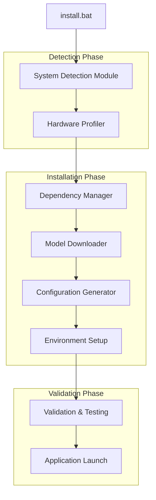

# Design Document

## Overview

This design outlines a comprehensive local installation and deployment system for the WAN2.2 video generation application. The system will be packaged as a shareable, self-contained installation that runs via a Windows batch file, automatically detects system specifications, and configures optimal settings for the detected hardware. The design follows the WebUI Forge approach of providing a one-click installation experience while handling all dependencies, model downloads, and system optimization automatically.

## Architecture

### High-Level Architecture



### Component Architecture

The installation system consists of several key components:

1. **Batch File Orchestrator** - Main entry point that coordinates the entire installation process
2. **System Detection Engine** - Detects hardware specifications and system capabilities
3. **Dependency Management System** - Handles Python, packages, and system dependencies
4. **Model Management System** - Downloads and configures WAN2.2 models
5. **Configuration Engine** - Generates optimized configuration files
6. **Validation Framework** - Tests the installation and verifies functionality

## Components and Interfaces

### 1. Batch File Orchestrator (`install.bat`)

**Purpose**: Main entry point that provides user interface and coordinates all installation phases.

**Key Features**:

- Progress indication with ASCII progress bars
- Error handling with user-friendly messages
- Automatic elevation for system-level operations
- Logging to installation.log file

**Interface**:

```batch
install.bat [options]
  --silent          # Silent installation mode
  --dev-mode        # Install development dependencies
  --custom-path     # Specify custom installation path
  --skip-models     # Skip model download (for testing)
```

### 2. System Detection Engine (`scripts/detect_system.py`)

**Purpose**: Automatically detects hardware specifications and system capabilities.

**Detection Capabilities**:

- CPU: Model, cores, threads, architecture
- RAM: Total amount, available, speed
- GPU: Model, VRAM, CUDA capability, driver version
- Storage: Available space, drive type (SSD/HDD)
- OS: Windows version, architecture (x64/x86)

**Interface**:

```python
class SystemDetector:
    def detect_hardware(self) -> HardwareProfile
    def get_optimal_settings(self, profile: HardwareProfile) -> OptimalSettings
    def validate_requirements(self, profile: HardwareProfile) -> ValidationResult
```

**Output Format**:

```json
{
  "cpu": {
    "model": "AMD Ryzen Threadripper PRO 5995WX",
    "cores": 64,
    "threads": 128,
    "base_clock": 2.7,
    "boost_clock": 4.5
  },
  "memory": {
    "total_gb": 128,
    "available_gb": 120,
    "type": "DDR4"
  },
  "gpu": {
    "model": "NVIDIA GeForce RTX 4080",
    "vram_gb": 16,
    "cuda_version": "12.1",
    "driver_version": "537.13"
  },
  "storage": {
    "available_gb": 500,
    "type": "NVMe SSD"
  }
}
```

### 3. Dependency Management System (`scripts/setup_dependencies.py`)

**Purpose**: Handles installation of Python, virtual environment, and all required packages.

**Key Features**:

- Automatic Python 3.9+ detection and installation
- Virtual environment creation with optimal settings
- Package installation with hardware-specific optimizations
- Dependency conflict resolution

**Installation Strategy**:

1. Check for existing Python installation
2. Download and install Python if needed (embedded version for portability)
3. Create virtual environment with hardware-optimized settings
4. Install packages with appropriate CUDA versions based on GPU detection
5. Configure environment variables for optimal performance

**Interface**:

```python
class DependencyManager:
    def check_python_installation(self) -> PythonInfo
    def install_python(self, target_dir: str) -> bool
    def create_virtual_environment(self, venv_path: str, hardware_profile: HardwareProfile) -> bool
    def install_packages(self, requirements_file: str, hardware_profile: HardwareProfile) -> bool
```

### 4. Model Management System (`scripts/download_models.py`)

**Purpose**: Downloads and configures WAN2.2 models automatically.

**Model Configuration**:

- **WAN2.2-T2V-A14B**: Text-to-Video model (14B parameters)
- **WAN2.2-I2V-A14B**: Image-to-Video model (14B parameters)
- **WAN2.2-TI2V-5B**: Text-Image-to-Video model (5B parameters)

**Download Strategy**:

1. Check existing models in `models/` directory
2. Download missing models from Hugging Face Hub
3. Verify model integrity with checksums
4. Configure model paths in application config

**Interface**:

```python
class ModelDownloader:
    def check_existing_models(self) -> List[str]
    def download_wan22_models(self, progress_callback: Callable) -> bool
    def verify_model_integrity(self, model_path: str) -> bool
    def configure_model_paths(self, config_path: str) -> bool
```

**Model Configuration with Version Pinning**:

```python
MODEL_CONFIG = {
    "WAN2.2-T2V-A14B": {
        "url": "huggingface.co/Wan2.2/T2V-A14B",
        "version": "v1.0.3",
        "checksum": "sha256:abc123...",
        "size_gb": 28.5,
        "required": True
    },
    "WAN2.2-I2V-A14B": {
        "url": "huggingface.co/Wan2.2/I2V-A14B",
        "version": "v1.0.3",
        "checksum": "sha256:def456...",
        "size_gb": 28.5,
        "required": True
    },
    "WAN2.2-TI2V-5B": {
        "url": "huggingface.co/Wan2.2/TI2V-5B",
        "version": "v1.0.2",
        "checksum": "sha256:ghi789...",
        "size_gb": 10.2,
        "required": True
    }
}
```

**Parallel Download Strategy**:

```python
class ParallelModelDownloader:
    def __init__(self, max_workers: int = 3):
        self.executor = ThreadPoolExecutor(max_workers=max_workers)

    def download_models_parallel(self, models: List[str]) -> bool:
        futures = [self.executor.submit(self.download_single_model, model) for model in models]
        return all(future.result() for future in futures)
```

### 5. Configuration Engine (`scripts/generate_config.py`)

**Purpose**: Generates optimized configuration files based on detected hardware.

**Configuration Optimization**:

- Thread allocation based on CPU cores
- Memory settings based on available RAM
- GPU settings based on VRAM and capabilities
- Storage optimization based on drive type

**Hardware-Specific Optimizations**:

**High-Performance Systems (64+ cores, 64+ GB RAM, RTX 4080+)**:

```json
{
  "system": {
    "default_quantization": "bf16",
    "enable_offload": false,
    "vae_tile_size": 512,
    "max_queue_size": 20,
    "worker_threads": 32
  },
  "optimization": {
    "max_vram_usage_gb": 14,
    "cpu_threads": 64,
    "memory_pool_gb": 32
  }
}
```

**Mid-Range Systems (8-32 cores, 16-32 GB RAM, RTX 3070+)**:

```json
{
  "system": {
    "default_quantization": "fp16",
    "enable_offload": true,
    "vae_tile_size": 256,
    "max_queue_size": 10,
    "worker_threads": 8
  },
  "optimization": {
    "max_vram_usage_gb": 8,
    "cpu_threads": 16,
    "memory_pool_gb": 8
  }
}
```

**Interface**:

```python
class ConfigurationEngine:
    def generate_config(self, hardware_profile: HardwareProfile) -> Dict[str, Any]
    def optimize_for_hardware(self, base_config: Dict, hardware: HardwareProfile) -> Dict[str, Any]
    def save_config(self, config: Dict, config_path: str) -> bool
```

### 6. Validation Framework (`scripts/validate_installation.py`)

**Purpose**: Validates the installation and ensures everything is working correctly.

**Validation Tests**:

1. **Dependency Validation**: Verify all packages are installed correctly
2. **Model Validation**: Check model files exist and are accessible
3. **Hardware Integration**: Test GPU acceleration and memory allocation
4. **Basic Functionality**: Run simple generation test
5. **Performance Baseline**: Quick performance benchmark

**Interface**:

```python
class InstallationValidator:
    def validate_dependencies(self) -> ValidationResult
    def validate_models(self) -> ValidationResult
    def validate_hardware_integration(self) -> ValidationResult
    def run_functionality_test(self) -> ValidationResult
    def run_performance_baseline(self) -> ValidationResult
```

## Data Models

### Hardware Profile

```python
@dataclass
class HardwareProfile:
    cpu: CPUInfo
    memory: MemoryInfo
    gpu: GPUInfo
    storage: StorageInfo
    os: OSInfo

@dataclass
class CPUInfo:
    model: str
    cores: int
    threads: int
    base_clock: float
    boost_clock: float
    architecture: str

@dataclass
class MemoryInfo:
    total_gb: int
    available_gb: int
    type: str
    speed: int

@dataclass
class GPUInfo:
    model: str
    vram_gb: int
    cuda_version: str
    driver_version: str
    compute_capability: str
```

### Installation State

```python
@dataclass
class InstallationState:
    phase: str  # "detection", "dependencies", "models", "config", "validation"
    progress: float  # 0.0 to 1.0
    current_task: str
    errors: List[str]
    warnings: List[str]
    hardware_profile: Optional[HardwareProfile]
    installation_path: str
```

## Error Handling

### Error Categories

1. **System Errors**: Hardware detection failures, insufficient resources
2. **Network Errors**: Download failures, connectivity issues
3. **Permission Errors**: Insufficient privileges, file access issues
4. **Configuration Errors**: Invalid settings, compatibility issues

### Error Recovery Strategies

1. **Automatic Retry**: Network downloads, temporary failures
2. **Fallback Options**: Alternative download sources, reduced settings
3. **User Guidance**: Clear error messages with suggested solutions
4. **Rollback Capability**: Restore previous state on critical failures

### Error Handling Implementation

```python
class InstallationError(Exception):
    def __init__(self, message: str, category: str, recovery_suggestions: List[str]):
        self.message = message
        self.category = category
        self.recovery_suggestions = recovery_suggestions

class ErrorHandler:
    def handle_error(self, error: InstallationError) -> RecoveryAction
    def log_error(self, error: InstallationError, context: Dict) -> None
    def suggest_recovery(self, error: InstallationError) -> List[str]
```

## Testing Strategy

### Automated Testing

1. **Unit Tests**: Individual component testing
2. **Integration Tests**: Cross-component functionality
3. **Hardware Simulation**: Test with various hardware profiles
4. **Network Simulation**: Test download failures and recovery

### Manual Testing

1. **Hardware Validation**: Test on actual target hardware configurations
2. **User Experience**: Test installation flow from user perspective
3. **Edge Cases**: Test with unusual hardware configurations
4. **Performance Validation**: Verify optimization effectiveness

### Test Hardware Profiles

1. **High-End**: Threadripper PRO 5995WX, 128GB RAM, RTX 4080
2. **Mid-Range**: Ryzen 7 5800X, 32GB RAM, RTX 3070
3. **Budget**: Ryzen 5 3600, 16GB RAM, GTX 1660 Ti
4. **Minimum**: Intel i5-8400, 8GB RAM, GTX 1060

## Deployment Strategy

### Package Structure

```
WAN22-Installer/
├── install.bat                 # Main installation script
├── README.md                   # Installation instructions
├── LICENSE                     # License information
├── scripts/                    # Python installation scripts
│   ├── detect_system.py
│   ├── setup_dependencies.py
│   ├── download_models.py
│   ├── generate_config.py
│   └── validate_installation.py
├── resources/                  # Static resources
│   ├── python-embed/          # Embedded Python (if needed)
│   ├── requirements.txt       # Python dependencies
│   └── default_config.json    # Default configuration template
├── application/               # Main application files
│   ├── main.py
│   ├── ui.py
│   ├── utils.py
│   └── error_handler.py
└── logs/                      # Installation logs
    └── installation.log
```

### Distribution Methods

1. **ZIP Archive**: Self-contained package for manual distribution
2. **Installer Executable**: Windows installer with GUI (future enhancement)
3. **GitHub Releases**: Automated releases with version management
4. **Direct Download**: Web-based download with integrity verification

### Version Management

**Version Manager Interface**:

```python
class VersionManager:
    def check_for_updates(self) -> UpdateInfo
    def download_update(self, version: str, progress_callback: Callable) -> bool
    def run_migration(self, from_version: str, to_version: str) -> bool
    def get_current_version(self) -> str
    def backup_current_installation(self) -> str
```

**Update Strategy**:

- Semantic versioning (e.g., v1.0.0)
- Automatic update checking via GitHub releases API
- Backward compatibility for configurations with migration scripts
- Incremental updates with rollback capability

**Migration System**:

```python
# Migration scripts stored in migrations/ directory
# Named as: migrate_v1.0.0_to_v1.1.0.py
class MigrationScript:
    def migrate_config(self, old_config: Dict) -> Dict
    def migrate_models(self, models_dir: str) -> bool
    def validate_migration(self) -> bool
```

### Rollback and Backup System

**Rollback Manager Interface**:

```python
class RollbackManager:
    def create_snapshot(self, snapshot_name: str) -> bool
    def restore_snapshot(self, snapshot_name: str) -> bool
    def list_snapshots(self) -> List[str]
    def cleanup_old_snapshots(self, keep_count: int = 3) -> bool
```

**Backup Strategy**:

- Create `.wan22_backup/` directory for snapshots
- Store configuration, model metadata, and installation state
- Automatic snapshots before major operations
- User-initiated snapshots via `--create-backup` flag

### Logging System

**Logging Configuration**:

```python
def setup_logging(level: str = "INFO", log_file: str = "installation.log"):
    levels = {"DEBUG": logging.DEBUG, "INFO": logging.INFO, "WARNING": logging.WARNING, "ERROR": logging.ERROR}
    logging.basicConfig(level=levels.get(level, logging.INFO))
```

**Log Levels**:

- `DEBUG`: Detailed system information, API calls, file operations
- `INFO`: Installation progress, major milestones, user actions
- `WARNING`: Non-critical issues, fallback actions, performance warnings
- `ERROR`: Critical failures, installation blockers, system errors

**Batch File Logging Options**:

```batch
install.bat --verbose          # Enable DEBUG logging
install.bat --log-level ERROR  # Only show errors
install.bat --dry-run          # Simulate installation without changes
```
