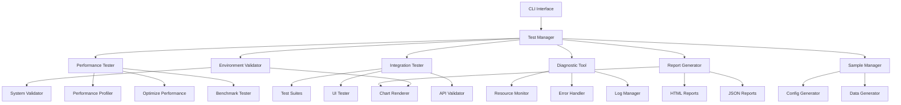

# Design Document

## Overview

The Local Testing Framework for Wan2.2 UI Variant is a comprehensive testing and validation system that automates the verification of performance optimizations, system functionality, and deployment readiness. The framework integrates with existing performance monitoring tools (`performance_profiler.py`, `optimize_performance.py`) and test suites while providing new capabilities for environment validation, automated testing workflows, and comprehensive reporting.

The system follows a modular architecture that allows for independent execution of different testing phases while maintaining integration capabilities for end-to-end validation workflows.

## Dependencies

### Core Dependencies

- **Python 3.8+**: Base runtime environment
- **psutil**: System resource monitoring
- **requests**: HTTP API testing and validation
- **selenium**: Web UI automated testing (headless mode supported)
- **Chart.js**: Performance chart generation (via web rendering)
- **WeasyPrint**: PDF report generation from HTML
- **dataclasses**: Data model definitions (Python 3.7+ backport if needed)
- **abc**: Abstract base classes for interface definitions

### Integration Dependencies

- **torch**: GPU/CUDA validation and monitoring
- **gradio**: UI testing integration
- **existing modules**: `performance_profiler.py`, `optimize_performance.py`, `error_handler.py`

### Optional Dependencies

- **pdfkit**: Alternative PDF generation
- **matplotlib**: Alternative chart generation for offline reports
- **concurrent.futures**: Multi-threaded test execution

## Architecture

### High-Level Architecture



### Core Components

1. **Test Manager**: Central orchestrator that coordinates all testing activities
2. **Environment Validator**: Validates system prerequisites and configuration
3. **Performance Tester**: Executes performance benchmarks and optimization tests
4. **Integration Tester**: Runs comprehensive integration test suites
5. **Diagnostic Tool**: Provides troubleshooting and system analysis capabilities
6. **Report Generator**: Creates comprehensive test reports in multiple formats
7. **Sample Manager**: Generates and manages test data and configurations

## Components and Interfaces

### 1. Test Manager (`test_manager.py`)

**Purpose**: Central coordinator for all testing activities with workflow management.

**Key Classes**:

- `LocalTestManager`: Main orchestrator class
- `TestWorkflow`: Defines test execution workflows
- `TestSession`: Manages individual test sessions

**Key Methods**:

```python
class LocalTestManager:
    def __init__(self, config_path: str = "config.json")
    def run_full_test_suite(self) -> TestResults
    def run_environment_validation(self) -> ValidationResults
    def run_performance_tests(self) -> PerformanceResults
    def run_integration_tests(self) -> IntegrationResults
    def run_diagnostics(self) -> DiagnosticResults
    def generate_reports(self, results: TestResults) -> ReportResults
```

**Interfaces**:

```python
from abc import ABC, abstractmethod

class TestComponent(ABC):
    """Base interface for all test components"""
    @abstractmethod
    def initialize(self, config: TestConfiguration) -> bool

    @abstractmethod
    def execute(self) -> TestResults

    @abstractmethod
    def cleanup(self) -> None

    @abstractmethod
    def get_resource_usage(self) -> ResourceMetrics

class TestResults(ABC):
    """Standard result format for all test types"""
    @abstractmethod
    def to_dict(self) -> Dict[str, Any]

    @abstractmethod
    def get_status(self) -> TestStatus

    @abstractmethod
    def get_recommendations(self) -> List[Recommendation]

class TestConfiguration(ABC):
    """Configuration interface for test parameters"""
    @abstractmethod
    def validate(self) -> ValidationResult

    @abstractmethod
    def get_performance_targets(self) -> PerformanceTargets
```

### 2. Environment Validator (`environment_validator.py`)

**Purpose**: Validates system prerequisites, dependencies, and configuration files.

**Key Classes**:

- `EnvironmentValidator`: Main validation orchestrator
- `SystemChecker`: Hardware and software validation
- `DependencyChecker`: Python package validation
- `ConfigurationChecker`: Configuration file validation

**Key Methods**:

```python
class EnvironmentValidator:
    def validate_python_version(self) -> ValidationResult
    def validate_cuda_availability(self) -> ValidationResult
    def validate_dependencies(self) -> ValidationResult
    def validate_configuration_files(self) -> ValidationResult
    def validate_environment_variables(self) -> ValidationResult
    def generate_remediation_instructions(self, failures: List[ValidationResult]) -> str
```

**Cross-Platform Support**:

- Windows: Uses `setx` for environment variables, PowerShell commands
- Linux/macOS: Uses `export` for environment variables, bash commands
- Automatic platform detection and command adaptation

### 3. Performance Tester (`performance_tester.py`)

**Purpose**: Executes automated performance benchmarks and validates optimization targets.

**Key Classes**:

- `PerformanceTester`: Main performance testing orchestrator
- `BenchmarkRunner`: Executes specific performance benchmarks
- `OptimizationValidator`: Validates VRAM and performance optimizations
- `MetricsCollector`: Collects and analyzes performance metrics

**Key Methods**:

```python
class PerformanceTester:
    def run_720p_benchmark(self) -> BenchmarkResult
    def run_1080p_benchmark(self) -> BenchmarkResult
    def validate_vram_optimization(self) -> OptimizationResult
    def test_performance_targets(self) -> TargetValidationResult
    def collect_performance_metrics(self) -> PerformanceMetrics
    def generate_optimization_recommendations(self) -> List[Recommendation]
```

**Integration with Existing Tools**:

- Uses `performance_profiler.py` for real-time monitoring
- Uses `optimize_performance.py` for benchmark execution
- Extends existing metrics collection capabilities

### 4. Integration Tester (`integration_tester.py`)

**Purpose**: Executes comprehensive integration tests and validates system components.

**Key Classes**:

- `IntegrationTester`: Main integration testing orchestrator
- `UITester`: Web UI testing capabilities
- `APITester`: API endpoint validation
- `WorkflowTester`: End-to-end workflow validation

**Key Methods**:

```python
class IntegrationTester:
    def run_video_generation_tests(self) -> GenerationTestResults
    def test_ui_functionality(self) -> UITestResults
    def validate_api_endpoints(self) -> APITestResults
    def test_error_handling(self) -> ErrorHandlingResults
    def test_resource_monitoring(self) -> MonitoringResults
```

**Test Suite Integration**:

- Leverages existing `TestIntegrationSuite`, `TestUIIntegrationSuite`, `TestPerformanceBenchmarkSuite`
- Extends test coverage with new automated scenarios
- Provides unified test execution and reporting

### 5. Diagnostic Tool (`diagnostic_tool.py`)

**Purpose**: Provides automated troubleshooting and system analysis capabilities.

**Key Classes**:

- `DiagnosticTool`: Main diagnostic orchestrator
- `SystemAnalyzer`: System resource and configuration analysis
- `ErrorAnalyzer`: Error log analysis and categorization
- `RecoveryManager`: Automated recovery procedures

**Key Methods**:

```python
class DiagnosticTool:
    def analyze_system_state(self) -> SystemAnalysis
    def diagnose_cuda_issues(self) -> CUDADiagnostic
    def analyze_memory_issues(self) -> MemoryDiagnostic
    def diagnose_model_download_issues(self) -> ModelDiagnostic
    def suggest_optimizations(self) -> List[OptimizationSuggestion]
    def attempt_automatic_recovery(self, error: Exception) -> RecoveryResult
```

**Error Handling Integration**:

- Integrates with existing `error_handler.py` system
- Extends diagnostic capabilities with automated analysis
- Provides specific remediation steps for common issues

### 6. Report Generator (`report_generator.py`)

**Purpose**: Creates comprehensive test reports in multiple formats with visual charts.

**Key Classes**:

- `ReportGenerator`: Main report generation orchestrator
- `HTMLReportGenerator`: HTML report creation with charts
- `JSONReportGenerator`: JSON report creation for programmatic access
- `ChartGenerator`: Performance chart generation using Chart.js

**Key Methods**:

```python
class ReportGenerator:
    def generate_html_report(self, results: TestResults) -> HTMLReport
    def generate_json_report(self, results: TestResults) -> JSONReport
    def generate_performance_charts(self, metrics: PerformanceMetrics) -> List[Chart]
    def create_comparison_charts(self, results: TestResults) -> ComparisonCharts
    def export_to_pdf(self, html_report: HTMLReport) -> PDFReport
```

**Chart Types**:

- Line charts for performance metrics over time
- Bar charts for benchmark comparisons
- Gauge charts for resource utilization
- Timeline charts for test execution progress

### 7. Sample Manager (`sample_manager.py`)

**Purpose**: Generates and manages test data, configurations, and sample inputs.

**Key Classes**:

- `SampleManager`: Main sample data orchestrator
- `ConfigGenerator`: Configuration file generation
- `TestDataGenerator`: Test input data generation
- `TemplateManager`: Template file management

**Key Methods**:

```python
class SampleManager:
    def generate_sample_config(self) -> ConfigFile
    def create_test_inputs(self, resolutions: List[str]) -> List[TestInput]
    def generate_env_template(self) -> EnvFile
    def create_sample_prompts(self) -> List[VideoPrompt]
    def validate_generated_files(self) -> ValidationResults
```

## Data Models

### Core Data Structures

```python
@dataclass
class TestResults:
    """Comprehensive test results container"""
    session_id: str
    start_time: datetime
    end_time: datetime
    environment_results: EnvironmentValidationResults
    performance_results: PerformanceTestResults
    integration_results: IntegrationTestResults
    diagnostic_results: DiagnosticResults
    overall_status: TestStatus
    recommendations: List[Recommendation]

@dataclass
class EnvironmentValidationResults:
    """Environment validation results"""
    python_version: ValidationResult
    cuda_availability: ValidationResult
    dependencies: ValidationResult
    configuration: ValidationResult
    environment_variables: ValidationResult
    overall_status: ValidationStatus
    remediation_steps: List[str]

@dataclass
class PerformanceTestResults:
    """Performance test results"""
    benchmark_720p: BenchmarkResult
    benchmark_1080p: BenchmarkResult
    vram_optimization: OptimizationResult
    target_validation: TargetValidationResult
    metrics: PerformanceMetrics
    recommendations: List[OptimizationRecommendation]

@dataclass
class BenchmarkResult:
    """Individual benchmark result"""
    resolution: str
    generation_time: float
    target_time: float
    meets_target: bool
    vram_usage: float
    cpu_usage: float
    memory_usage: float
    optimization_level: str

@dataclass
class ValidationResult:
    """Generic validation result"""
    component: str
    status: ValidationStatus
    message: str
    details: Dict[str, Any]
    remediation_steps: List[str]
```

### Configuration Schema

```python
@dataclass
class TestConfiguration:
    """Test framework configuration"""
    test_modes: List[TestMode]
    performance_targets: PerformanceTargets
    environment_requirements: EnvironmentRequirements
    reporting_options: ReportingOptions
    diagnostic_settings: DiagnosticSettings

@dataclass
class PerformanceTargets:
    """Performance target definitions"""
    target_720p_time_minutes: float = 9.0
    target_1080p_time_minutes: float = 17.0
    max_vram_usage_gb: float = 12.0
    vram_warning_threshold: float = 0.9
    cpu_warning_threshold: float = 80.0
    expected_vram_reduction_percent: float = 80.0
```

## Error Handling

### Error Categories

1. **Environment Errors**: Missing dependencies, configuration issues
2. **Performance Errors**: Benchmark failures, optimization issues
3. **Integration Errors**: Test failures, component integration issues
4. **System Errors**: Hardware issues, resource constraints
5. **Configuration Errors**: Invalid settings, missing files

### Error Recovery Strategies

```python
class TestErrorHandler:
    """Specialized error handling for testing framework"""

    def handle_environment_error(self, error: EnvironmentError) -> RecoveryAction
    def handle_performance_error(self, error: PerformanceError) -> RecoveryAction
    def handle_integration_error(self, error: IntegrationError) -> RecoveryAction
    def handle_system_error(self, error: SystemError) -> RecoveryAction

    def attempt_automatic_recovery(self, error: Exception) -> RecoveryResult
    def generate_recovery_instructions(self, error: Exception) -> List[str]
```

### Integration with Existing Error Handling

- Extends existing `error_handler.py` system
- Adds test-specific error categories and recovery procedures
- Maintains compatibility with existing error handling workflows

## Testing Strategy

### Unit Testing

- Individual component testing for each module
- Mock external dependencies (GPU, file system, network)
- Test error conditions and edge cases
- Validate configuration parsing and validation logic

### Integration Testing

- Test component interactions and data flow
- Validate end-to-end testing workflows
- Test report generation and chart creation
- Validate cross-platform compatibility

### Performance Testing

- Benchmark the testing framework itself
- Validate minimal performance impact during monitoring
- Test scalability with large test suites
- Validate memory usage and resource cleanup

### Test Files Structure

```
tests/
├── unit/
│   ├── test_environment_validator.py
│   ├── test_performance_tester.py
│   ├── test_integration_tester.py
│   ├── test_diagnostic_tool.py
│   ├── test_report_generator.py
│   └── test_sample_manager.py
├── integration/
│   ├── test_full_workflow.py
│   ├── test_cross_platform.py
│   └── test_error_scenarios.py
└── fixtures/
    ├── sample_configs/
    ├── test_data/
    └── mock_responses/
```

## Implementation Architecture

### File Structure

```
local_testing_framework/
├── __init__.py
├── test_manager.py              # Main orchestrator
├── environment_validator.py     # Environment validation
├── performance_tester.py        # Performance testing
├── integration_tester.py        # Integration testing
├── diagnostic_tool.py           # Diagnostics and troubleshooting
├── report_generator.py          # Report generation
├── sample_manager.py            # Sample data management
├── models/
│   ├── __init__.py
│   ├── test_results.py          # Data models for results
│   ├── configuration.py         # Configuration models
│   └── validation.py            # Validation models
├── utils/
│   ├── __init__.py
│   ├── platform_utils.py        # Cross-platform utilities
│   ├── chart_generator.py       # Chart generation utilities
│   └── file_utils.py            # File management utilities
├── templates/
│   ├── config_template.json     # Configuration templates
│   ├── env_template.env         # Environment templates
│   ├── report_template.html     # HTML report templates
│   └── sample_inputs/           # Sample input templates
└── cli/
    ├── __init__.py
    └── main.py                  # CLI interface
```

### CLI Interface Design

```bash
# Main command structure
python -m local_testing_framework [command] [options]

# Environment validation
python -m local_testing_framework validate-env [--fix] [--report]

# Performance testing
python -m local_testing_framework test-performance [--resolution 720p|1080p] [--benchmark]

# Integration testing
python -m local_testing_framework test-integration [--ui] [--api] [--full]

# Diagnostics
python -m local_testing_framework diagnose [--system] [--cuda] [--memory]

# Sample generation
python -m local_testing_framework generate-samples [--config] [--data] [--all]

# Full test suite
python -m local_testing_framework run-all [--report-format html|json|pdf]

# Continuous monitoring
python -m local_testing_framework monitor [--duration 3600] [--alerts]
```

### Integration Points

1. **Existing Performance Tools**:

   - `performance_profiler.py`: Real-time monitoring integration
   - `optimize_performance.py`: Benchmark execution integration

2. **Existing Test Suites**:

   - `run_integration_tests.py`: Test execution integration
   - Individual test files: Extended coverage and reporting

3. **Configuration System**:

   - `config.json`: Configuration validation and extension
   - `main.py`: Application lifecycle integration

4. **Error Handling System**:
   - `error_handler.py`: Error categorization and recovery integration

This design provides a comprehensive, modular, and extensible local testing framework that integrates seamlessly with the existing Wan2.2 UI Variant codebase while adding powerful new testing and validation capabilities.

## Enhanced Component Details

### Performance Overhead Management

The testing framework implements strict overhead controls to ensure minimal impact on benchmark accuracy:

```python
class FrameworkOverheadMonitor:
    """Monitors and controls framework resource usage"""
    MAX_CPU_OVERHEAD_PERCENT = 2.0
    MAX_MEMORY_OVERHEAD_MB = 100.0
    CLEANUP_INTERVAL_SECONDS = 300

    def monitor_overhead(self) -> OverheadMetrics
    def trigger_cleanup_if_needed(self) -> None
    def separate_monitoring_process(self) -> Process
```

### Security Validation Integration

```python
class SecurityValidator:
    """Security-focused validation for production readiness"""

    def validate_https_configuration(self) -> SecurityResult
    def check_authentication_tokens(self) -> SecurityResult
    def validate_file_permissions(self) -> SecurityResult
    def scan_for_security_vulnerabilities(self) -> SecurityResult
```

### Multi-GPU and Hardware Fallback Support

```python
class HardwareValidator:
    """Enhanced hardware validation with fallback support"""

    def detect_multi_gpu_setup(self) -> MultiGPUResult
    def validate_non_nvidia_fallbacks(self) -> FallbackResult
    def test_concurrent_gpu_usage(self) -> ConcurrencyResult
    def validate_queue_management_scaling(self) -> ScalingResult
```

### UI and API Testing Specificity

```python
class UITester:
    """Detailed UI testing with Selenium integration"""

    def setup_headless_browser(self) -> WebDriver
    def test_ui_responsiveness(self) -> UITestResult
    def validate_accessibility_compliance(self) -> AccessibilityResult
    def test_browser_compatibility(self) -> CompatibilityResult

class APITester:
    """Comprehensive API testing with requests library"""

    def test_health_endpoint(self) -> APIResult
    def validate_authentication_endpoints(self) -> AuthResult
    def test_api_rate_limiting(self) -> RateLimitResult
    def validate_error_response_formats(self) -> ErrorFormatResult
```

### Sample Data Enhancement

```python
class EnhancedSampleManager:
    """Extended sample generation with edge cases"""

    def generate_edge_case_prompts(self) -> List[EdgeCasePrompt]
    def create_invalid_input_samples(self) -> List[InvalidInput]
    def generate_stress_test_scenarios(self) -> List[StressScenario]
    def create_multi_resolution_test_suite(self) -> TestSuite
```

### Plugin Architecture for Extensibility

```python
class PluginManager:
    """Dynamic plugin loading for custom test workflows"""

    def load_custom_test_plugins(self, plugin_dir: str) -> List[TestPlugin]
    def register_custom_validators(self, validators: List[Validator]) -> None
    def extend_reporting_formats(self, formatters: List[ReportFormatter]) -> None
```

## CLI Examples with Sample Output

### Environment Validation Example

```bash
$ python -m local_testing_framework validate-env --report

Environment Validation Report
=============================
✓ Python Version: 3.9.7 (Required: 3.8+)
✓ CUDA Availability: 11.8 (Compatible)
✓ Dependencies: 45/45 packages installed
✗ Configuration: Missing HF_TOKEN in .env
✓ Multi-GPU: 2 GPUs detected (RTX 3080, RTX 3090)

Remediation Steps:
1. Add HF_TOKEN to .env file: echo "HF_TOKEN=your_token" >> .env
2. Restart application to load new environment variables

Overall Status: NEEDS_ATTENTION (1 issue found)
```

### Performance Testing Example

```bash
$ python -m local_testing_framework test-performance --benchmark

Performance Benchmark Results
============================
720p Generation Test:
  ✓ Time: 7.2 minutes (Target: <9 minutes)
  ✓ VRAM Usage: 8.4GB (Target: <12GB)
  ✓ VRAM Reduction: 82% (Target: 80%)

1080p Generation Test:
  ✓ Time: 14.8 minutes (Target: <17 minutes)
  ✓ VRAM Usage: 10.1GB (Target: <12GB)
  ✓ VRAM Reduction: 79% (Target: 80%)

Overall Status: PASSED (All targets met)
```

## Error Recovery Integration

### Integration with Existing Error Handler

```python
class TestErrorHandler(ErrorHandler):
    """Extended error handling for testing framework"""

    def handle_test_specific_errors(self, error: Exception) -> RecoveryAction:
        """Handle errors specific to testing framework"""
        if isinstance(error, CUDAOutOfMemoryError):
            return self._handle_cuda_memory_error(error)
        elif isinstance(error, ModelDownloadError):
            return self._handle_model_download_error(error)
        elif isinstance(error, ConfigurationError):
            return self._handle_configuration_error(error)
        else:
            return super().handle_error_with_recovery(error)

    def _handle_cuda_memory_error(self, error: CUDAOutOfMemoryError) -> RecoveryAction:
        """Specific recovery for CUDA memory issues during testing"""
        return RecoveryAction(
            steps=[
                "Enable attention slicing in config.json",
                "Reduce VAE tile size to 128",
                "Enable CPU offload for models",
                "Restart test with reduced batch size"
            ],
            auto_executable=True
        )
```

### Continuous Monitoring Resource Management

```python
class ContinuousMonitor:
    """Long-running monitoring with resource leak prevention"""

    def __init__(self):
        self.cleanup_timer = threading.Timer(300, self._periodic_cleanup)
        self.resource_tracker = ResourceTracker()

    def _periodic_cleanup(self):
        """Prevent resource leaks during long monitoring sessions"""
        gc.collect()
        torch.cuda.empty_cache() if torch.cuda.is_available() else None
        self.resource_tracker.check_for_leaks()
        # Restart cleanup timer
        self.cleanup_timer = threading.Timer(300, self._periodic_cleanup)
        self.cleanup_timer.start()
```

This enhanced design provides comprehensive coverage of the feedback points while maintaining integration with the existing Wan2.2 UI Variant architecture.
