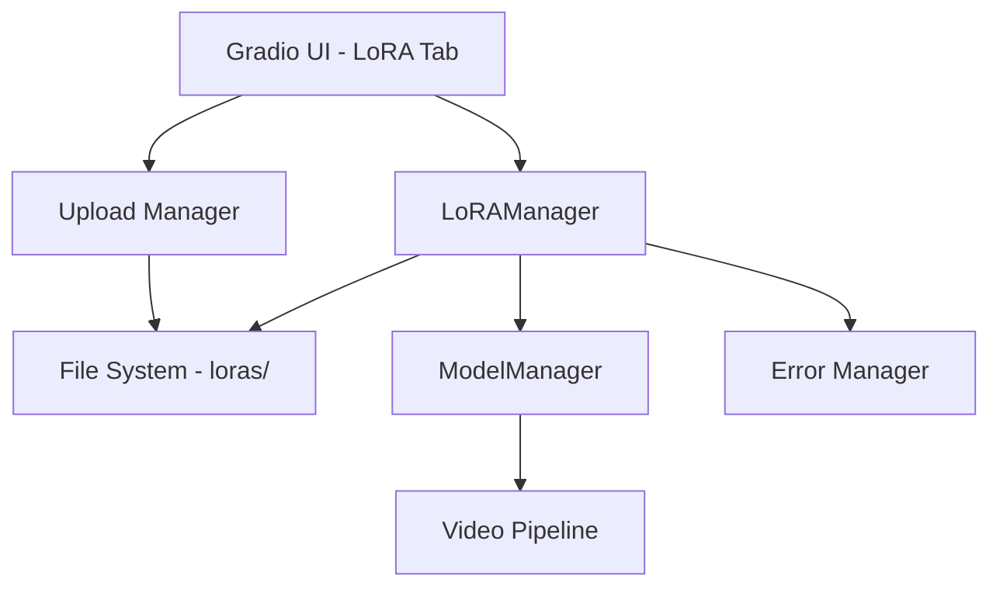

# Design Document

## Overview

The LoRA integration feature will enhance the existing Wan2.2 video generation application by providing a comprehensive user interface for managing and applying LoRA (Low-Rank Adaptation) weights. The design leverages the existing `LoRAManager` class in `utils.py` and extends the current Gradio-based UI to include LoRA management capabilities.

The integration will add a new "🎨 LoRAs" tab to the main interface, providing users with intuitive controls for uploading, managing, and applying LoRA models to their video generations.

## Architecture

### High-Level Architecture



### Component Interaction Flow

1. **User Interface Layer**: New LoRA tab in Gradio interface
2. **Management Layer**: Enhanced `LoRAManager` with UI integration methods
3. **Storage Layer**: File system management for LoRA files
4. **Integration Layer**: Connection with existing model pipeline
5. **Error Handling**: Integration with existing error recovery system

## Components and Interfaces

### 1. UI Components

#### LoRA Management Tab (`_create_lora_tab()`)

- **File Upload Section**: Drag-and-drop interface for LoRA files
- **LoRA Library**: Grid view of available LoRA models with thumbnails
- **Selection Panel**: Multi-select interface with strength sliders
- **Status Display**: Real-time feedback on LoRA operations

#### LoRA Selection Integration

- **Generation Tab Enhancement**: LoRA selection controls integrated into existing generation interface
- **Quick Selection**: Dropdown for recently used LoRAs
- **Strength Controls**: Individual sliders for each selected LoRA

### 2. Backend Components

#### Enhanced LoRAManager

```python
class LoRAManager:
    # Existing methods remain unchanged

    # New UI integration methods
    def upload_lora_file(self, file_path: str, filename: str) -> Dict[str, Any]
    def delete_lora_file(self, lora_name: str) -> bool
    def rename_lora_file(self, old_name: str, new_name: str) -> bool
    def get_lora_metadata(self, lora_name: str) -> Dict[str, Any]
    def validate_lora_compatibility(self, lora_name: str, model_type: str) -> bool
    def estimate_memory_impact(self, lora_names: List[str]) -> Dict[str, float]
    def get_ui_display_data(self) -> Dict[str, Any]
```

#### LoRA Upload Handler

```python
class LoRAUploadHandler:
    def validate_file(self, file_path: str) -> Tuple[bool, str]
    def process_upload(self, file_data: bytes, filename: str) -> Dict[str, Any]
    def generate_thumbnail(self, lora_name: str) -> Optional[str]
    def extract_metadata(self, lora_path: str) -> Dict[str, Any]
```

#### LoRA UI State Manager

```python
class LoRAUIState:
    def __init__(self):
        self.selected_loras: Dict[str, float] = {}  # name -> strength
        self.upload_progress: Dict[str, float] = {}
        self.last_refresh: datetime = datetime.now()

    def update_selection(self, lora_name: str, strength: float)
    def clear_selection(self)
    def get_selection_summary(self) -> Dict[str, Any]
```

### 3. Integration Points

#### Generation Task Enhancement

```python
@dataclass
class GenerationTask:
    # Existing fields remain unchanged

    # New LoRA-related fields
    selected_loras: Dict[str, float] = field(default_factory=dict)  # name -> strength
    lora_memory_usage: float = 0.0
    lora_load_time: float = 0.0
    lora_metadata: Dict[str, Any] = field(default_factory=dict)
```

#### Model Pipeline Integration

- Modify `generate_video()` function to apply LoRAs before generation
- Add LoRA information to generation metadata
- Implement fallback mechanisms for LoRA loading failures

## Data Models

### LoRA File Structure

```json
{
  "name": "anime_style_v1",
  "filename": "anime_style_v1.safetensors",
  "path": "/loras/anime_style_v1.safetensors",
  "size_mb": 144.5,
  "upload_date": "2025-01-08T10:30:00Z",
  "last_used": "2025-01-08T15:45:00Z",
  "use_count": 23,
  "is_loaded": false,
  "is_applied": false,
  "current_strength": 0.0,
  "compatible_models": ["t2v-A14B", "i2v-A14B"],
  "metadata": {
    "description": "Anime style enhancement",
    "tags": ["anime", "style", "cartoon"],
    "author": "user123",
    "version": "1.0"
  },
  "thumbnail_path": "/loras/.thumbnails/anime_style_v1.jpg"
}
```

### LoRA Selection State

```json
{
  "selected_loras": {
    "anime_style_v1": 0.8,
    "detail_enhancer": 0.6,
    "cinematic_lighting": 0.4
  },
  "total_memory_impact": 432.1,
  "estimated_load_time": 12.3,
  "compatibility_warnings": []
}
```

## Error Handling

### Error Categories

1. **File Upload Errors**: Invalid format, corrupted files, size limits
2. **LoRA Loading Errors**: Memory issues, compatibility problems
3. **Application Errors**: Model integration failures, strength adjustment issues
4. **File Management Errors**: Deletion, renaming, permission issues

### Recovery Strategies

```python
# Integration with existing error handling system
@handle_error_with_recovery
def apply_loras_to_generation(task: GenerationTask) -> GenerationTask:
    try:
        # Apply LoRAs with fallback mechanisms
        pass
    except LoRALoadingError as e:
        # Fallback to prompt enhancement
        task.prompt = enhance_prompt_with_lora_fallback(task.prompt, task.selected_loras)
        log_error_with_context(e, "lora_application", {"task_id": task.id})
    except VRAMError as e:
        # Reduce LoRA count or strength
        task.selected_loras = reduce_lora_complexity(task.selected_loras)
        raise ErrorWithRecoveryInfo(e, create_error_info(
            ErrorCategory.VRAM_ERROR,
            "Reduced LoRA complexity due to memory constraints",
            ["Try using fewer LoRAs", "Reduce LoRA strength values"]
        ))
```

## Testing Strategy

### Unit Tests

1. **LoRAManager Tests**: File operations, loading, application
2. **Upload Handler Tests**: File validation, processing, error handling
3. **UI State Tests**: Selection management, state persistence
4. **Integration Tests**: End-to-end LoRA workflow

### Integration Tests

1. **UI Integration**: Gradio component interactions
2. **Pipeline Integration**: LoRA application in generation workflow
3. **Error Recovery**: Fallback mechanisms and error handling
4. **Performance Tests**: Memory usage, loading times

### Test Data

- Sample LoRA files (various formats and sizes)
- Invalid/corrupted files for error testing
- Large files for performance testing
- Edge cases (empty files, unsupported formats)

### Mock Objects

```python
class MockLoRAManager:
    def __init__(self):
        self.mock_loras = {
            "test_lora": {
                "name": "test_lora",
                "size_mb": 100.0,
                "is_loaded": False
            }
        }

    def list_available_loras(self) -> Dict[str, Any]:
        return self.mock_loras
```

## Performance Considerations

### Memory Management

- Lazy loading of LoRA weights
- Automatic unloading of unused LoRAs
- Memory usage monitoring and warnings
- VRAM optimization for multiple LoRAs

### Loading Optimization

- Parallel LoRA loading where possible
- Caching of frequently used LoRAs
- Progressive loading with user feedback
- Background preloading of selected LoRAs

### UI Responsiveness

- Asynchronous file operations
- Progress indicators for long operations
- Non-blocking UI updates
- Efficient thumbnail generation and caching

## Security Considerations

### File Upload Security

- File type validation (whitelist approach)
- File size limits (configurable)
- Malware scanning integration points
- Sandboxed file processing

### Path Traversal Prevention

- Sanitized filename handling
- Restricted file operations to loras directory
- Validation of file paths before operations

### Resource Protection

- Memory usage limits
- CPU usage monitoring
- Disk space checks before uploads
- Rate limiting for file operations
