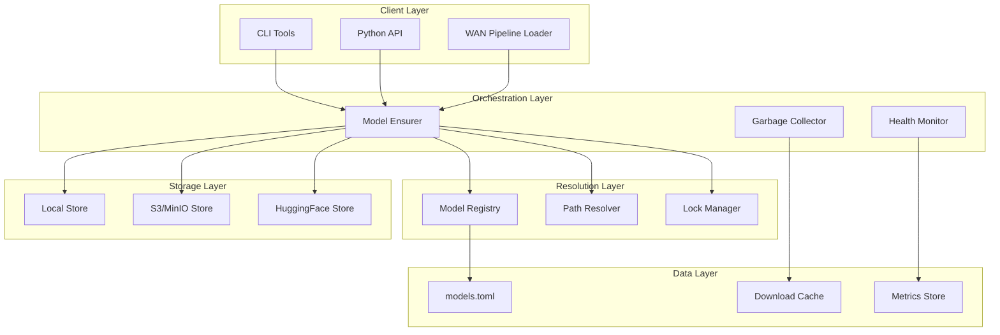

# Model Orchestrator Design Document

## Overview

The Model Orchestrator is a production-ready model management system that provides unified, manifest-driven model resolution for WAN2.2. It eliminates path drift and download complexity through a layered architecture with pluggable storage backends, atomic operations, and comprehensive observability.

The system follows a three-tier architecture:

1. **Registry Layer** - Manifest parsing and model specification management
2. **Resolution Layer** - Deterministic path resolution and storage backend coordination
3. **Orchestration Layer** - Download management, integrity verification, and lifecycle operations

## Architecture

### Core Components



### Directory Structure

The system integrates into the existing repository structure:

```
wan/
├── config/
│   └── models.toml                    # Single source of truth for model definitions
├── backend/core/
│   ├── model_registry.py             # Manifest parsing and model specifications
│   ├── model_resolver.py             # Deterministic path resolution
│   ├── model_ensurer.py              # Download orchestration and lifecycle
│   ├── lock_manager.py               # Cross-process synchronization
│   ├── garbage_collector.py          # Disk space management
│   └── storage_backends/
│       ├── base_store.py             # Abstract storage interface
│       ├── local_store.py            # Local filesystem operations
│       ├── s3_store.py               # S3/MinIO backend
│       └── hf_store.py               # HuggingFace Hub integration
├── backend/services/
│   ├── wan_pipeline_loader.py        # Integration point for existing pipelines
│   └── model_health_service.py       # Health monitoring and metrics
└── cli/
    └── models.py                     # Command-line interface
```

## Components and Interfaces

### Model Registry

**Purpose**: Parse and validate the models.toml manifest, providing typed access to model specifications.

**Key Classes**:

```python
@dataclass(frozen=True)
class ModelSpec:
    model_id: str                     # Canonical ID (e.g., "t2v-A14B@2.2.0")
    version: str                      # Model version (e.g., "2.2.0")
    variants: List[str]               # Available variants ["fp16", "bf16", "int8"]
    default_variant: str              # Default precision variant
    files: List[FileSpec]             # Required files with metadata
    sources: List[str]                # Priority-ordered source URLs
    allow_patterns: List[str]         # File patterns for selective download
    resolution_caps: List[str]        # Supported resolutions
    optional_components: List[str]    # Optional model components
    lora_required: bool               # Whether LoRA support is required

@dataclass(frozen=True)
class FileSpec:
    path: str                         # Relative path within model directory
    size: int                         # Expected file size in bytes
    sha256: str                       # SHA256 checksum for integrity verification
    optional: bool = False            # Whether file is optional
```

**Interface**:

```python
class ModelRegistry:
    def __init__(self, manifest_path: str)
    def spec(self, model_id: str, variant: Optional[str] = None) -> ModelSpec
    def list_models(self) -> List[str]
    def validate_manifest(self) -> List[ValidationError]
    def get_schema_version(self) -> str
```

### Path Resolver

**Purpose**: Provide deterministic path resolution from MODELS_ROOT with cross-platform compatibility.

**Interface**:

```python
class ModelResolver:
    def __init__(self, models_root: str)
    def local_dir(self, model_id: str, variant: Optional[str] = None) -> str
    def temp_dir(self, model_id: str) -> str
    def validate_path_constraints(self, path: str) -> List[PathIssue]
    def ensure_directory_exists(self, path: str) -> None
```

**Path Strategy**:

- Base pattern: `{MODELS_ROOT}/wan22/{model_id}`
- Variant pattern: `{MODELS_ROOT}/wan22/{model_id}@{variant}`
- Temporary pattern: `{MODELS_ROOT}/.tmp/{model_id}_{timestamp}`
- Cross-platform normalization for Windows long paths, WSL compatibility

### Lock Manager

**Purpose**: Provide cross-process synchronization to prevent concurrent download conflicts.

**Interface**:

```python
class LockManager:
    def __init__(self, lock_dir: str)
    def acquire_model_lock(self, model_id: str, timeout: float = 300.0) -> ContextManager
    def is_locked(self, model_id: str) -> bool
    def cleanup_stale_locks(self, max_age: timedelta) -> int
```

**Implementation Strategy**:

- File-based locking using OS-appropriate mechanisms (fcntl on Unix, msvcrt on Windows)
- Timeout-based acquisition with exponential backoff
- Automatic cleanup of stale locks from crashed processes
- Lock files stored in `{MODELS_ROOT}/.locks/`

### Storage Backends

**Base Interface**:

```python
class StorageBackend:
    def can_handle(self, source_url: str) -> bool
    def download(self, source_url: str, local_dir: str, file_specs: List[FileSpec],
                progress_callback: Optional[Callable] = None) -> DownloadResult
    def verify_availability(self, source_url: str) -> bool
    def estimate_download_size(self, source_url: str, file_specs: List[FileSpec]) -> int
```

**Local Store**:

- Handles `local://` URLs
- Direct file system operations with integrity checking
- Supports both absolute and relative path resolution

**S3/MinIO Store**:

- Handles `s3://` URLs with custom endpoint support
- Parallel downloads with configurable concurrency
- Resume capability using HTTP Range requests
- Presigned URL support for temporary access

**HuggingFace Store**:

- Handles `hf://` URLs using huggingface_hub library
- Leverages shared HF cache to avoid duplicate downloads
- Supports allow_patterns for selective file downloading
- Multi-connection downloads via hf_transfer when available

### Model Ensurer

**Purpose**: Orchestrate the complete model lifecycle from download to verification.

**Interface**:

```python
class ModelEnsurer:
    def __init__(self, registry: ModelRegistry, resolver: ModelResolver,
                 lock_manager: LockManager, storage_backends: List[StorageBackend])

    def ensure(self, model_id: str, variant: Optional[str] = None,
               force_redownload: bool = False) -> str
    def status(self, model_id: str, variant: Optional[str] = None) -> ModelStatus
    def verify_integrity(self, model_id: str, variant: Optional[str] = None) -> VerificationResult
    def estimate_download_size(self, model_id: str, variant: Optional[str] = None) -> int
```

**Download Flow**:

1. **Validation**: Validate model_id and variant against registry
2. **Path Resolution**: Determine target directory using resolver
3. **Lock Acquisition**: Acquire exclusive lock for the model
4. **Completeness Check**: Verify if model is already complete locally
5. **Source Iteration**: Try each source in priority order until success
6. **Atomic Download**: Download to temporary directory
7. **Integrity Verification**: Verify checksums and file sizes
8. **Atomic Move**: Move from temporary to final location
9. **Lock Release**: Release the exclusive lock

### Garbage Collector

**Purpose**: Manage disk space through configurable retention policies.

**Interface**:

```python
class GarbageCollector:
    def __init__(self, resolver: ModelResolver, config: GCConfig)

    def collect(self, dry_run: bool = False) -> GCResult
    def pin_model(self, model_id: str, variant: Optional[str] = None) -> None
    def unpin_model(self, model_id: str, variant: Optional[str] = None) -> None
    def get_disk_usage(self) -> DiskUsage
    def estimate_reclaimable_space(self) -> int
```

**Collection Strategy**:

- LRU-based eviction using access timestamps
- TTL-based eviction for models older than configured age
- Pin/protect mechanism to preserve critical models
- Configurable size limits (global and per-model-family)
- Dry-run mode for safe planning

## Data Models

### Manifest Schema (models.toml)

```toml
schema_version = 1

[models."t2v-A14B@2.2.0"]
description = "WAN2.2 Text-to-Video A14B Model"
version = "2.2.0"
variants = ["fp16", "bf16"]
default_variant = "fp16"
resolution_caps = ["720p24", "1080p24"]
optional_components = ["text_encoder"]
lora_required = false

[[models."t2v-A14B@2.2.0".files]]
path = "model_index.json"
size = 12345
sha256 = "abc123..."

[[models."t2v-A14B@2.2.0".files]]
path = "unet/diffusion_pytorch_model.safetensors"
size = 5368709120
sha256 = "def456..."

[models."t2v-A14B@2.2.0".sources]
priority = [
    "local://wan22/t2v-A14B@2.2.0",
    "s3://ai-models/wan22/t2v-A14B@2.2.0",
    "hf://Wan-AI/Wan2.2-T2V-A14B"
]
allow_patterns = ["*.safetensors", "*.json", "*.yaml", "*.index.json"]
```

### Configuration Schema

```python
@dataclass
class OrchestratorConfig:
    models_root: str
    manifest_path: str
    max_concurrent_downloads: int = 4
    download_timeout: float = 3600.0
    retry_attempts: int = 3
    retry_backoff_factor: float = 2.0
    enable_garbage_collection: bool = True
    max_total_size: Optional[int] = None
    max_model_age: Optional[timedelta] = None
    hf_cache_dir: Optional[str] = None
    s3_endpoint_url: Optional[str] = None
    enable_metrics: bool = True
    log_level: str = "INFO"
```

## Error Handling

### Error Classification

The system uses structured error codes for consistent handling:

```python
class ErrorCode(Enum):
    # Configuration Errors
    INVALID_CONFIG = "INVALID_CONFIG"
    MISSING_MANIFEST = "MISSING_MANIFEST"
    SCHEMA_VERSION_MISMATCH = "SCHEMA_VERSION_MISMATCH"

    # Model Errors
    MODEL_NOT_FOUND = "MODEL_NOT_FOUND"
    VARIANT_NOT_FOUND = "VARIANT_NOT_FOUND"
    INVALID_MODEL_ID = "INVALID_MODEL_ID"

    # Storage Errors
    NO_SPACE = "NO_SPACE"
    PERMISSION_DENIED = "PERMISSION_DENIED"
    PATH_TOO_LONG = "PATH_TOO_LONG"
    FILESYSTEM_ERROR = "FILESYSTEM_ERROR"

    # Network Errors
    AUTH_FAIL = "AUTH_FAIL"
    RATE_LIMIT = "RATE_LIMIT"
    NETWORK_TIMEOUT = "NETWORK_TIMEOUT"
    SOURCE_UNAVAILABLE = "SOURCE_UNAVAILABLE"

    # Integrity Errors
    CHECKSUM_FAIL = "CHECKSUM_FAIL"
    SIZE_MISMATCH = "SIZE_MISMATCH"
    INCOMPLETE_DOWNLOAD = "INCOMPLETE_DOWNLOAD"

    # Concurrency Errors
    LOCK_TIMEOUT = "LOCK_TIMEOUT"
    CONCURRENT_MODIFICATION = "CONCURRENT_MODIFICATION"
```

### Error Recovery Strategies

1. **Transient Errors**: Automatic retry with exponential backoff
2. **Source Failures**: Failover to next source in priority list
3. **Integrity Failures**: Re-download affected files up to retry limit
4. **Space Errors**: Trigger garbage collection and retry
5. **Lock Timeouts**: Wait and retry with jitter to avoid thundering herd

## Testing Strategy

### Unit Tests

- **Model Registry**: Manifest parsing, validation, schema migration
- **Path Resolver**: Cross-platform path handling, long path support
- **Storage Backends**: Mock network operations, error simulation
- **Lock Manager**: Concurrent access patterns, stale lock cleanup
- **Garbage Collector**: Retention policies, disk usage calculations

### Integration Tests

- **End-to-End Download**: Complete model download and verification flow
- **Concurrent Access**: Multiple processes downloading same model
- **Source Failover**: Primary source failure with automatic fallback
- **Resume Capability**: Interrupted downloads resuming correctly
- **Cross-Platform**: Windows, WSL, and Unix compatibility

### Performance Tests

- **Download Speed**: Benchmark against different source types
- **Concurrent Throughput**: Multiple simultaneous downloads
- **Memory Usage**: Large model handling without excessive memory
- **Disk I/O**: Efficient file operations and minimal fragmentation

### Chaos Tests

- **Network Failures**: Simulated network partitions and timeouts
- **Disk Full**: Handling insufficient disk space scenarios
- **Process Kills**: Recovery from interrupted operations
- **Corrupted Files**: Detection and recovery from file corruption

## Security Considerations

### Credential Management

- **Environment Variables**: Secure handling of tokens and keys
- **Keyring Integration**: System keyring for persistent credential storage
- **Credential Masking**: Automatic masking in logs and error messages
- **Presigned URLs**: Support for temporary access without permanent credentials

### File System Security

- **Path Traversal**: Prevention of directory traversal attacks
- **Permissions**: Appropriate file and directory permissions
- **Temporary Files**: Secure temporary file handling with cleanup
- **Symlink Safety**: Protection against symlink-based attacks

### Network Security

- **TLS Verification**: Proper certificate validation for HTTPS
- **Timeout Limits**: Prevention of resource exhaustion attacks
- **Rate Limiting**: Respect for upstream rate limits
- **Input Validation**: Sanitization of all external inputs

## Performance Optimizations

### Download Optimization

- **Parallel Downloads**: Multiple files downloaded concurrently
- **Connection Reuse**: HTTP connection pooling for efficiency
- **Compression**: Support for compressed transfers where available
- **Resume Support**: Efficient resume using HTTP Range requests

### Caching Strategy

- **Shared HF Cache**: Leverage HuggingFace's shared cache across environments
- **Metadata Caching**: Cache manifest and model metadata for faster lookups
- **Negative Caching**: Cache failed source attempts to avoid repeated failures
- **Disk Cache**: Local caching of frequently accessed model metadata

### Memory Management

- **Streaming Downloads**: Process large files without loading into memory
- **Lazy Loading**: Load model specifications only when needed
- **Resource Cleanup**: Proper cleanup of file handles and network connections
- **Memory Limits**: Configurable limits to prevent excessive memory usage

## Monitoring and Observability

### Metrics

The system exposes Prometheus-compatible metrics:

```python
# Download metrics
model_downloads_total{model_id, variant, source, status}
model_download_duration_seconds{model_id, variant, source}
model_download_bytes_total{model_id, variant, source}

# Storage metrics
model_storage_bytes_used{model_family}
model_storage_files_total{model_family}
garbage_collection_runs_total{trigger_reason}
garbage_collection_bytes_reclaimed{trigger_reason}

# Error metrics
model_errors_total{error_code, model_id, source}
lock_timeouts_total{model_id}
integrity_failures_total{model_id, file_path}
```

### Structured Logging

All log entries include structured metadata:

```json
{
  "timestamp": "2024-01-15T10:30:00Z",
  "level": "INFO",
  "message": "Model download completed",
  "correlation_id": "req-123456",
  "model_id": "t2v-A14B@2.2.0",
  "variant": "fp16",
  "source": "s3://ai-models/wan22/t2v-A14B@2.2.0",
  "duration_seconds": 45.2,
  "bytes_downloaded": 5368709120,
  "files_downloaded": 12
}
```

### Health Endpoints

- **`/health/models`**: Overall model availability status
- **`/health/models/{model_id}`**: Specific model health with detailed status
- **`/health/storage`**: Disk usage and storage backend availability
- **`/metrics`**: Prometheus metrics endpoint

## Migration and Backward Compatibility

### Migration Strategy

1. **Dual Operation Period**: Support both old and new systems during transition
2. **Configuration Migration**: Automatic conversion of existing configurations
3. **Path Compatibility**: Ensure new paths are compatible with existing model references
4. **Gradual Rollout**: Feature flags to enable orchestrator components incrementally

### Compatibility Adapters

- **Legacy Path Resolver**: Adapter to resolve old hardcoded paths
- **Configuration Converter**: Tool to convert existing model configurations to manifest format
- **API Compatibility**: Wrapper to maintain existing API contracts during transition
