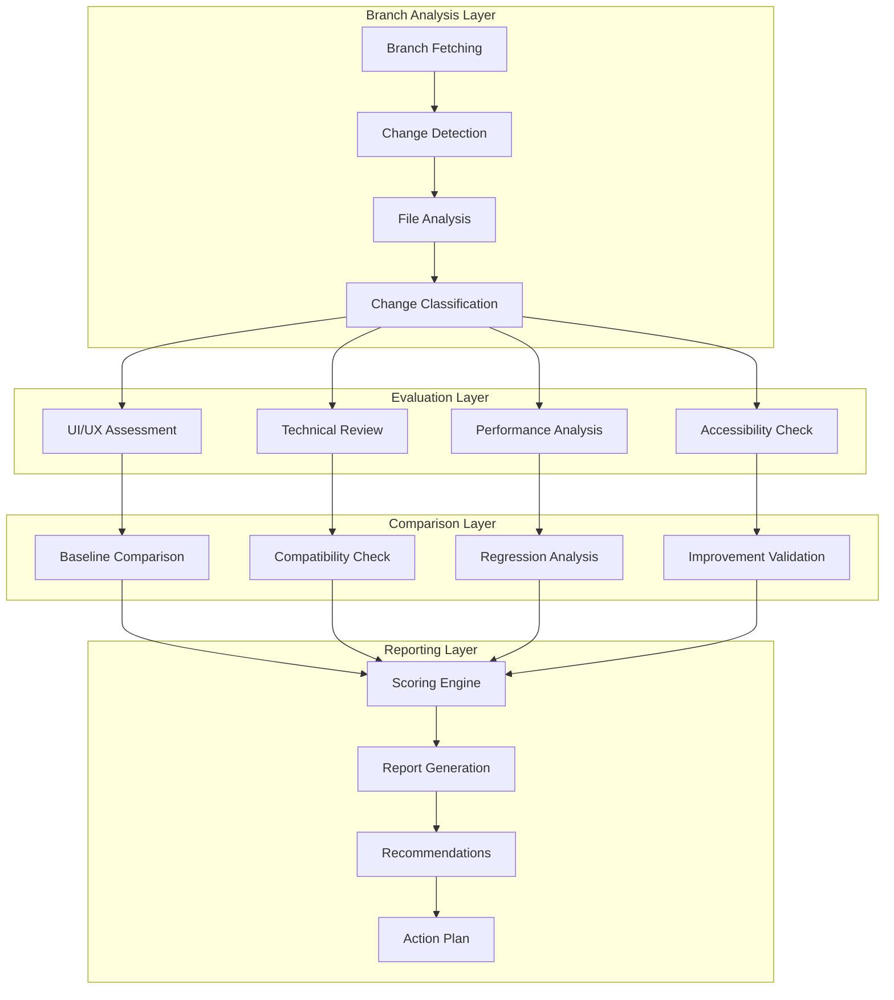

# Design Document

## Overview

The Modernize UI Branch Review system is a comprehensive evaluation framework for assessing the `feature/modernize-ui` branch changes against our existing React frontend implementation. The design focuses on systematic analysis of code changes, UI/UX improvements, technical implementation quality, and integration readiness to ensure the proposed modernization enhances the user experience while maintaining system stability.

## Architecture

### Review Process Architecture



### Technology Stack

#### Analysis Tools

- **Git Integration**: Branch comparison and change detection
- **AST Parsing**: TypeScript/JavaScript code analysis
- **CSS Analysis**: Styling and responsive design evaluation
- **Bundle Analysis**: Performance and dependency impact assessment
- **Accessibility Tools**: WCAG compliance checking

#### Evaluation Framework

- **Component Analysis**: React component structure and patterns
- **State Management**: Zustand/Redux pattern evaluation
- **API Integration**: FastAPI compatibility assessment
- **Performance Metrics**: Bundle size, runtime performance analysis
- **Design System**: Consistency with Tailwind CSS patterns

## Components and Interfaces

### Branch Analysis Engine

```typescript
interface BranchAnalysis {
  branchName: string;
  baseCommit: string;
  headCommit: string;
  changedFiles: ChangedFile[];
  addedFiles: string[];
  deletedFiles: string[];
  modifiedFiles: string[];
  summary: ChangeSummary;
}

interface ChangedFile {
  path: string;
  type: "added" | "modified" | "deleted" | "renamed";
  category: FileCategory;
  linesAdded: number;
  linesDeleted: number;
  complexity: ComplexityScore;
}

enum FileCategory {
  COMPONENT = "component",
  HOOK = "hook",
  UTILITY = "utility",
  STYLE = "style",
  CONFIG = "config",
  TEST = "test",
  DOCUMENTATION = "documentation",
}

class BranchAnalyzer {
  async analyzeBranch(branchUrl: string): Promise<BranchAnalysis> {
    // Fetch branch changes
    // Parse file modifications
    // Classify changes by type and impact
    // Generate analysis summary
  }

  private classifyFile(filePath: string): FileCategory {
    // Determine file category based on path and content
  }

  private calculateComplexity(fileContent: string): ComplexityScore {
    // Analyze code complexity metrics
  }
}
```

### UI/UX Evaluation System

```typescript
interface UIEvaluation {
  designConsistency: ConsistencyScore;
  userExperience: UXScore;
  accessibility: AccessibilityScore;
  responsiveDesign: ResponsiveScore;
  visualHierarchy: HierarchyScore;
  interactionPatterns: InteractionScore;
}

interface ConsistencyScore {
  colorScheme: number; // 0-100
  typography: number;
  spacing: number;
  componentPatterns: number;
  iconUsage: number;
  overall: number;
}

class UIEvaluator {
  async evaluateUIChanges(changes: ChangedFile[]): Promise<UIEvaluation> {
    const componentChanges = changes.filter(
      (f) => f.category === FileCategory.COMPONENT
    );
    const styleChanges = changes.filter(
      (f) => f.category === FileCategory.STYLE
    );

    return {
      designConsistency: await this.assessDesignConsistency(
        componentChanges,
        styleChanges
      ),
      userExperience: await this.assessUserExperience(componentChanges),
      accessibility: await this.assessAccessibility(componentChanges),
      responsiveDesign: await this.assessResponsiveDesign(styleChanges),
      visualHierarchy: await this.assessVisualHierarchy(componentChanges),
      interactionPatterns: await this.assessInteractionPatterns(
        componentChanges
      ),
    };
  }

  private async assessDesignConsistency(
    components: ChangedFile[],
    styles: ChangedFile[]
  ): Promise<ConsistencyScore> {
    // Analyze Tailwind class usage patterns
    // Check color scheme adherence
    // Validate typography consistency
    // Assess spacing and layout patterns
  }

  private async assessAccessibility(
    components: ChangedFile[]
  ): Promise<AccessibilityScore> {
    // Check ARIA labels and roles
    // Validate keyboard navigation support
    // Assess color contrast ratios
    // Verify screen reader compatibility
  }
}
```

### Technical Quality Assessment

```typescript
interface TechnicalAssessment {
  codeQuality: CodeQualityScore;
  architecture: ArchitectureScore;
  performance: PerformanceScore;
  maintainability: MaintainabilityScore;
  testCoverage: TestCoverageScore;
  dependencies: DependencyScore;
}

interface CodeQualityScore {
  typeScript: number; // Type safety improvements
  eslintCompliance: number;
  codeComplexity: number;
  duplicateCode: number;
  bestPractices: number;
  overall: number;
}

class TechnicalEvaluator {
  async assessTechnicalQuality(
    changes: ChangedFile[]
  ): Promise<TechnicalAssessment> {
    return {
      codeQuality: await this.assessCodeQuality(changes),
      architecture: await this.assessArchitecture(changes),
      performance: await this.assessPerformance(changes),
      maintainability: await this.assessMaintainability(changes),
      testCoverage: await this.assessTestCoverage(changes),
      dependencies: await this.assessDependencies(changes),
    };
  }

  private async assessCodeQuality(
    changes: ChangedFile[]
  ): Promise<CodeQualityScore> {
    // Analyze TypeScript usage and type safety
    // Check ESLint rule compliance
    // Calculate cyclomatic complexity
    // Detect code duplication
    // Validate React best practices
  }

  private async assessPerformance(
    changes: ChangedFile[]
  ): Promise<PerformanceScore> {
    // Analyze bundle size impact
    // Check for performance anti-patterns
    // Validate lazy loading implementation
    // Assess rendering optimization
  }
}
```

### Compatibility Checker

```typescript
interface CompatibilityAssessment {
  backendCompatibility: CompatibilityScore;
  browserSupport: BrowserSupportScore;
  apiIntegration: APIIntegrationScore;
  stateManagement: StateCompatibilityScore;
  existingFeatures: FeatureCompatibilityScore;
}

class CompatibilityChecker {
  async checkCompatibility(
    changes: ChangedFile[],
    baseline: BranchAnalysis
  ): Promise<CompatibilityAssessment> {
    return {
      backendCompatibility: await this.checkBackendCompatibility(changes),
      browserSupport: await this.checkBrowserSupport(changes),
      apiIntegration: await this.checkAPIIntegration(changes),
      stateManagement: await this.checkStateManagement(changes),
      existingFeatures: await this.checkExistingFeatures(changes, baseline),
    };
  }

  private async checkBackendCompatibility(
    changes: ChangedFile[]
  ): Promise<CompatibilityScore> {
    // Verify API endpoint compatibility
    // Check request/response format consistency
    // Validate WebSocket integration
    // Assess authentication flow compatibility
  }

  private async checkExistingFeatures(
    changes: ChangedFile[],
    baseline: BranchAnalysis
  ): Promise<FeatureCompatibilityScore> {
    // Compare component interfaces
    // Validate prop compatibility
    // Check hook usage patterns
    // Assess routing changes
  }
}
```

## Data Models

### Review Results Schema

```typescript
interface ReviewResult {
  id: string;
  branchUrl: string;
  timestamp: Date;
  analysis: BranchAnalysis;
  evaluation: {
    ui: UIEvaluation;
    technical: TechnicalAssessment;
    compatibility: CompatibilityAssessment;
  };
  scoring: {
    overall: number; // 0-100
    categories: {
      functionality: number;
      design: number;
      performance: number;
      maintainability: number;
      compatibility: number;
    };
  };
  recommendations: Recommendation[];
  actionPlan: ActionItem[];
  risks: Risk[];
  readinessLevel: ReadinessLevel;
}

interface Recommendation {
  id: string;
  category: RecommendationCategory;
  priority: Priority;
  title: string;
  description: string;
  impact: ImpactLevel;
  effort: EffortLevel;
  suggestedActions: string[];
}

enum RecommendationCategory {
  UI_IMPROVEMENT = "ui_improvement",
  PERFORMANCE_OPTIMIZATION = "performance_optimization",
  ACCESSIBILITY_ENHANCEMENT = "accessibility_enhancement",
  CODE_QUALITY = "code_quality",
  TESTING = "testing",
  DOCUMENTATION = "documentation",
}

enum ReadinessLevel {
  READY_TO_MERGE = "ready_to_merge",
  MINOR_CHANGES_NEEDED = "minor_changes_needed",
  MAJOR_REVISIONS_REQUIRED = "major_revisions_required",
  NOT_READY = "not_ready",
}
```

### Scoring Algorithm

```typescript
class ScoringEngine {
  calculateOverallScore(evaluation: ReviewEvaluation): number {
    const weights = {
      functionality: 0.25,
      design: 0.2,
      performance: 0.2,
      maintainability: 0.2,
      compatibility: 0.15,
    };

    const scores = {
      functionality: this.calculateFunctionalityScore(evaluation),
      design: this.calculateDesignScore(evaluation.ui),
      performance: this.calculatePerformanceScore(
        evaluation.technical.performance
      ),
      maintainability: this.calculateMaintainabilityScore(evaluation.technical),
      compatibility: this.calculateCompatibilityScore(evaluation.compatibility),
    };

    return Object.entries(weights).reduce(
      (total, [category, weight]) => total + scores[category] * weight,
      0
    );
  }

  private calculateFunctionalityScore(evaluation: ReviewEvaluation): number {
    // Assess feature completeness
    // Check for breaking changes
    // Validate user workflow preservation
    // Score based on functionality enhancement
  }

  private calculateDesignScore(ui: UIEvaluation): number {
    return (
      ui.designConsistency.overall * 0.3 +
      ui.userExperience.overall * 0.25 +
      ui.accessibility.overall * 0.25 +
      ui.responsiveDesign.overall * 0.2
    );
  }
}
```

## Error Handling

### Review Process Error Handling

```typescript
class ReviewError extends Error {
  constructor(
    public code: ReviewErrorCode,
    public message: string,
    public context?: any
  ) {
    super(message);
  }
}

enum ReviewErrorCode {
  BRANCH_NOT_FOUND = "BRANCH_NOT_FOUND",
  ANALYSIS_FAILED = "ANALYSIS_FAILED",
  EVALUATION_ERROR = "EVALUATION_ERROR",
  COMPATIBILITY_CHECK_FAILED = "COMPATIBILITY_CHECK_FAILED",
  SCORING_ERROR = "SCORING_ERROR",
}

class ReviewErrorHandler {
  handleError(error: ReviewError): ReviewResult {
    switch (error.code) {
      case ReviewErrorCode.BRANCH_NOT_FOUND:
        return this.createErrorResult("Branch not accessible", error);

      case ReviewErrorCode.ANALYSIS_FAILED:
        return this.createPartialResult("Analysis incomplete", error);

      default:
        return this.createErrorResult("Review failed", error);
    }
  }

  private createErrorResult(message: string, error: ReviewError): ReviewResult {
    // Create minimal result with error information
    // Provide fallback recommendations
    // Suggest manual review steps
  }
}
```

## Testing Strategy

### Review System Testing

```typescript
describe("Branch Review System", () => {
  describe("BranchAnalyzer", () => {
    test("should analyze branch changes correctly", async () => {
      const analyzer = new BranchAnalyzer();
      const result = await analyzer.analyzeBranch("test-branch-url");

      expect(result.changedFiles).toBeDefined();
      expect(result.summary).toBeDefined();
    });

    test("should classify files by category", () => {
      const analyzer = new BranchAnalyzer();

      expect(analyzer.classifyFile("src/components/Button.tsx")).toBe(
        FileCategory.COMPONENT
      );
      expect(analyzer.classifyFile("src/hooks/useApi.ts")).toBe(
        FileCategory.HOOK
      );
    });
  });

  describe("UIEvaluator", () => {
    test("should assess design consistency", async () => {
      const evaluator = new UIEvaluator();
      const mockChanges = createMockComponentChanges();

      const result = await evaluator.evaluateUIChanges(mockChanges);

      expect(result.designConsistency.overall).toBeGreaterThan(0);
      expect(result.accessibility.overall).toBeGreaterThan(0);
    });
  });

  describe("ScoringEngine", () => {
    test("should calculate weighted overall score", () => {
      const engine = new ScoringEngine();
      const mockEvaluation = createMockEvaluation();

      const score = engine.calculateOverallScore(mockEvaluation);

      expect(score).toBeGreaterThanOrEqual(0);
      expect(score).toBeLessThanOrEqual(100);
    });
  });
});
```

### Integration Testing

```typescript
describe("End-to-End Review Process", () => {
  test("should complete full review workflow", async () => {
    const reviewer = new BranchReviewer();

    const result = await reviewer.reviewBranch({
      branchUrl: "https://github.com/ramcana/wan/tree/feature/modernize-ui",
      baselineBranch: "main",
    });

    expect(result.readinessLevel).toBeDefined();
    expect(result.recommendations).toHaveLength.greaterThan(0);
    expect(result.actionPlan).toHaveLength.greaterThan(0);
  });

  test("should handle review errors gracefully", async () => {
    const reviewer = new BranchReviewer();

    const result = await reviewer.reviewBranch({
      branchUrl: "invalid-url",
      baselineBranch: "main",
    });

    expect(result.readinessLevel).toBe(ReadinessLevel.NOT_READY);
    expect(result.recommendations).toContain(
      expect.objectContaining({
        category: RecommendationCategory.DOCUMENTATION,
      })
    );
  });
});
```

This design provides a comprehensive framework for systematically reviewing the modernize-ui branch changes, ensuring thorough evaluation of UI improvements, technical quality, and integration readiness while maintaining compatibility with the existing React frontend implementation.
