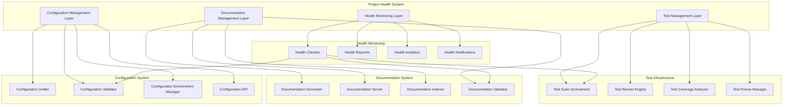

# Design Document

## Overview

This design addresses the critical project health issues identified in the WAN22 video generation system by implementing a comprehensive solution for test suite reliability, documentation consolidation, and configuration management unification. The solution will establish a robust foundation that improves maintainability, reduces deployment risks, and enhances developer productivity.

The design follows a modular approach where each component can be implemented independently while working together to create a cohesive project health system.

## Architecture

### High-Level Architecture



### Component Integration

The system integrates with existing project components:

- **Backend Services**: FastAPI application, model management, generation pipeline
- **Frontend**: React/Vite application, UI components
- **Infrastructure**: Startup management, deployment scripts
- **Development Tools**: Existing test files, documentation files, configuration files

## Components and Interfaces

### 1. Test Management System

#### Test Suite Orchestrator

```python
class TestSuiteOrchestrator:
    def __init__(self, config: TestConfig):
        self.config = config
        self.runners = {}
        self.coverage_analyzer = CoverageAnalyzer()

    async def run_full_suite(self) -> TestResults:
        """Run complete test suite with categorization"""

    async def run_category(self, category: TestCategory) -> CategoryResults:
        """Run specific test category (unit, integration, performance)"""

    def validate_test_health(self) -> HealthReport:
        """Check for broken, incomplete, or outdated tests"""
```

#### Test Categories

- **Unit Tests**: Component-level testing with mocking
- **Integration Tests**: Cross-component testing with real dependencies
- **Performance Tests**: Benchmarking and resource usage validation
- **End-to-End Tests**: Full workflow validation
- **Regression Tests**: Automated testing of previously fixed issues

#### Test Configuration

```yaml
# tests/config.yaml
test_categories:
  unit:
    timeout: 30
    parallel: true
    coverage_threshold: 70

  integration:
    timeout: 120
    parallel: false
    requires_services: [backend, database]

  performance:
    timeout: 300
    baseline_file: "performance_baselines.json"

  e2e:
    timeout: 600
    requires_full_stack: true
```

### 2. Documentation Management System

#### Documentation Structure

```
docs/
├── index.md                    # Main documentation entry point
├── user-guide/                 # User-facing documentation
│   ├── installation.md
│   ├── configuration.md
│   └── troubleshooting.md
├── developer-guide/            # Developer documentation
│   ├── architecture.md
│   ├── api-reference.md
│   └── contributing.md
├── deployment/                 # Deployment and operations
│   ├── production-setup.md
│   └── monitoring.md
└── api/                       # Auto-generated API docs
    ├── backend-api.md
    └── frontend-components.md
```

#### Documentation Generator

```python
class DocumentationGenerator:
    def __init__(self, source_dirs: List[Path], output_dir: Path):
        self.source_dirs = source_dirs
        self.output_dir = output_dir

    def generate_api_docs(self) -> None:
        """Auto-generate API documentation from code"""

    def consolidate_existing_docs(self) -> None:
        """Migrate and organize existing documentation"""

    def validate_links(self) -> ValidationReport:
        """Check for broken links and references"""

    def generate_search_index(self) -> None:
        """Create searchable documentation index"""
```

#### Documentation Server

- Static site generator (MkDocs or similar)
- Search functionality
- Version control integration
- Auto-deployment on documentation changes

### 3. Configuration Management System

#### Unified Configuration Schema

```python
@dataclass
class UnifiedConfig:
    # System-wide settings
    system: SystemConfig

    # Service configurations
    backend: BackendConfig
    frontend: FrontendConfig

    # Environment-specific overrides
    environments: Dict[str, EnvironmentConfig]

    # Feature flags
    features: FeatureFlags

    # Security settings
    security: SecurityConfig
```

#### Configuration Unifier

```python
class ConfigurationUnifier:
    def __init__(self, config_sources: List[Path]):
        self.config_sources = config_sources
        self.unified_config = None

    def migrate_existing_configs(self) -> MigrationReport:
        """Migrate scattered config files to unified system"""

    def validate_configuration(self, config: UnifiedConfig) -> ValidationResult:
        """Validate configuration values and dependencies"""

    def apply_environment_overrides(self, env: str) -> UnifiedConfig:
        """Apply environment-specific configuration"""

    def backup_configuration(self) -> Path:
        """Create configuration backup"""
```

#### Configuration API

```python
class ConfigurationAPI:
    def get_config(self, path: str) -> Any:
        """Get configuration value by path (e.g., 'backend.api.port')"""

    def set_config(self, path: str, value: Any) -> None:
        """Set configuration value with validation"""

    def reload_config(self) -> None:
        """Reload configuration from files"""

    def watch_changes(self, callback: Callable) -> None:
        """Watch for configuration file changes"""
```

### 4. Health Monitoring System

#### Health Checker

```python
class ProjectHealthChecker:
    def __init__(self, config: HealthConfig):
        self.config = config
        self.checkers = [
            TestHealthChecker(),
            DocumentationHealthChecker(),
            ConfigurationHealthChecker(),
            CodeQualityChecker()
        ]

    async def run_health_check(self) -> HealthReport:
        """Run comprehensive project health check"""

    def get_health_score(self) -> float:
        """Calculate overall project health score (0-100)"""

    def get_recommendations(self) -> List[Recommendation]:
        """Get actionable recommendations for improvements"""
```

#### Health Metrics

- **Test Health**: Pass rate, coverage, broken tests, execution time
- **Documentation Health**: Coverage, broken links, outdated content
- **Configuration Health**: Consistency, validation errors, security issues
- **Code Quality**: Complexity, maintainability, technical debt

## Data Models

### Test Results Model

```python
@dataclass
class TestResults:
    suite_id: str
    timestamp: datetime
    categories: Dict[str, CategoryResults]
    overall_summary: TestSummary
    coverage_report: CoverageReport
    performance_metrics: PerformanceMetrics

@dataclass
class CategoryResults:
    category: TestCategory
    total_tests: int
    passed_tests: int
    failed_tests: int
    skipped_tests: int
    duration: float
    test_details: List[TestDetail]
```

### Documentation Model

```python
@dataclass
class DocumentationIndex:
    pages: List[DocumentationPage]
    search_index: SearchIndex
    link_graph: LinkGraph
    last_updated: datetime

@dataclass
class DocumentationPage:
    path: Path
    title: str
    content: str
    metadata: Dict[str, Any]
    links: List[str]
    backlinks: List[str]
```

### Configuration Model

```python
@dataclass
class ConfigurationState:
    unified_config: UnifiedConfig
    source_files: List[Path]
    validation_results: ValidationResults
    environment_overrides: Dict[str, Any]
    last_modified: datetime
```

### Health Report Model

```python
@dataclass
class HealthReport:
    timestamp: datetime
    overall_score: float
    component_scores: Dict[str, float]
    issues: List[HealthIssue]
    recommendations: List[Recommendation]
    trends: HealthTrends

@dataclass
class HealthIssue:
    severity: Severity
    category: str
    description: str
    affected_components: List[str]
    remediation_steps: List[str]
```

## Error Handling

### Test System Error Handling

- **Test Failures**: Categorize and report with detailed diagnostics
- **Timeout Handling**: Graceful timeout with partial results
- **Resource Constraints**: Detect and adapt to system limitations
- **Dependency Issues**: Clear error messages for missing dependencies

### Documentation Error Handling

- **Build Failures**: Detailed error reporting with line numbers
- **Link Validation**: Comprehensive broken link detection and reporting
- **Content Validation**: Schema validation for documentation metadata

### Configuration Error Handling

- **Validation Errors**: Specific error messages with suggested fixes
- **Migration Issues**: Rollback capability and error recovery
- **Environment Conflicts**: Clear conflict resolution guidance

### Health Monitoring Error Handling

- **Check Failures**: Graceful degradation when individual checks fail
- **Notification Failures**: Fallback notification mechanisms
- **Data Collection Issues**: Partial health reports when data is incomplete

## Testing Strategy

### Test Infrastructure Testing

- **Unit Tests**: Test individual components of the test system
- **Integration Tests**: Validate test orchestration and reporting
- **Performance Tests**: Ensure test suite performance meets requirements
- **Meta-Tests**: Tests that validate the testing infrastructure itself

### Documentation System Testing

- **Generation Tests**: Validate documentation generation from various sources
- **Link Tests**: Automated link checking and validation
- **Search Tests**: Validate search functionality and indexing
- **Migration Tests**: Test documentation consolidation process

### Configuration System Testing

- **Validation Tests**: Test configuration validation logic
- **Migration Tests**: Validate configuration migration from existing files
- **Environment Tests**: Test environment-specific configuration handling
- **API Tests**: Validate configuration API functionality

### Health Monitoring Testing

- **Health Check Tests**: Validate individual health checkers
- **Reporting Tests**: Test health report generation and formatting
- **Notification Tests**: Validate health notification systems
- **Analytics Tests**: Test health trend analysis and scoring

### End-to-End Testing

- **Full System Tests**: Validate complete project health system
- **Integration Tests**: Test interaction between all components
- **Performance Tests**: Validate system performance under load
- **Regression Tests**: Prevent regression of fixed issues

## Implementation Phases

### Phase 1: Test Suite Foundation

1. Implement test orchestrator and runner engine
2. Categorize and fix existing broken tests
3. Establish test coverage baseline
4. Create test configuration system

### Phase 2: Documentation Consolidation

1. Implement documentation generator and consolidation
2. Create unified documentation structure
3. Migrate existing documentation
4. Establish documentation server

### Phase 3: Configuration Unification

1. Design and implement unified configuration schema
2. Create configuration migration tools
3. Implement configuration API and validation
4. Migrate existing configuration files

### Phase 4: Health Monitoring

1. Implement health checking system
2. Create health reporting and analytics
3. Establish health monitoring dashboard
4. Implement automated health notifications

### Phase 5: Integration and Optimization

1. Integrate all components
2. Optimize performance and reliability
3. Establish automated workflows
4. Create comprehensive documentation and training

## Git Structure and Organization

### Recommended Repository Structure

```
project-root/
├── .github/                    # GitHub workflows and templates
│   ├── workflows/
│   │   ├── test-suite.yml     # Automated test execution
│   │   ├── docs-build.yml     # Documentation building
│   │   ├── health-check.yml   # Project health monitoring
│   │   └── config-validation.yml # Configuration validation
│   └── ISSUE_TEMPLATE/
├── docs/                       # Centralized documentation
│   ├── index.md
│   ├── user-guide/
│   ├── developer-guide/
│   ├── deployment/
│   └── api/
├── tests/                      # Unified test suite
│   ├── unit/                   # Unit tests by component
│   ├── integration/            # Integration tests
│   ├── performance/            # Performance benchmarks
│   ├── e2e/                   # End-to-end tests
│   ├── fixtures/              # Test data and fixtures
│   ├── config/                # Test configuration
│   └── utils/                 # Test utilities
├── config/                     # Unified configuration
│   ├── base.yaml              # Base configuration
│   ├── environments/          # Environment-specific configs
│   │   ├── development.yaml
│   │   ├── staging.yaml
│   │   └── production.yaml
│   └── schemas/               # Configuration schemas
├── tools/                      # Project health tools
│   ├── health-checker/        # Health monitoring tools
│   ├── test-runner/           # Test orchestration
│   ├── doc-generator/         # Documentation tools
│   └── config-manager/        # Configuration management
├── scripts/                    # Utility scripts
│   ├── setup/                 # Setup and installation
│   ├── deployment/            # Deployment scripts
│   └── maintenance/           # Maintenance utilities
└── [existing project structure]
```

### Git Workflow Integration

#### Branch Strategy

- **main**: Production-ready code with full health checks
- **develop**: Integration branch for ongoing development
- **feature/**: Feature branches with health validation
- **hotfix/**: Critical fixes with expedited health checks

#### Pre-commit Hooks

```yaml
# .pre-commit-config.yaml
repos:
  - repo: local
    hooks:
      - id: test-health-check
        name: Test Health Check
        entry: tools/health-checker/pre-commit-tests.py
        language: python

      - id: config-validation
        name: Configuration Validation
        entry: tools/config-manager/validate-config.py
        language: python

      - id: doc-link-check
        name: Documentation Link Check
        entry: tools/doc-generator/check-links.py
        language: python
```

#### CI/CD Integration

- **Pull Request Checks**: Automated health validation on PRs
- **Merge Requirements**: Health score threshold for merging
- **Deployment Gates**: Health validation before deployment
- **Scheduled Health Checks**: Regular project health monitoring

## Updated Implementation Phases

### Phase 1: Git Structure and Test Suite Foundation

1. Reorganize repository structure according to recommended layout
2. Implement test orchestrator and runner engine
3. Categorize and fix existing broken tests
4. Establish test coverage baseline
5. Create test configuration system
6. Set up CI/CD workflows for automated testing

### Phase 2: Documentation Consolidation

1. Implement documentation generator and consolidation
2. Create unified documentation structure in `/docs`
3. Migrate existing documentation from scattered locations
4. Establish documentation server with automated building
5. Set up documentation validation in CI/CD

### Phase 3: Configuration Unification

1. Design and implement unified configuration schema
2. Create `/config` directory structure
3. Create configuration migration tools
4. Implement configuration API and validation
5. Migrate existing configuration files
6. Set up configuration validation in CI/CD

### Phase 4: Health Monitoring and Git Integration

1. Implement health checking system in `/tools/health-checker`
2. Create health reporting and analytics
3. Establish health monitoring dashboard
4. Implement automated health notifications
5. Set up pre-commit hooks and git workflow integration
6. Create branch protection rules based on health scores

### Phase 5: Integration and Optimization

1. Integrate all components with git workflows
2. Optimize performance and reliability
3. Establish automated workflows and deployment gates
4. Create comprehensive documentation and training
5. Set up monitoring and alerting for ongoing health
