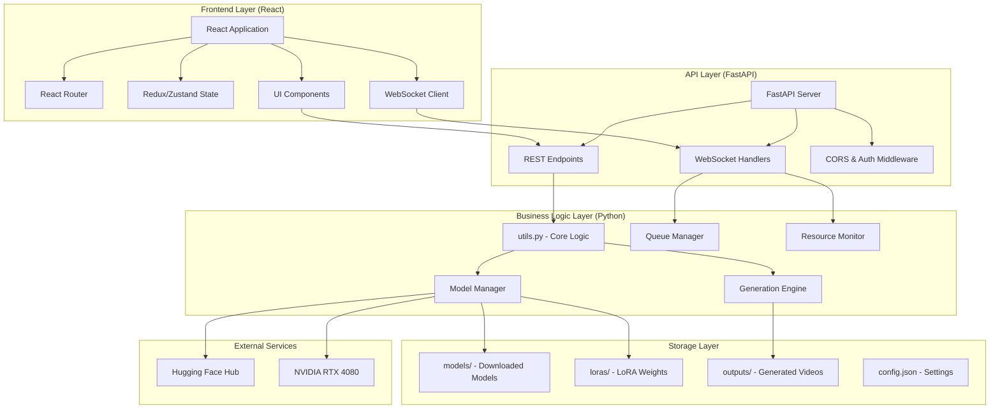

# Design Document

## Overview

The React Frontend with FastAPI Backend is a modern web application that replaces the existing Gradio interface for the Wan2.2 video generation system. The architecture separates the frontend and backend concerns, with a React-based client providing a professional user interface and a FastAPI server exposing the existing Python generation capabilities through RESTful APIs and WebSocket connections.

The system maintains all existing functionality while providing enhanced user experience through modern web technologies, responsive design, real-time updates, and professional UI components.

## Architecture

### System Architecture



### Technology Stack

#### Frontend Technologies

- **React 18**: Modern React with hooks and concurrent features
- **TypeScript**: Type safety and enhanced developer experience
- **Vite**: Fast build tool and development server
- **Tailwind CSS**: Utility-first CSS framework for rapid styling
- **Framer Motion**: Smooth animations and transitions
- **React Query/TanStack Query**: Server state management and caching
- **Zustand**: Lightweight client state management
- **React Hook Form**: Efficient form handling and validation
- **React Router**: Client-side routing
- **Socket.IO Client**: Real-time WebSocket communication

#### Backend Technologies

- **FastAPI**: Modern Python web framework with automatic API documentation
- **Pydantic**: Data validation and serialization
- **Socket.IO**: Real-time bidirectional communication
- **Uvicorn**: ASGI server for FastAPI
- **Python-multipart**: File upload handling
- **Existing Python modules**: Integration with current utils.py and generation system

## Components and Interfaces

### Frontend Components

#### Application Shell

```typescript
interface AppShellProps {
  children: React.ReactNode;
}

const AppShell: React.FC<AppShellProps> = ({ children }) => {
  // Navigation, theme provider, global state
};
```

**Features:**

- Responsive navigation sidebar
- Theme switching (light/dark mode)
- Global loading states
- Notification system
- Offline status indicator

#### Generation Interface

```typescript
interface GenerationFormData {
  modelType: "T2V-A14B" | "I2V-A14B" | "TI2V-5B";
  prompt: string;
  image?: File;
  resolution: string;
  steps: number;
  loraPath?: string;
  loraStrength: number;
}

const GenerationPanel: React.FC = () => {
  // Form handling, validation, API calls
};
```

**Features:**

- Dynamic form based on model type selection
- Drag-and-drop image upload with preview
- Real-time prompt character counter
- Prompt enhancement with diff display
- Resolution selector with visual previews
- Advanced settings collapsible panel

#### Queue Management

```typescript
interface QueueTask {
  id: string;
  modelType: string;
  prompt: string;
  status: "pending" | "processing" | "completed" | "failed";
  progress: number;
  estimatedTime?: number;
  createdAt: Date;
}

const QueueManager: React.FC = () => {
  // Queue display, task management, real-time updates
};
```

**Features:**

- Card-based task display
- Drag-and-drop reordering
- Real-time progress indicators
- Bulk operations (pause, cancel, retry)
- Task filtering and search

#### Resource Dashboard

```typescript
interface SystemMetrics {
  cpu: number;
  ram: { used: number; total: number };
  gpu: number;
  vram: { used: number; total: number };
  timestamp: Date;
}

const ResourceDashboard: React.FC = () => {
  // Real-time charts, alerts, historical data
};
```

**Features:**

- Interactive charts with Chart.js or Recharts
- Real-time updates via WebSocket
- Historical data with time range selection
- Resource usage alerts and warnings
- Performance recommendations

#### Media Gallery

```typescript
interface GeneratedVideo {
  id: string;
  filename: string;
  thumbnail: string;
  metadata: {
    prompt: string;
    modelType: string;
    resolution: string;
    duration: number;
    createdAt: Date;
  };
}

const MediaGallery: React.FC = () => {
  // Grid layout, lightbox, bulk operations
};
```

**Features:**

- Responsive masonry grid layout
- Lazy loading with intersection observer
- Lightbox with video player
- Metadata overlay and editing
- Bulk selection and operations
- Search and filtering

### Backend API Design

#### REST Endpoints

```python
from fastapi import FastAPI, UploadFile, File, Form
from pydantic import BaseModel
from typing import Optional, List

app = FastAPI(title="Wan2.2 Video Generation API")

class GenerationRequest(BaseModel):
    model_type: str
    prompt: str
    resolution: str = "1280x720"
    steps: int = 50
    lora_path: Optional[str] = None
    lora_strength: float = 1.0

class GenerationResponse(BaseModel):
    task_id: str
    status: str
    message: str

@app.post("/api/generate", response_model=GenerationResponse)
async def generate_video(
    request: GenerationRequest,
    image: Optional[UploadFile] = File(None)
):
    # Handle video generation request
    pass

@app.get("/api/queue", response_model=List[QueueTask])
async def get_queue():
    # Return current queue status
    pass

@app.get("/api/system/stats", response_model=SystemMetrics)
async def get_system_stats():
    # Return current system resource usage
    pass

@app.get("/api/outputs", response_model=List[GeneratedVideo])
async def get_outputs():
    # Return list of generated videos
    pass

@app.post("/api/prompt/enhance")
async def enhance_prompt(prompt: str):
    # Enhance prompt using existing enhancement system
    pass
```

#### WebSocket Handlers

```python
from fastapi import WebSocket
import socketio

sio = socketio.AsyncServer(cors_allowed_origins="*")

@sio.event
async def connect(sid, environ):
    print(f"Client {sid} connected")

@sio.event
async def disconnect(sid):
    print(f"Client {sid} disconnected")

# Real-time progress updates
async def emit_progress_update(task_id: str, progress: int):
    await sio.emit('progress_update', {
        'task_id': task_id,
        'progress': progress
    })

# Real-time system stats
async def emit_system_stats(stats: SystemMetrics):
    await sio.emit('system_stats', stats.dict())
```

### Data Models

#### Frontend State Models

```typescript
// Global application state
interface AppState {
  theme: "light" | "dark";
  isOnline: boolean;
  notifications: Notification[];
  user: User | null;
}

// Generation form state
interface GenerationState {
  formData: GenerationFormData;
  isSubmitting: boolean;
  errors: Record<string, string>;
  enhancedPrompt?: string;
}

// Queue state
interface QueueState {
  tasks: QueueTask[];
  isProcessing: boolean;
  totalTasks: number;
  completedTasks: number;
}

// System monitoring state
interface MonitoringState {
  currentStats: SystemMetrics;
  historicalData: SystemMetrics[];
  alerts: Alert[];
  isConnected: boolean;
}
```

#### Backend Data Models

```python
from pydantic import BaseModel, Field
from typing import Optional, List
from datetime import datetime
from enum import Enum

class ModelType(str, Enum):
    T2V_A14B = "T2V-A14B"
    I2V_A14B = "I2V-A14B"
    TI2V_5B = "TI2V-5B"

class TaskStatus(str, Enum):
    PENDING = "pending"
    PROCESSING = "processing"
    COMPLETED = "completed"
    FAILED = "failed"

class GenerationTask(BaseModel):
    id: str
    model_type: ModelType
    prompt: str
    image_path: Optional[str] = None
    resolution: str = "1280x720"
    steps: int = 50
    lora_path: Optional[str] = None
    lora_strength: float = 1.0
    status: TaskStatus = TaskStatus.PENDING
    progress: int = 0
    created_at: datetime
    completed_at: Optional[datetime] = None
    output_path: Optional[str] = None
    error_message: Optional[str] = None

class SystemStats(BaseModel):
    cpu_percent: float
    ram_used_gb: float
    ram_total_gb: float
    gpu_percent: float
    vram_used_mb: float
    vram_total_mb: float
    timestamp: datetime
```

## Error Handling

### Frontend Error Handling

#### Error Boundary Component

```typescript
class ErrorBoundary extends React.Component<
  { children: React.ReactNode },
  { hasError: boolean; error?: Error }
> {
  constructor(props: any) {
    super(props);
    this.state = { hasError: false };
  }

  static getDerivedStateFromError(error: Error) {
    return { hasError: true, error };
  }

  componentDidCatch(error: Error, errorInfo: React.ErrorInfo) {
    console.error("Error caught by boundary:", error, errorInfo);
    // Send error to monitoring service
  }

  render() {
    if (this.state.hasError) {
      return <ErrorFallback error={this.state.error} />;
    }
    return this.props.children;
  }
}
```

#### API Error Handling

```typescript
class ApiError extends Error {
  constructor(
    public status: number,
    public message: string,
    public details?: any
  ) {
    super(message);
  }
}

const apiClient = {
  async request<T>(url: string, options?: RequestInit): Promise<T> {
    try {
      const response = await fetch(url, options);

      if (!response.ok) {
        const errorData = await response.json();
        throw new ApiError(response.status, errorData.message, errorData);
      }

      return await response.json();
    } catch (error) {
      if (error instanceof ApiError) {
        throw error;
      }
      throw new ApiError(0, "Network error", error);
    }
  },
};
```

### Backend Error Handling

#### Custom Exception Handlers

```python
from fastapi import HTTPException, Request
from fastapi.responses import JSONResponse
from fastapi.exceptions import RequestValidationError

class GenerationError(Exception):
    def __init__(self, message: str, error_type: str = "generation_error"):
        self.message = message
        self.error_type = error_type
        super().__init__(self.message)

@app.exception_handler(GenerationError)
async def generation_error_handler(request: Request, exc: GenerationError):
    return JSONResponse(
        status_code=400,
        content={
            "error": exc.error_type,
            "message": exc.message,
            "suggestions": get_error_suggestions(exc.error_type)
        }
    )

@app.exception_handler(RequestValidationError)
async def validation_error_handler(request: Request, exc: RequestValidationError):
    return JSONResponse(
        status_code=422,
        content={
            "error": "validation_error",
            "message": "Invalid request data",
            "details": exc.errors()
        }
    )
```

## Testing Strategy

### Frontend Testing

#### Unit Testing with Jest and React Testing Library

```typescript
// Component testing
describe("GenerationPanel", () => {
  test("should show image upload when I2V model is selected", () => {
    render(<GenerationPanel />);

    const modelSelect = screen.getByLabelText("Model Type");
    fireEvent.change(modelSelect, { target: { value: "I2V-A14B" } });

    expect(screen.getByText("Upload Image")).toBeInTheDocument();
  });

  test("should validate prompt length", async () => {
    render(<GenerationPanel />);

    const promptInput = screen.getByLabelText("Prompt");
    fireEvent.change(promptInput, {
      target: { value: "a".repeat(501) },
    });

    await waitFor(() => {
      expect(
        screen.getByText("Prompt must be 500 characters or less")
      ).toBeInTheDocument();
    });
  });
});
```

#### Integration Testing with Cypress

```typescript
// E2E testing
describe("Video Generation Flow", () => {
  it("should complete T2V generation workflow", () => {
    cy.visit("/");

    // Select T2V model
    cy.get('[data-testid="model-select"]').select("T2V-A14B");

    // Enter prompt
    cy.get('[data-testid="prompt-input"]').type(
      "A beautiful sunset over mountains"
    );

    // Start generation
    cy.get('[data-testid="generate-button"]').click();

    // Verify task appears in queue
    cy.get('[data-testid="queue-panel"]').should(
      "contain",
      "A beautiful sunset"
    );

    // Wait for completion (with timeout)
    cy.get('[data-testid="task-status"]', { timeout: 600000 }).should(
      "contain",
      "completed"
    );
  });
});
```

### Backend Testing

#### API Testing with pytest and httpx

```python
import pytest
from httpx import AsyncClient
from fastapi.testclient import TestClient

@pytest.mark.asyncio
async def test_generate_video_endpoint():
    async with AsyncClient(app=app, base_url="http://test") as ac:
        response = await ac.post("/api/generate", json={
            "model_type": "T2V-A14B",
            "prompt": "Test prompt",
            "resolution": "1280x720"
        })

    assert response.status_code == 200
    data = response.json()
    assert "task_id" in data
    assert data["status"] == "pending"

def test_queue_endpoint():
    with TestClient(app) as client:
        response = client.get("/api/queue")
        assert response.status_code == 200
        assert isinstance(response.json(), list)
```

## Performance Considerations

### Frontend Performance

#### Code Splitting and Lazy Loading

```typescript
// Route-based code splitting
const GenerationPanel = lazy(() => import("./components/GenerationPanel"));
const QueueManager = lazy(() => import("./components/QueueManager"));
const MediaGallery = lazy(() => import("./components/MediaGallery"));

// Component lazy loading
const LazyVideoPlayer = lazy(() => import("./components/VideoPlayer"));

// Image lazy loading
const LazyImage: React.FC<{ src: string; alt: string }> = ({ src, alt }) => {
  const [isLoaded, setIsLoaded] = useState(false);
  const [isInView, setIsInView] = useState(false);

  const imgRef = useRef<HTMLImageElement>(null);

  useEffect(() => {
    const observer = new IntersectionObserver(
      ([entry]) => setIsInView(entry.isIntersecting),
      { threshold: 0.1 }
    );

    if (imgRef.current) observer.observe(imgRef.current);

    return () => observer.disconnect();
  }, []);

  return (
     setIsLoaded(true)}
      className={`transition-opacity ${isLoaded ? "opacity-100" : "opacity-0"}`}
    />
  );
};
```

#### State Management Optimization

```typescript
// Optimized state updates with Zustand
interface AppStore {
  tasks: QueueTask[];
  addTask: (task: QueueTask) => void;
  updateTask: (id: string, updates: Partial<QueueTask>) => void;
  removeTask: (id: string) => void;
}

const useAppStore = create<AppStore>((set) => ({
  tasks: [],
  addTask: (task) =>
    set((state) => ({
      tasks: [...state.tasks, task],
    })),
  updateTask: (id, updates) =>
    set((state) => ({
      tasks: state.tasks.map((task) =>
        task.id === id ? { ...task, ...updates } : task
      ),
    })),
  removeTask: (id) =>
    set((state) => ({
      tasks: state.tasks.filter((task) => task.id !== id),
    })),
}));
```

### Backend Performance

#### Async Processing and Background Tasks

```python
import asyncio
from concurrent.futures import ThreadPoolExecutor
from fastapi import BackgroundTasks

# Thread pool for CPU-intensive tasks
executor = ThreadPoolExecutor(max_workers=4)

@app.post("/api/generate")
async def generate_video(
    request: GenerationRequest,
    background_tasks: BackgroundTasks,
    image: Optional[UploadFile] = File(None)
):
    # Create task immediately
    task_id = str(uuid.uuid4())
    task = GenerationTask(
        id=task_id,
        model_type=request.model_type,
        prompt=request.prompt,
        **request.dict(exclude={'model_type', 'prompt'})
    )

    # Add to queue
    queue_manager.add_task(task)

    # Start background processing
    background_tasks.add_task(process_generation_task, task_id)

    return GenerationResponse(
        task_id=task_id,
        status="pending",
        message="Task added to queue"
    )

async def process_generation_task(task_id: str):
    """Process generation task in background"""
    try:
        task = queue_manager.get_task(task_id)

        # Update status
        await emit_progress_update(task_id, 0)

        # Run generation in thread pool
        loop = asyncio.get_event_loop()
        result = await loop.run_in_executor(
            executor,
            run_generation,
            task
        )

        # Update completion status
        task.status = TaskStatus.COMPLETED
        task.output_path = result.output_path
        await emit_progress_update(task_id, 100)

    except Exception as e:
        task.status = TaskStatus.FAILED
        task.error_message = str(e)
        await emit_progress_update(task_id, -1)
```

#### Caching and Response Optimization

```python
from functools import lru_cache
from fastapi_cache import FastAPICache
from fastapi_cache.decorator import cache

# Memory caching for system stats
@lru_cache(maxsize=1)
def get_cached_system_stats(timestamp_minute: int) -> SystemStats:
    """Cache system stats for 1 minute"""
    return collect_system_stats()

@app.get("/api/system/stats")
@cache(expire=5)  # Cache for 5 seconds
async def get_system_stats():
    current_minute = int(time.time() // 60)
    return get_cached_system_stats(current_minute)

# Response compression
from fastapi.middleware.gzip import GZipMiddleware
app.add_middleware(GZipMiddleware, minimum_size=1000)
```

This design provides a comprehensive foundation for implementing a modern React frontend with FastAPI backend that maintains all existing functionality while providing an enhanced user experience through professional UI components, real-time updates, and responsive design.
