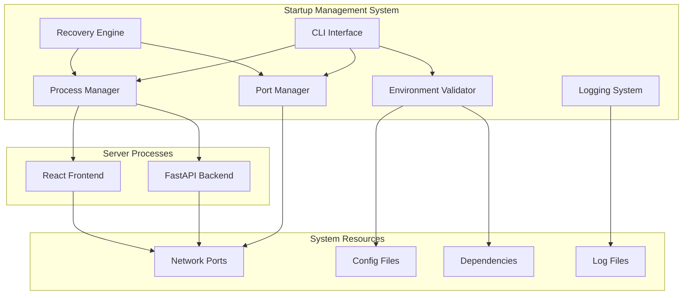

# Design Document

## Overview

The Server Startup Management System is a comprehensive solution for handling the complexities of starting and managing the WAN22 application's dual-server architecture (FastAPI backend + React frontend) on Windows development environments. The system addresses common issues like port conflicts, permission errors, dependency validation, and provides intelligent recovery mechanisms.

The design focuses on creating a robust, user-friendly startup experience that can handle various edge cases while providing clear feedback and automated solutions to common problems.

## Architecture

### System Architecture



### Component Design

#### 1. Environment Validator

**Purpose**: Validates system requirements and configuration before server startup

**Key Features**:

- Dependency checking (Python, Node.js, npm versions)
- Virtual environment detection and activation
- Configuration file validation and repair
- System resource availability checks

```python
class EnvironmentValidator:
    def __init__(self):
        self.checks = []
        self.fixes = []

    def validate_python_environment(self) -> ValidationResult:
        """Check Python version, virtual env, and backend dependencies"""
        pass

    def validate_node_environment(self) -> ValidationResult:
        """Check Node.js version and frontend dependencies"""
        pass

    def validate_configuration(self) -> ValidationResult:
        """Validate config.json and other configuration files"""
        pass

    def auto_fix_issues(self, issues: List[ValidationIssue]) -> FixResult:
        """Attempt to automatically fix detected issues"""
        pass
```

#### 2. Port Manager

**Purpose**: Handles port allocation, conflict detection, and resolution

**Key Features**:

- Port availability checking
- Automatic port assignment
- Firewall exception detection
- Port conflict resolution

```python
class PortManager:
    def __init__(self):
        self.default_ports = {"backend": 8000, "frontend": 3000}
        self.allocated_ports = {}

    def check_port_availability(self, port: int) -> bool:
        """Check if a specific port is available"""
        pass

    def find_available_port(self, start_port: int, max_attempts: int = 100) -> int:
        """Find next available port starting from given port"""
        pass

    def detect_port_conflicts(self) -> List[PortConflict]:
        """Detect what processes are using required ports"""
        pass

    def resolve_conflicts(self, conflicts: List[PortConflict]) -> ResolutionResult:
        """Attempt to resolve port conflicts automatically"""
        pass
```

#### 3. Process Manager

**Purpose**: Manages server process lifecycle with health monitoring

**Key Features**:

- Process startup and shutdown
- Health monitoring
- Automatic restart on failure
- Clean process termination

```python
class ProcessManager:
    def __init__(self):
        self.processes = {}
        self.health_monitors = {}

    def start_backend(self, port: int, config: BackendConfig) -> ProcessResult:
        """Start FastAPI backend server"""
        pass

    def start_frontend(self, port: int, config: FrontendConfig) -> ProcessResult:
        """Start React development server"""
        pass

    def monitor_health(self, process_name: str) -> HealthStatus:
        """Monitor process health and responsiveness"""
        pass

    def graceful_shutdown(self, process_name: str) -> bool:
        """Gracefully shutdown a process"""
        pass
```

#### 4. Recovery Engine

**Purpose**: Implements intelligent retry and recovery mechanisms

**Key Features**:

- Exponential backoff retry logic
- Failure pattern detection
- Automatic recovery strategies
- Fallback configurations

```python
class RecoveryEngine:
    def __init__(self):
        self.retry_strategies = {}
        self.failure_patterns = {}

    def implement_retry_strategy(self, operation: str, max_attempts: int = 3) -> RetryResult:
        """Implement exponential backoff retry for operations"""
        pass

    def detect_failure_patterns(self, errors: List[Error]) -> List[FailurePattern]:
        """Analyze errors to detect common failure patterns"""
        pass

    def suggest_recovery_actions(self, failure: FailurePattern) -> List[RecoveryAction]:
        """Suggest specific recovery actions based on failure type"""
        pass
```

## Components and Interfaces

### CLI Interface Design

#### Main Startup Script (Enhanced start_both_servers.bat)

```batch
@echo off
setlocal enabledelayedexpansion

echo ========================================
echo WAN22 Server Startup Manager v2.0
echo ========================================
echo.

REM Check if Python startup manager exists, if not fall back to basic mode
if exist "scripts\startup_manager.py" (
    echo Using advanced startup manager...
    python scripts\startup_manager.py %*
) else (
    echo Using basic startup mode...
    call :basic_startup
)

goto :end

:basic_startup
echo Starting servers in basic mode...
REM Existing basic startup logic as fallback
goto :eof

:end
pause
```

#### Python Startup Manager

```python
class StartupManager:
    def __init__(self):
        self.validator = EnvironmentValidator()
        self.port_manager = PortManager()
        self.process_manager = ProcessManager()
        self.recovery_engine = RecoveryEngine()
        self.logger = StartupLogger()

    def run(self, args: StartupArgs) -> StartupResult:
        """Main startup orchestration method"""
        try:
            # Phase 1: Environment validation
            validation_result = self.validator.validate_all()
            if not validation_result.is_valid:
                self.handle_validation_failures(validation_result)

            # Phase 2: Port management
            ports = self.port_manager.allocate_ports()

            # Phase 3: Process startup
            backend_result = self.process_manager.start_backend(ports.backend)
            frontend_result = self.process_manager.start_frontend(ports.frontend)

            # Phase 4: Health verification
            self.verify_startup_success(backend_result, frontend_result)

            return StartupResult.success(ports)

        except Exception as e:
            return self.recovery_engine.handle_startup_failure(e)
```

### Configuration Management

#### Startup Configuration Schema

```python
from pydantic import BaseModel
from typing import Optional, Dict, List

class ServerConfig(BaseModel):
    host: str = "localhost"
    port: Optional[int] = None
    auto_port: bool = True
    timeout: int = 30

class BackendConfig(ServerConfig):
    port: Optional[int] = 8000
    reload: bool = True
    log_level: str = "info"
    workers: int = 1

class FrontendConfig(ServerConfig):
    port: Optional[int] = 3000
    open_browser: bool = True
    hot_reload: bool = True

class StartupConfig(BaseModel):
    backend: BackendConfig = BackendConfig()
    frontend: FrontendConfig = FrontendConfig()
    retry_attempts: int = 3
    retry_delay: float = 2.0
    verbose_logging: bool = False
    auto_fix_issues: bool = True

    class Config:
        env_prefix = "WAN22_"
```

### Error Handling and Recovery

#### Error Classification System

```python
from enum import Enum
from dataclasses import dataclass
from typing import List, Optional

class ErrorType(Enum):
    PORT_CONFLICT = "port_conflict"
    PERMISSION_DENIED = "permission_denied"
    DEPENDENCY_MISSING = "dependency_missing"
    CONFIG_INVALID = "config_invalid"
    PROCESS_FAILED = "process_failed"
    NETWORK_ERROR = "network_error"

@dataclass
class StartupError:
    type: ErrorType
    message: str
    details: Optional[Dict] = None
    suggested_actions: List[str] = None
    auto_fixable: bool = False

class ErrorHandler:
    def __init__(self):
        self.error_patterns = {
            "WinError 10013": ErrorType.PERMISSION_DENIED,
            "Address already in use": ErrorType.PORT_CONFLICT,
            "ModuleNotFoundError": ErrorType.DEPENDENCY_MISSING,
        }

    def classify_error(self, error: Exception) -> StartupError:
        """Classify error and provide recovery suggestions"""
        error_str = str(error)

        for pattern, error_type in self.error_patterns.items():
            if pattern in error_str:
                return self.create_error_response(error_type, error_str)

        return StartupError(
            type=ErrorType.PROCESS_FAILED,
            message=error_str,
            suggested_actions=["Check logs for more details", "Try restarting"]
        )

    def create_error_response(self, error_type: ErrorType, message: str) -> StartupError:
        """Create detailed error response with recovery actions"""
        if error_type == ErrorType.PERMISSION_DENIED:
            return StartupError(
                type=error_type,
                message="Socket access forbidden - likely firewall or permission issue",
                suggested_actions=[
                    "Run as administrator",
                    "Add firewall exception for Python/Node.js",
                    "Try different port range (8080-8090)",
                    "Check Windows Defender settings"
                ],
                auto_fixable=True
            )
        elif error_type == ErrorType.PORT_CONFLICT:
            return StartupError(
                type=error_type,
                message="Port already in use by another process",
                suggested_actions=[
                    "Kill existing process",
                    "Use different port",
                    "Check for zombie processes"
                ],
                auto_fixable=True
            )
        # Add more error types...
```

### Logging and Monitoring

#### Structured Logging System

```python
import logging
from datetime import datetime
from pathlib import Path
from typing import Dict, Any

class StartupLogger:
    def __init__(self, log_dir: Path = Path("logs")):
        self.log_dir = log_dir
        self.log_dir.mkdir(exist_ok=True)

        # Create timestamped log file
        timestamp = datetime.now().strftime("%Y%m%d_%H%M%S")
        self.log_file = self.log_dir / f"startup_{timestamp}.log"

        self.setup_logging()

    def setup_logging(self):
        """Configure structured logging"""
        logging.basicConfig(
            level=logging.INFO,
            format='%(asctime)s - %(name)s - %(levelname)s - %(message)s',
            handlers=[
                logging.FileHandler(self.log_file),
                logging.StreamHandler()
            ]
        )
        self.logger = logging.getLogger("StartupManager")

    def log_startup_phase(self, phase: str, details: Dict[str, Any]):
        """Log startup phase with structured data"""
        self.logger.info(f"PHASE: {phase}", extra={"phase_details": details})

    def log_error_with_context(self, error: Exception, context: Dict[str, Any]):
        """Log error with full context for debugging"""
        self.logger.error(
            f"ERROR: {str(error)}",
            extra={"error_context": context, "error_type": type(error).__name__}
        )
```

### User Interface Design

#### Interactive CLI Interface

```python
import click
from rich.console import Console
from rich.progress import Progress, SpinnerColumn, TextColumn
from rich.prompt import Confirm, Prompt

class InteractiveCLI:
    def __init__(self):
        self.console = Console()

    def display_startup_banner(self):
        """Display attractive startup banner"""
        self.console.print("""
[bold blue]╔══════════════════════════════════════╗[/bold blue]
[bold blue]║        WAN22 Startup Manager         ║[/bold blue]
[bold blue]║     Intelligent Server Management    ║[/bold blue]
[bold blue]╚══════════════════════════════════════╝[/bold blue]
        """)

    def show_progress(self, description: str):
        """Show progress spinner for long operations"""
        return Progress(
            SpinnerColumn(),
            TextColumn("[progress.description]{task.description}"),
            console=self.console
        )

    def prompt_for_action(self, message: str, choices: List[str]) -> str:
        """Prompt user for action with validation"""
        return Prompt.ask(
            message,
            choices=choices,
            default=choices[0]
        )

    def confirm_action(self, message: str) -> bool:
        """Get user confirmation for actions"""
        return Confirm.ask(message)

    def display_error_with_solutions(self, error: StartupError):
        """Display error with suggested solutions"""
        self.console.print(f"[bold red]Error:[/bold red] {error.message}")

        if error.suggested_actions:
            self.console.print("\n[bold yellow]Suggested solutions:[/bold yellow]")
            for i, action in enumerate(error.suggested_actions, 1):
                self.console.print(f"  {i}. {action}")

        if error.auto_fixable:
            if self.confirm_action("Would you like me to try fixing this automatically?"):
                return "auto_fix"

        return self.prompt_for_action(
            "What would you like to do?",
            ["retry", "manual_fix", "exit"]
        )
```

## Data Models

### Core Data Structures

```python
from dataclasses import dataclass
from typing import Optional, List, Dict
from datetime import datetime
from enum import Enum

class ProcessStatus(Enum):
    STARTING = "starting"
    RUNNING = "running"
    FAILED = "failed"
    STOPPED = "stopped"

@dataclass
class ProcessInfo:
    name: str
    pid: Optional[int]
    port: int
    status: ProcessStatus
    start_time: Optional[datetime]
    health_check_url: str
    log_file: str

@dataclass
class PortAllocation:
    backend: int
    frontend: int
    conflicts_resolved: List[str]
    alternative_ports_used: bool

@dataclass
class ValidationResult:
    is_valid: bool
    issues: List[str]
    fixes_applied: List[str]
    warnings: List[str]

@dataclass
class StartupResult:
    success: bool
    ports: Optional[PortAllocation]
    processes: List[ProcessInfo]
    errors: List[StartupError]
    duration: float

    @classmethod
    def success(cls, ports: PortAllocation, processes: List[ProcessInfo] = None):
        return cls(
            success=True,
            ports=ports,
            processes=processes or [],
            errors=[],
            duration=0.0
        )

    @classmethod
    def failure(cls, errors: List[StartupError]):
        return cls(
            success=False,
            ports=None,
            processes=[],
            errors=errors,
            duration=0.0
        )
```

## Testing Strategy

### Unit Testing

```python
import pytest
from unittest.mock import Mock, patch
from startup_manager import StartupManager, PortManager

class TestPortManager:
    def test_port_availability_check(self):
        port_manager = PortManager()

        # Test available port
        with patch('socket.socket') as mock_socket:
            mock_socket.return_value.__enter__.return_value.bind.return_value = None
            assert port_manager.check_port_availability(8000) == True

    def test_port_conflict_detection(self):
        port_manager = PortManager()

        with patch('psutil.net_connections') as mock_connections:
            mock_connections.return_value = [
                Mock(laddr=Mock(port=8000), pid=1234)
            ]
            conflicts = port_manager.detect_port_conflicts()
            assert len(conflicts) > 0

class TestEnvironmentValidator:
    def test_python_version_check(self):
        validator = EnvironmentValidator()

        with patch('sys.version_info', (3, 8, 0)):
            result = validator.validate_python_environment()
            assert result.is_valid == True

    def test_missing_dependencies(self):
        validator = EnvironmentValidator()

        with patch('importlib.import_module', side_effect=ImportError):
            result = validator.validate_python_environment()
            assert result.is_valid == False
            assert "dependency_missing" in [issue.type for issue in result.issues]
```

### Integration Testing

```python
class TestStartupIntegration:
    def test_full_startup_flow(self):
        """Test complete startup flow with mocked servers"""
        startup_manager = StartupManager()

        with patch.multiple(
            startup_manager.process_manager,
            start_backend=Mock(return_value=ProcessResult.success()),
            start_frontend=Mock(return_value=ProcessResult.success())
        ):
            result = startup_manager.run(StartupArgs())
            assert result.success == True
            assert result.ports is not None

    def test_port_conflict_recovery(self):
        """Test automatic port conflict resolution"""
        startup_manager = StartupManager()

        # Simulate port 8000 being occupied
        with patch.object(startup_manager.port_manager, 'check_port_availability') as mock_check:
            mock_check.side_effect = lambda port: port != 8000

            result = startup_manager.run(StartupArgs())
            assert result.success == True
            assert result.ports.backend != 8000  # Should use alternative port
```

## Performance Considerations

### Startup Time Optimization

- **Parallel Validation**: Run environment checks concurrently where possible
- **Cached Results**: Cache dependency validation results to avoid repeated checks
- **Fast Port Scanning**: Use efficient port scanning algorithms
- **Lazy Loading**: Load heavy components only when needed

### Resource Management

- **Memory Usage**: Minimize memory footprint during startup process
- **Process Cleanup**: Ensure proper cleanup of failed processes
- **File Handle Management**: Properly manage log files and temporary files
- **Network Resource**: Minimize network calls during startup validation

### Error Recovery Performance

- **Smart Retry Logic**: Implement exponential backoff to avoid overwhelming system
- **Failure Pattern Caching**: Cache common failure patterns to speed up diagnosis
- **Parallel Recovery**: Attempt multiple recovery strategies simultaneously when safe

This design provides a comprehensive foundation for creating a robust server startup management system that addresses the common issues developers face when working with the WAN22 application's dual-server architecture on Windows systems.
