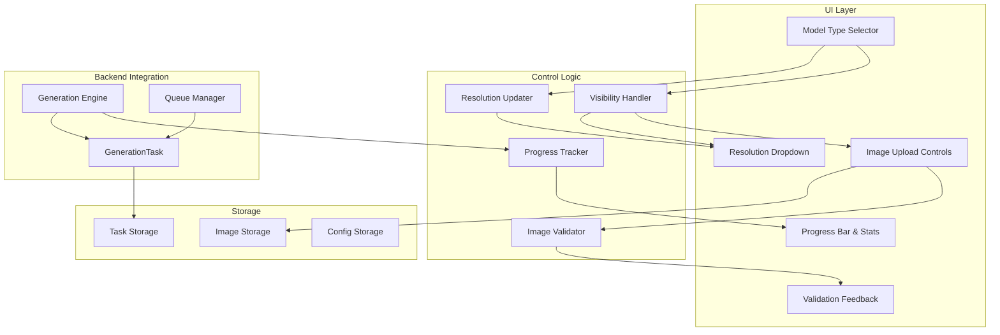

# Design Document

## Overview

The Wan2.2 Start/End Image Fix is designed to address critical UI issues where the start and end image upload functionality is not properly visible or functioning in the current implementation. The system will enhance the existing Gradio-based interface to properly display image upload controls for I2V and TI2V modes, implement proper resolution dropdown updates, and add comprehensive progress tracking with statistics during video generation.

The design focuses on fixing the existing UI components while maintaining backward compatibility with the current generation pipeline and queue system.

## Architecture

### System Architecture



### Component Interaction Flow

1. **Model Selection**: User selects model type → Visibility Handler updates UI components
2. **Image Upload**: User uploads images → Image Validator processes → Feedback displayed
3. **Resolution Update**: Model type changes → Resolution Updater modifies dropdown options
4. **Generation Start**: User initiates generation → Progress Tracker begins monitoring
5. **Progress Updates**: Generation engine reports progress → Progress Bar updates in real-time

## Components and Interfaces

### UI Components

#### Enhanced Image Upload Controls

**Purpose**: Provide intuitive image upload interface with proper visibility control

**Key Methods**:

- `update_image_visibility(model_type)`: Show/hide image controls based on model selection
- `validate_image_upload(image, image_type)`: Validate uploaded images with detailed feedback
- `display_image_preview(image)`: Show thumbnail previews with metadata
- `clear_image_upload(image_type)`: Reset upload areas and clear validation messages

**Interface**:

```python
class ImageUploadControls:
    def __init__(self, config: Dict[str, Any]):
        self.start_image_input: gr.Image
        self.end_image_input: gr.Image
        self.image_inputs_row: gr.Row
        self.validation_displays: Dict[str, gr.HTML]

    def update_visibility(self, model_type: str) -> Tuple[gr.update, gr.update]:
        """Update visibility based on model type selection"""

    def validate_upload(self, image: PIL.Image, image_type: str) -> ValidationResult:
        """Validate uploaded image and return feedback"""
```

#### Dynamic Resolution Dropdown

**Purpose**: Provide model-specific resolution options with automatic updates

**Key Methods**:

- `get_resolution_options(model_type)`: Return supported resolutions for model
- `update_resolution_dropdown(model_type)`: Refresh dropdown choices
- `validate_resolution_compatibility(resolution, model_type)`: Check resolution support

**Interface**:

```python
class ResolutionDropdown:
    RESOLUTION_MAP = {
        't2v-A14B': ['854x480', '480x854', '1280x720', '1280x704', '1920x1080'],
        'i2v-A14B': ['854x480', '480x854', '1280x720', '1280x704', '1920x1080'],
        'ti2v-5B': ['854x480', '480x854', '1280x720', '1280x704', '1920x1080', '1024x1024']
    }

    def update_options(self, model_type: str) -> gr.update:
        """Update dropdown with model-specific resolutions"""
```

#### Progress Bar with Statistics

**Purpose**: Display real-time generation progress with detailed statistics

**Key Methods**:

- `start_progress_tracking(task_id)`: Initialize progress monitoring
- `update_progress(step, total_steps, stats)`: Update progress display
- `display_generation_stats(stats)`: Show detailed generation statistics
- `complete_progress_tracking(final_stats)`: Display completion summary

**Interface**:

```python
class ProgressTracker:
    def __init__(self):
        self.progress_bar: gr.Progress
        self.stats_display: gr.HTML
        self.current_task: Optional[str] = None

    def update_display(self, progress_data: ProgressData) -> str:
        """Generate HTML for progress statistics display"""

    def format_statistics(self, stats: GenerationStats) -> str:
        """Format generation statistics for display"""
```

### Backend Components

#### Image Validation System

**Purpose**: Comprehensive validation of uploaded images with detailed feedback

**Key Methods**:

- `validate_image_format(image)`: Check file format compatibility
- `validate_image_dimensions(image)`: Verify minimum size requirements
- `validate_aspect_ratio_compatibility(start_image, end_image)`: Check image compatibility
- `generate_validation_feedback(validation_result)`: Create user-friendly feedback

**Interface**:

```python
@dataclass
class ValidationResult:
    is_valid: bool
    message: str
    details: Dict[str, Any]
    suggestions: List[str]

class ImageValidator:
    MIN_DIMENSIONS = (256, 256)
    SUPPORTED_FORMATS = ['PNG', 'JPEG', 'JPG', 'WEBP']

    def validate_comprehensive(self, image: PIL.Image, image_type: str) -> ValidationResult:
        """Perform comprehensive image validation"""
```

#### Enhanced Generation Task

**Purpose**: Extended GenerationTask to properly handle image data and progress tracking

**Key Methods**:

- `store_image_data(start_image, end_image)`: Safely store image references
- `get_generation_parameters()`: Return complete parameter set including images
- `update_progress(progress_data)`: Update task progress information
- `serialize_for_queue()`: Prepare task for queue storage

**Interface**:

```python
@dataclass
class EnhancedGenerationTask(GenerationTask):
    start_image: Optional[PIL.Image] = None
    end_image: Optional[PIL.Image] = None
    progress_data: Optional[ProgressData] = None
    validation_results: Dict[str, ValidationResult] = field(default_factory=dict)

    def has_images(self) -> bool:
        """Check if task includes image data"""

    def get_image_summary(self) -> str:
        """Get summary of included images"""
```

#### Progress Data Collection

**Purpose**: Collect and format generation progress information

**Key Methods**:

- `collect_generation_stats()`: Gather current generation statistics
- `calculate_eta(current_step, total_steps, elapsed_time)`: Estimate completion time
- `format_progress_message(stats)`: Create progress display message
- `track_performance_metrics()`: Monitor generation performance

**Interface**:

```python
@dataclass
class ProgressData:
    current_step: int
    total_steps: int
    progress_percentage: float
    elapsed_time: float
    estimated_remaining: float
    current_phase: str
    frames_processed: int
    processing_speed: float

class ProgressCollector:
    def collect_stats(self, generation_context) -> ProgressData:
        """Collect comprehensive progress statistics"""
```

## Data Models

### Enhanced UI State Model

```python
@dataclass
class UIState:
    selected_model_type: str = 't2v-A14B'
    start_image: Optional[PIL.Image] = None
    end_image: Optional[PIL.Image] = None
    image_validation_results: Dict[str, ValidationResult] = field(default_factory=dict)
    selected_resolution: str = '1280x720'
    available_resolutions: List[str] = field(default_factory=list)
    generation_in_progress: bool = False
    current_progress: Optional[ProgressData] = None
```

### Image Metadata Model

```python
@dataclass
class ImageMetadata:
    filename: str
    format: str
    dimensions: Tuple[int, int]
    file_size: int
    aspect_ratio: float
    upload_timestamp: datetime
    validation_status: str
```

### Progress Statistics Model

```python
@dataclass
class GenerationStats:
    start_time: datetime
    current_time: datetime
    elapsed_seconds: float
    estimated_total_seconds: float
    current_step: int
    total_steps: int
    current_phase: str
    frames_processed: int
    frames_per_second: float
    memory_usage_mb: float
    gpu_utilization_percent: float
```

## Error Handling

### Image Upload Error Handling

#### Invalid Format Errors

- **Detection**: Check file extension and PIL format detection
- **Response**: Display format requirements with supported types list
- **Recovery**: Suggest format conversion tools or alternative files

#### Dimension Validation Errors

- **Detection**: Check image width/height against minimum requirements
- **Response**: Show current dimensions vs. required minimums
- **Recovery**: Suggest image resizing or alternative images

#### Aspect Ratio Compatibility Errors

- **Detection**: Compare start and end image aspect ratios
- **Response**: Display both aspect ratios with compatibility warning
- **Recovery**: Suggest cropping or padding to match ratios

### Resolution Update Errors

#### Model Compatibility Errors

- **Detection**: Check if selected resolution is supported by model
- **Response**: Automatically select closest supported resolution
- **Recovery**: Display notification about automatic resolution change

### Progress Tracking Errors

#### Generation Monitoring Errors

- **Detection**: Loss of connection to generation process
- **Response**: Display "Progress tracking unavailable" message
- **Recovery**: Continue generation with periodic status checks

#### Statistics Collection Errors

- **Detection**: Failure to collect system statistics
- **Response**: Show basic progress bar without detailed stats
- **Recovery**: Retry statistics collection with fallback metrics

## Testing Strategy

### Unit Testing

#### Image Upload Component Tests

- Test visibility updates for different model types
- Verify image validation with various file formats and sizes
- Test thumbnail generation and preview display
- Validate error message generation and display

#### Resolution Dropdown Tests

- Test resolution options for each model type
- Verify automatic updates when model type changes
- Test resolution compatibility validation
- Validate fallback behavior for unsupported resolutions

#### Progress Tracking Tests

- Test progress data collection and formatting
- Verify real-time updates during mock generation
- Test completion statistics display
- Validate error handling when progress tracking fails

### Integration Testing

#### End-to-End Image Workflow Tests

- Upload start image → validate → generate video
- Upload both start and end images → validate compatibility → generate
- Test image persistence through queue system
- Verify image data reaches generation engine correctly

#### Model Type Switching Tests

- Switch between T2V, I2V, TI2V modes
- Verify UI updates correctly for each mode
- Test image preservation during mode switches
- Validate resolution dropdown updates

#### Progress Integration Tests

- Start generation → monitor progress → complete successfully
- Test progress updates during actual video generation
- Verify statistics accuracy against actual generation metrics
- Test progress display during queue processing

### User Acceptance Testing

#### Usability Testing

- Users can easily upload and preview images
- Model type selection clearly shows/hides relevant controls
- Progress information is clear and helpful
- Error messages are understandable and actionable

#### Feature Validation

- All image formats work correctly
- Resolution options match model capabilities
- Progress tracking provides accurate information
- Generated videos properly use uploaded images

### Performance Testing

#### Image Processing Performance

- Image validation response time (<500ms)
- Thumbnail generation speed
- Memory usage during image storage
- UI responsiveness during image operations

#### Progress Update Performance

- Real-time update frequency (target: every 2 seconds)
- Statistics collection overhead
- UI rendering performance during updates
- Memory usage of progress tracking system

## Implementation Considerations

### Backward Compatibility

The design maintains full backward compatibility with:

- Existing GenerationTask structure (extended, not replaced)
- Current generation pipeline interfaces
- Queue system data formats
- Configuration file structure

### Performance Optimizations

1. **Image Caching**: Store processed images in memory to avoid re-validation
2. **Lazy Loading**: Load image previews only when needed
3. **Efficient Updates**: Batch UI updates to reduce rendering overhead
4. **Memory Management**: Properly dispose of image data when no longer needed

### Security Considerations

1. **File Validation**: Strict validation of uploaded file types and sizes
2. **Memory Limits**: Prevent excessive memory usage from large images
3. **Path Sanitization**: Ensure safe handling of file paths and names
4. **Input Sanitization**: Validate all user inputs before processing

This design provides a comprehensive solution for fixing the start/end image functionality while adding enhanced progress tracking and resolution management capabilities.
