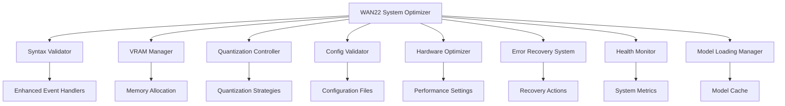

# Design Document

## Overview

This design addresses the critical system anomalies and optimization challenges in the WAN2.2 UI application running on high-end hardware (RTX 4080, Threadripper PRO 5995WX, 128GB RAM). The solution implements a comprehensive system optimization framework that includes syntax error detection and repair, intelligent VRAM management, adaptive quantization strategies, configuration validation, hardware-specific optimizations, and robust error recovery mechanisms.

The design follows a modular approach with separate components for each major system area, allowing for independent testing and maintenance while ensuring seamless integration across the entire WAN2.2 ecosystem.

## Architecture

### Core Components



### System Integration Points

- **Main Application**: Integration with existing `main.py` and `ui.py`
- **Configuration System**: Integration with `config.json` and WAN22 config managers
- **Pipeline Management**: Integration with `wan_pipeline_loader.py` and related components
- **Error Handling**: Integration with existing error handling systems
- **Performance Monitoring**: Integration with existing performance profilers

## Components and Interfaces

### 1. WAN22SystemOptimizer (Main Controller)

**Purpose**: Central coordinator for all optimization operations

**Key Methods**:

```python
class WAN22SystemOptimizer:
    def __init__(self, config_path: str, hardware_profile: HardwareProfile)
    def initialize_system(self) -> OptimizationResult
    def validate_and_repair_system(self) -> ValidationResult
    def apply_hardware_optimizations(self) -> OptimizationResult
    def monitor_system_health(self) -> HealthStatus
```

**Interfaces**:

- Input: Configuration files, hardware detection results
- Output: Optimization status, error reports, performance metrics

### 2. SyntaxValidator

**Purpose**: Detect and repair syntax errors in critical Python files

**Key Methods**:

```python
class SyntaxValidator:
    def validate_file(self, file_path: str) -> ValidationResult
    def repair_syntax_errors(self, file_path: str) -> RepairResult
    def backup_file(self, file_path: str) -> str
    def validate_enhanced_handlers(self) -> ValidationResult
```

**Target Files**:

- `ui_event_handlers_enhanced.py` (line 187 syntax error)
- `ui_event_handlers.py`
- Critical pipeline components

**Error Detection Strategy**:

- AST parsing for syntax validation
- Line-by-line analysis for common Python syntax issues
- Automated repair for simple syntax errors (missing else clauses, brackets)

### 3. VRAMManager

**Purpose**: Accurate VRAM detection and intelligent memory management

**Key Methods**:

```python
class VRAMManager:
    def detect_vram_capacity(self) -> VRAMInfo
    def monitor_vram_usage(self) -> VRAMUsage
    def apply_memory_optimizations(self, usage_threshold: float) -> OptimizationResult
    def get_fallback_vram_config(self) -> VRAMConfig
```

**Detection Strategy**:

- Primary: NVIDIA ML (nvml) library
- Secondary: PyTorch CUDA memory info
- Fallback: Manual configuration with validation
- Tertiary: nvidia-smi command parsing

**Memory Optimization Techniques**:

- Gradient checkpointing for large models
- CPU offloading for text encoder and VAE
- Dynamic batch size adjustment
- Memory-efficient attention mechanisms

### 4. QuantizationController

**Purpose**: Intelligent quantization management with timeout handling

**Key Methods**:

```python
class QuantizationController:
    def determine_optimal_quantization(self, model_info: ModelInfo, hardware: HardwareProfile) -> QuantizationStrategy
    def apply_quantization_with_timeout(self, strategy: QuantizationStrategy) -> QuantizationResult
    def fallback_to_no_quantization(self) -> None
    def validate_quantization_quality(self, original_output, quantized_output) -> QualityMetrics
```

**Quantization Strategies**:

- **bf16**: Best quality, high VRAM usage, moderate speed
- **int8**: Balanced quality/performance, lower VRAM usage
- **FP8**: Experimental, highest performance on supported hardware
- **none**: No quantization, highest quality, highest VRAM usage

**Timeout Management**:

- Configurable timeout periods (default: 300s, extended: 600s)
- Progress monitoring with user cancellation
- Automatic fallback on timeout
- User preference persistence

### 5. ConfigValidator

**Purpose**: Validate and clean configuration files

**Key Methods**:

```python
class ConfigValidator:
    def validate_config_schema(self, config_path: str) -> ValidationResult
    def clean_unexpected_attributes(self, config: dict) -> CleanupResult
    def backup_and_repair_config(self, config_path: str) -> RepairResult
    def validate_model_compatibility(self, model_config: dict) -> CompatibilityResult
```

**Validation Rules**:

- Remove unsupported attributes (e.g., `clip_output` from AutoencoderKLWan)
- Validate data types and value ranges
- Check model-library compatibility
- Ensure required attributes are present

**Configuration Targets**:

- Main `config.json`
- Model-specific configuration files
- Pipeline configuration files
- User preference files

### 6. HardwareOptimizer

**Purpose**: Apply hardware-specific optimizations

**Key Methods**:

```python
class HardwareOptimizer:
    def detect_hardware_profile(self) -> HardwareProfile
    def generate_optimal_settings(self, profile: HardwareProfile) -> OptimalSettings
    def apply_cpu_optimizations(self, cpu_cores: int, memory_gb: int) -> None
    def apply_gpu_optimizations(self, gpu_info: GPUInfo) -> None
```

**RTX 4080 Optimizations**:

- Enable tensor cores for mixed precision
- Optimize memory allocation patterns
- Configure optimal tile sizes (256x256 for VAE)
- Enable CPU offloading for non-critical components

**Threadripper PRO 5995WX Optimizations**:

- Utilize multiple CPU cores for preprocessing
- Optimize thread allocation for PyTorch
- Configure NUMA-aware memory allocation
- Enable parallel processing where possible

### 7. ErrorRecoverySystem

**Purpose**: Comprehensive error handling and recovery

**Key Methods**:

```python
class ErrorRecoverySystem:
    def register_error_handler(self, error_type: Type, handler: Callable) -> None
    def attempt_recovery(self, error: Exception, context: dict) -> RecoveryResult
    def save_system_state(self) -> str
    def restore_system_state(self, state_path: str) -> RestoreResult
```

**Recovery Strategies**:

- Automatic retry with exponential backoff
- Fallback to safe configurations
- State preservation and restoration
- User-guided recovery workflows

### 8. HealthMonitor

**Purpose**: Continuous system health monitoring

**Key Methods**:

```python
class HealthMonitor:
    def start_monitoring(self) -> None
    def get_current_metrics(self) -> SystemMetrics
    def check_safety_thresholds(self) -> SafetyStatus
    def generate_health_report(self) -> HealthReport
```

**Monitoring Metrics**:

- GPU temperature and utilization
- VRAM usage and allocation patterns
- CPU usage and memory consumption
- System stability indicators

## Data Models

### HardwareProfile

```python
@dataclass
class HardwareProfile:
    cpu_model: str
    cpu_cores: int
    total_memory_gb: int
    gpu_model: str
    vram_gb: int
    cuda_version: str
    driver_version: str
```

### OptimizationResult

```python
@dataclass
class OptimizationResult:
    success: bool
    optimizations_applied: List[str]
    performance_improvement: float
    memory_savings: int
    warnings: List[str]
    errors: List[str]
```

### SystemMetrics

```python
@dataclass
class SystemMetrics:
    timestamp: datetime
    gpu_temperature: float
    vram_usage_mb: int
    vram_total_mb: int
    cpu_usage_percent: float
    memory_usage_gb: float
    generation_speed: float
```

## Error Handling

### Error Categories

1. **Syntax Errors**: Python syntax issues in critical files
2. **Hardware Detection Errors**: VRAM/GPU detection failures
3. **Configuration Errors**: Invalid or corrupted config files
4. **Model Loading Errors**: Issues loading or initializing models
5. **Performance Errors**: System performance degradation
6. **Memory Errors**: Out-of-memory conditions

### Recovery Strategies

1. **Immediate Recovery**: Automatic fixes for common issues
2. **Fallback Recovery**: Safe alternative configurations
3. **User-Guided Recovery**: Interactive problem resolution
4. **System Restoration**: Restore from known good state

### Error Logging

- Structured logging with JSON format
- Contextual information capture
- Performance impact tracking
- User action recommendations

## Testing Strategy

### Unit Testing

- Individual component testing with mocked dependencies
- Hardware simulation for different configurations
- Error injection testing for recovery mechanisms
- Performance benchmarking for optimization effectiveness

### Integration Testing

- End-to-end system optimization workflows
- Cross-component interaction validation
- Real hardware testing on RTX 4080 systems
- Stress testing under high load conditions

### Validation Testing

- Syntax validation accuracy testing
- VRAM detection reliability testing
- Quantization quality validation
- Configuration repair effectiveness

### Performance Testing

- Model loading time benchmarks
- Memory usage optimization validation
- Generation speed improvements
- System stability under extended use

## Implementation Phases

### Phase 1: Core Infrastructure

- Implement base optimizer framework
- Create hardware detection system
- Establish error handling foundation

### Phase 2: Critical Fixes

- Fix syntax errors in enhanced event handlers
- Implement VRAM detection and management
- Create configuration validation system

### Phase 3: Optimization Features

- Implement quantization controller
- Add hardware-specific optimizations
- Create health monitoring system

### Phase 4: Integration and Testing

- Integrate all components with existing system
- Comprehensive testing and validation
- Performance optimization and tuning

## Security Considerations

- Validate all configuration inputs to prevent injection attacks
- Secure handling of system state files
- Safe execution of repair operations with proper backups
- Restricted file system access for automated repairs

## Performance Considerations

- Minimize overhead of monitoring and optimization systems
- Lazy loading of optimization components
- Efficient memory usage in monitoring systems
- Asynchronous operations where possible to avoid blocking UI

## Compatibility Requirements

- Python 3.11+ compatibility
- PyTorch 2.4+ compatibility
- Diffusers 0.35+ compatibility
- CUDA 12.x compatibility
- Windows 11 compatibility
