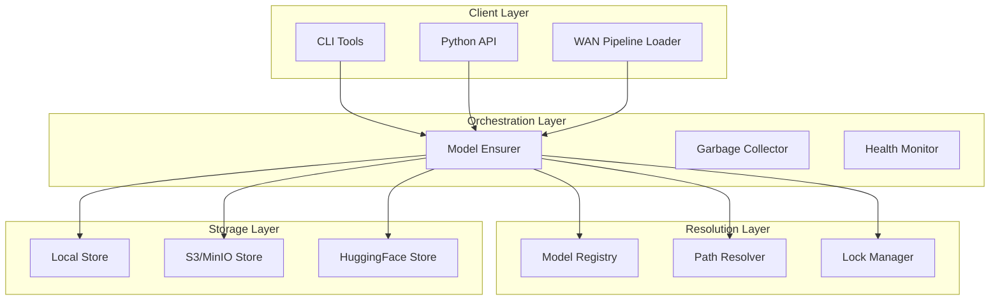

# Model Orchestrator Documentation

## Overview

The WAN2.2 Model Orchestrator is a comprehensive model management system that provides unified, manifest-driven model resolution with support for multiple storage backends, atomic operations, and cross-platform compatibility.

## Documentation Structure

### User Documentation

- **[User Guide](USER_GUIDE.md)** - Complete guide for end users

  - Quick start and installation
  - Configuration and environment setup
  - Basic usage examples
  - CLI commands and Python API
  - Best practices and troubleshooting

- **[API Reference](API_REFERENCE.md)** - Comprehensive API documentation
  - Core classes and methods
  - Data structures and exceptions
  - Configuration options
  - Integration examples

### Operations Documentation

- **[Deployment Guide](DEPLOYMENT_GUIDE.md)** - Production deployment guide

  - Environment setup (development, staging, production)
  - Configuration management
  - Storage backend configuration
  - Security and monitoring setup
  - High availability and scaling

- **[Operational Runbook](OPERATIONAL_RUNBOOK.md)** - Day-to-day operations

  - Daily, weekly, and monthly procedures
  - Emergency response procedures
  - Backup and recovery processes
  - Performance monitoring and capacity planning

- **[Troubleshooting Guide](TROUBLESHOOTING_GUIDE.md)** - Problem resolution
  - Common issues and solutions
  - Diagnostic procedures
  - Platform-specific problems
  - Emergency recovery procedures

### Development Documentation

- **[Architecture Overview](#architecture-overview)** - System design and components
- **[Testing Guide](#testing-guide)** - Comprehensive testing documentation
- **[Contributing Guide](#contributing-guide)** - Development and contribution guidelines

## Quick Start

### Installation

```bash
# Install dependencies
pip install -r requirements.txt

# Set environment variables
export MODELS_ROOT="/data/models"
export WAN_MODELS_MANIFEST="config/models.toml"
```

### Basic Usage

```python
from backend.core.model_orchestrator import ModelEnsurer

# Initialize orchestrator
ensurer = ModelEnsurer.from_config()

# Ensure model is available
model_path = ensurer.ensure("t2v-A14B@2.2.0")

# Use with WAN pipeline
from backend.services.wan_pipeline_loader import get_wan_paths
pipeline_path = get_wan_paths("t2v-A14B@2.2.0")
```

### CLI Usage

```bash
# Check model status
wan models status

# Download specific model
wan models ensure --only t2v-A14B@2.2.0

# Clean up old models
wan models gc --dry-run
```

## Architecture Overview

### System Components



### Key Features

- **Unified Model Management**: Single source of truth for all WAN2.2 model definitions
- **Multi-Source Downloads**: Automatic failover between local, S3/MinIO, and HuggingFace sources
- **Atomic Operations**: Safe, concurrent downloads with integrity verification
- **Cross-Platform Support**: Works on Windows, WSL, and Unix systems
- **Intelligent Caching**: Efficient storage with deduplication and garbage collection
- **Comprehensive Monitoring**: Metrics, logging, and health checks

### Directory Structure

```
backend/core/model_orchestrator/
├── __init__.py                    # Main package exports
├── model_ensurer.py              # Core orchestration logic
├── model_registry.py             # Manifest parsing and validation
├── model_resolver.py             # Deterministic path resolution
├── lock_manager.py               # Cross-process synchronization
├── garbage_collector.py          # Disk space management
├── integrity_verifier.py         # File integrity verification
├── exceptions.py                 # Custom exception classes
├── metrics.py                    # Metrics collection
├── logging_config.py             # Structured logging setup
├── storage_backends/             # Storage backend implementations
│   ├── base_store.py            # Abstract base class
│   ├── local_store.py           # Local filesystem backend
│   ├── hf_store.py              # HuggingFace Hub backend
│   └── s3_store.py              # S3/MinIO backend
├── tests/                        # Comprehensive test suite
│   ├── test_end_to_end_workflows.py
│   ├── test_cross_platform_compatibility.py
│   ├── test_performance_load.py
│   ├── test_requirements_validation.py
│   └── test_runner.py
└── docs/                         # Documentation
    ├── README.md                 # This file
    ├── USER_GUIDE.md
    ├── API_REFERENCE.md
    ├── DEPLOYMENT_GUIDE.md
    ├── OPERATIONAL_RUNBOOK.md
    └── TROUBLESHOOTING_GUIDE.md
```

## Testing Guide

### Test Structure

The Model Orchestrator includes comprehensive testing at multiple levels:

#### Unit Tests

Located in `backend/core/model_orchestrator/test_*.py`:

- `test_model_registry.py` - Manifest parsing and validation
- `test_model_resolver.py` - Path resolution logic
- `test_model_ensurer.py` - Core orchestration functionality
- `test_lock_manager.py` - Concurrency and locking
- `test_garbage_collector.py` - Disk space management
- `test_integrity_verifier.py` - File integrity verification

#### Integration Tests

Located in `backend/core/model_orchestrator/tests/`:

- `test_end_to_end_workflows.py` - Complete user workflows
- `test_cross_platform_compatibility.py` - Platform-specific behavior
- `test_performance_load.py` - Performance and scalability
- `test_requirements_validation.py` - Requirements compliance

#### Running Tests

```bash
# Run all tests
python backend/core/model_orchestrator/tests/test_runner.py

# Run specific test suite
python backend/core/model_orchestrator/tests/test_runner.py --suite e2e

# Run with coverage
python backend/core/model_orchestrator/tests/test_runner.py --verbose

# Platform-specific tests
pytest backend/core/model_orchestrator/tests/test_cross_platform_compatibility.py -v
```

#### Test Categories

**End-to-End Tests:**

- Complete download workflows
- Concurrent access scenarios
- Source failover behavior
- Integrity verification flows
- Error recovery procedures

**Cross-Platform Tests:**

- Windows long path handling
- Unix file permissions
- WSL compatibility
- Case sensitivity behavior
- Platform-specific error messages

**Performance Tests:**

- Concurrent download performance
- Memory usage optimization
- Network timeout handling
- Storage I/O efficiency
- Scalability limits

**Requirements Validation:**

- All specification requirements
- API contract compliance
- Error handling behavior
- Configuration validation

### Test Configuration

#### Environment Setup

```bash
# Test environment variables
export TEST_MODELS_ROOT="/tmp/test_models"
export TEST_MANIFEST_PATH="tests/fixtures/test_models.toml"
export TEST_ENABLE_INTEGRATION="true"
```

#### Mock Configuration

Tests use comprehensive mocking for external dependencies:

- HuggingFace Hub API calls
- S3/MinIO operations
- File system operations
- Network requests
- Time-dependent operations

#### Fixtures and Test Data

Test fixtures include:

- Sample manifest files
- Mock model files
- Test configuration files
- Platform-specific test cases

## Contributing Guide

### Development Setup

1. **Clone Repository**

   ```bash
   git clone <repository-url>
   cd wan22
   ```

2. **Set Up Environment**

   ```bash
   python -m venv venv
   source venv/bin/activate  # Linux/Mac
   # or
   venv\Scripts\activate     # Windows

   pip install -r requirements-dev.txt
   ```

3. **Configure Pre-commit Hooks**
   ```bash
   pre-commit install
   ```

### Code Standards

#### Style Guidelines

- Follow PEP 8 for Python code style
- Use type hints for all public APIs
- Maximum line length: 100 characters
- Use descriptive variable and function names

#### Documentation Standards

- All public classes and methods must have docstrings
- Use Google-style docstrings
- Include examples in docstrings for complex APIs
- Update documentation for any API changes

#### Testing Requirements

- All new features must include comprehensive tests
- Maintain >90% code coverage
- Include both unit and integration tests
- Test cross-platform compatibility where applicable

### Development Workflow

1. **Create Feature Branch**

   ```bash
   git checkout -b feature/your-feature-name
   ```

2. **Implement Changes**

   - Write code following style guidelines
   - Add comprehensive tests
   - Update documentation

3. **Run Tests**

   ```bash
   # Run full test suite
   python backend/core/model_orchestrator/tests/test_runner.py

   # Run linting
   ruff check backend/core/model_orchestrator/

   # Run type checking
   mypy backend/core/model_orchestrator/
   ```

4. **Submit Pull Request**
   - Ensure all tests pass
   - Include clear description of changes
   - Reference any related issues

### Code Review Process

All changes require code review:

1. **Automated Checks**

   - All tests must pass
   - Code coverage must be maintained
   - Linting and type checking must pass

2. **Manual Review**

   - Code quality and style
   - Test coverage and quality
   - Documentation completeness
   - API design consistency

3. **Integration Testing**
   - End-to-end functionality
   - Performance impact
   - Cross-platform compatibility

## Support and Resources

### Getting Help

1. **Documentation**: Start with this documentation
2. **Issues**: Check existing GitHub issues
3. **Discussions**: Use GitHub discussions for questions
4. **Support**: Contact the development team

### Useful Links

- [WAN2.2 Project Repository](https://github.com/your-org/wan22)
- [Model Manifest Specification](config/models.toml)
- [Performance Benchmarks](docs/PERFORMANCE_BENCHMARKS.md)
- [Security Guidelines](docs/SECURITY_GUIDELINES.md)

### Version History

- **v1.0.0** - Initial release with core functionality
- **v1.1.0** - Added S3/MinIO support and enhanced error handling
- **v1.2.0** - Cross-platform improvements and performance optimizations
- **v2.0.0** - WAN2.2 integration and advanced features

## License

This project is licensed under the MIT License. See the LICENSE file for details.

---

For more detailed information, please refer to the specific documentation files linked above.
