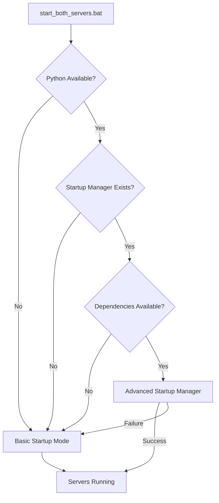

# WAN22 Startup Manager Integration Guide

## Overview

The WAN22 Startup Manager is an intelligent server management system that provides automated environment validation, port conflict resolution, process management, and error recovery for the WAN22 video generation application.

## Integration with Existing Project Structure

### Batch File Integration

The enhanced `start_both_servers.bat` automatically detects and uses the Python startup manager when available, while maintaining backward compatibility with existing development workflows.

#### Automatic Detection Flow



### File Structure Integration

The startup manager integrates seamlessly with the existing project structure:

```
wan2.2/
├── start_both_servers.bat          # Enhanced batch file (entry point)
├── startup_config.json             # Startup configuration
├── scripts/
│   ├── startup_manager.py          # Main startup manager
│   └── startup_manager/            # Startup manager package
│       ├── __init__.py
│       ├── cli.py                  # CLI interface
│       ├── config.py               # Configuration management
│       ├── environment_validator.py # Environment validation
│       ├── port_manager.py         # Port management
│       ├── process_manager.py      # Process lifecycle
│       ├── recovery_engine.py      # Error recovery
│       ├── logger.py               # Logging system
│       ├── diagnostics.py          # Diagnostic tools
│       ├── performance_monitor.py  # Performance monitoring
│       └── analytics.py            # Usage analytics
├── tests/                          # Comprehensive test suite
│   ├── test_startup_manager*.py    # Startup manager tests
│   └── ...
├── logs/                           # Enhanced logging
│   ├── startup_*.log              # Startup session logs
│   └── ...
└── docs/
    ├── STARTUP_MANAGER_USER_GUIDE.md
    ├── STARTUP_MANAGER_DEVELOPER_GUIDE.md
    └── STARTUP_MANAGER_MIGRATION_GUIDE.md
```

## Backward Compatibility

### Legacy Workflow Support

The startup manager maintains full backward compatibility:

1. **Existing batch file usage**: All existing `start_both_servers.bat` usage patterns continue to work
2. **Manual server startup**: Direct Python/Node.js server startup still functions
3. **Configuration files**: Existing `config.json` and other configuration files are preserved
4. **Development workflows**: No changes required to existing development processes

### Fallback Mechanisms

When the startup manager is unavailable:

1. **Missing Python**: Automatically falls back to basic startup mode
2. **Missing dependencies**: Gracefully degrades to simple server startup
3. **Startup manager failure**: Automatically retries with basic mode
4. **User preference**: `--basic` flag forces basic mode

## Enhanced Features

### Intelligent Port Management

- **Automatic port conflict detection**: Scans for occupied ports before startup
- **Alternative port allocation**: Finds available ports when defaults are occupied
- **Process identification**: Shows which processes are using occupied ports
- **Firewall integration**: Handles Windows firewall exceptions

### Environment Validation

- **Dependency checking**: Validates Python, Node.js, and package installations
- **Virtual environment detection**: Ensures proper environment activation
- **Configuration validation**: Checks and repairs configuration files
- **System resource verification**: Validates available system resources

### Process Management

- **Health monitoring**: Continuously monitors server health and responsiveness
- **Graceful shutdown**: Properly terminates processes on exit
- **Automatic restart**: Restarts failed processes with exponential backoff
- **Process cleanup**: Handles zombie processes and resource cleanup

### Error Recovery

- **Pattern recognition**: Learns from common failure patterns
- **Automatic fixes**: Applies known solutions to common problems
- **Recovery suggestions**: Provides actionable solutions for manual intervention
- **Retry logic**: Implements intelligent retry strategies

### Performance Monitoring

- **Startup metrics**: Tracks startup time and success rates
- **Resource usage**: Monitors CPU, memory, and disk usage during startup
- **Trend analysis**: Identifies performance trends over time
- **Optimization suggestions**: Provides recommendations for performance improvements

## Configuration

### Startup Configuration (`startup_config.json`)

```json
{
  "backend": {
    "host": "localhost",
    "port": 8000,
    "auto_port": true,
    "timeout": 30,
    "reload": true,
    "log_level": "info",
    "workers": 1
  },
  "frontend": {
    "host": "localhost",
    "port": 3000,
    "auto_port": true,
    "timeout": 30,
    "open_browser": true,
    "hot_reload": true
  },
  "retry_attempts": 3,
  "retry_delay": 2.0,
  "verbose_logging": false,
  "auto_fix_issues": true,
  "performance_monitoring": {
    "enabled": true,
    "collect_metrics": true,
    "analytics": true
  },
  "windows_optimizations": {
    "firewall_exceptions": true,
    "process_priority": "normal",
    "service_integration": false
  }
}
```

### Environment Variables

Override configuration with environment variables:

```bash
# Port configuration
set WAN22_BACKEND_PORT=8080
set WAN22_FRONTEND_PORT=3001

# Logging configuration
set WAN22_VERBOSE_LOGGING=true
set WAN22_LOG_LEVEL=debug

# Feature toggles
set WAN22_AUTO_FIX_ISSUES=false
set WAN22_PERFORMANCE_MONITORING=true
```

## Command Line Usage

### Basic Usage

```bash
# Standard startup (uses startup manager if available)
start_both_servers.bat

# Verbose output
start_both_servers.bat --verbose

# Debug mode
start_both_servers.bat --debug

# Force basic mode (bypass startup manager)
start_both_servers.bat --basic
```

### Advanced Usage

```bash
# Custom ports
start_both_servers.bat --backend-port 8080 --frontend-port 3001

# Python startup manager direct usage
python scripts/startup_manager.py

# Diagnostic mode
python scripts/startup_manager.py --diagnostics

# Configuration validation
python scripts/startup_manager.py --validate-config
```

## Integration Benefits

### For Developers

1. **Reduced setup time**: Automatic environment validation and configuration
2. **Fewer port conflicts**: Intelligent port management eliminates common issues
3. **Better error messages**: Clear, actionable error messages with suggested solutions
4. **Consistent experience**: Standardized startup process across different environments
5. **Performance insights**: Visibility into startup performance and optimization opportunities

### For Teams

1. **Standardized workflows**: Consistent startup process for all team members
2. **Reduced support burden**: Automatic issue resolution reduces support requests
3. **Better onboarding**: New developers can start quickly with minimal setup
4. **Environment consistency**: Ensures all developers have properly configured environments
5. **Troubleshooting data**: Comprehensive logging and diagnostics for issue resolution

### For Production

1. **Reliability**: Robust error handling and recovery mechanisms
2. **Monitoring**: Performance metrics and health monitoring
3. **Scalability**: Configurable for different deployment scenarios
4. **Maintenance**: Automated maintenance tasks and optimization suggestions
5. **Documentation**: Comprehensive logs and diagnostic information

## Migration Path

### Immediate Benefits (No Changes Required)

- Enhanced error messages and recovery
- Automatic port conflict resolution
- Improved logging and diagnostics
- Performance monitoring

### Optional Enhancements

1. **Custom configuration**: Modify `startup_config.json` for specific needs
2. **Environment variables**: Use environment variables for deployment-specific settings
3. **Advanced features**: Enable Windows service integration, analytics, etc.
4. **Team configuration**: Standardize configuration across team members

### Future Enhancements

1. **CI/CD integration**: Integrate startup manager with build and deployment pipelines
2. **Container support**: Docker and container orchestration integration
3. **Cloud deployment**: Cloud-specific optimizations and configurations
4. **Monitoring integration**: Integration with external monitoring and alerting systems

## Troubleshooting Integration Issues

### Common Issues

1. **Python not found**: Ensure Python is installed and in PATH
2. **Import errors**: Install startup manager dependencies with `pip install -r requirements.txt`
3. **Permission issues**: Run as administrator for Windows optimizations
4. **Port conflicts**: Use `--verbose` to see detailed port conflict information

### Diagnostic Tools

```bash
# Run full system diagnostics
python scripts/startup_manager.py --diagnostics

# Validate configuration
python scripts/startup_manager.py --validate-config

# Test environment
python scripts/startup_manager.py --test-environment

# Check dependencies
python scripts/startup_manager.py --check-deps
```

### Getting Help

1. **Verbose mode**: Use `--verbose` for detailed operation information
2. **Debug mode**: Use `--debug` for comprehensive debugging information
3. **Log files**: Check `logs/startup_*.log` for detailed session information
4. **Diagnostic reports**: Generate diagnostic reports for troubleshooting

## Conclusion

The WAN22 Startup Manager provides a seamless upgrade to the existing development workflow while maintaining full backward compatibility. Developers can immediately benefit from enhanced error handling and automatic issue resolution, while teams can gradually adopt advanced features as needed.

The integration is designed to be transparent and non-disruptive, ensuring that existing workflows continue to function while providing significant improvements in reliability, performance, and developer experience.
