# System Architecture Documentation

This document provides a comprehensive overview of the project health system architecture, including component relationships, data flow, and operational procedures.

## Architecture Overview

The project health system is designed as a modular, scalable solution for monitoring and maintaining project health across multiple dimensions: testing, documentation, configuration, and overall system health.

### High-Level Architecture

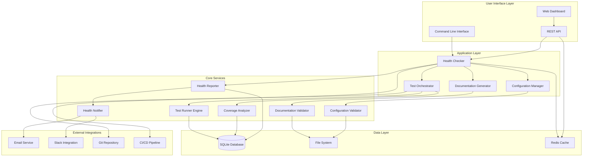

## Component Architecture

### 1. User Interface Layer

#### Command Line Interface (CLI)

- **Purpose**: Primary interface for system administration and automation
- **Location**: `tools/health_checker/cli.py`
- **Key Features**:
  - Health check execution
  - Configuration management
  - Report generation
  - System maintenance

```python
# CLI Architecture
class HealthCheckerCLI:
    def __init__(self):
        self.health_checker = ProjectHealthChecker()
        self.config_manager = ConfigurationManager()
        self.reporter = HealthReporter()

    def run_health_check(self, options):
        # Execute health check with specified options
        pass

    def generate_report(self, format, output):
        # Generate and save health report
        pass
```

#### Web Dashboard

- **Purpose**: Visual interface for monitoring and reporting
- **Location**: `tools/health_checker/dashboard_server.py`
- **Technology**: Flask/FastAPI with HTML/CSS/JavaScript frontend
- **Features**:
  - Real-time health metrics
  - Interactive charts and graphs
  - Historical trend analysis
  - Alert management

#### REST API

- **Purpose**: Programmatic access to health system
- **Endpoints**:
  - `GET /health` - Current health status
  - `GET /health/detailed` - Comprehensive health report
  - `POST /health/check` - Trigger health check
  - `GET /metrics` - Prometheus-compatible metrics

### 2. Application Layer

#### Health Checker

- **Purpose**: Central orchestrator for all health monitoring activities
- **Location**: `tools/health_checker/health_checker.py`
- **Responsibilities**:
  - Coordinate health checks across all components
  - Aggregate health scores
  - Generate recommendations
  - Trigger alerts

```python
class ProjectHealthChecker:
    def __init__(self, project_root: Path):
        self.project_root = project_root
        self.checkers = [
            TestHealthChecker(),
            DocumentationHealthChecker(),
            ConfigurationHealthChecker(),
            CodeQualityChecker()
        ]

    async def run_health_check(self) -> HealthReport:
        # Execute all health checks and aggregate results
        pass
```

#### Test Orchestrator

- **Purpose**: Manage test execution and analysis
- **Location**: `tools/test_runner/orchestrator.py`
- **Features**:
  - Test categorization and execution
  - Parallel test running
  - Coverage analysis
  - Performance benchmarking

#### Documentation Generator

- **Purpose**: Consolidate and validate project documentation
- **Location**: `tools/doc_generator/documentation_generator.py`
- **Features**:
  - Documentation consolidation
  - Link validation
  - Search index generation
  - Multi-format output

#### Configuration Manager

- **Purpose**: Unify and validate system configuration
- **Location**: `tools/config_manager/config_unifier.py`
- **Features**:
  - Configuration migration
  - Validation and schema checking
  - Environment-specific overrides
  - Hot reloading

### 3. Core Services

#### Test Runner Engine

- **Purpose**: Execute tests with advanced features
- **Location**: `tools/test_runner/runner_engine.py`
- **Capabilities**:
  - Timeout handling
  - Resource management
  - Failure recovery
  - Result aggregation

#### Coverage Analyzer

- **Purpose**: Analyze code coverage and quality metrics
- **Location**: `tools/test_runner/coverage_analyzer.py`
- **Metrics**:
  - Line coverage
  - Branch coverage
  - Function coverage
  - Complexity analysis

#### Health Reporter

- **Purpose**: Generate comprehensive health reports
- **Location**: `tools/health_checker/health_reporter.py`
- **Output Formats**:
  - JSON for API consumption
  - HTML for web display
  - Markdown for documentation
  - PDF for executive reports

#### Health Notifier

- **Purpose**: Send alerts and notifications
- **Location**: `tools/health_checker/health_notifier.py`
- **Channels**:
  - Email notifications
  - Slack integration
  - Webhook callbacks
  - SMS alerts (optional)

### 4. Data Layer

#### SQLite Database

- **Purpose**: Persistent storage for health data
- **Location**: `/var/lib/project-health/health.db`
- **Schema**:

```sql
-- Health Reports Table
CREATE TABLE health_reports (
    id INTEGER PRIMARY KEY AUTOINCREMENT,
    timestamp DATETIME DEFAULT CURRENT_TIMESTAMP,
    overall_score REAL NOT NULL,
    component_scores TEXT NOT NULL, -- JSON
    issues TEXT, -- JSON
    recommendations TEXT -- JSON
);

-- Test Results Table
CREATE TABLE test_results (
    id INTEGER PRIMARY KEY AUTOINCREMENT,
    timestamp DATETIME DEFAULT CURRENT_TIMESTAMP,
    suite_id TEXT NOT NULL,
    category TEXT NOT NULL,
    total_tests INTEGER NOT NULL,
    passed_tests INTEGER NOT NULL,
    failed_tests INTEGER NOT NULL,
    duration REAL NOT NULL,
    coverage_percent REAL
);

-- Configuration Changes Table
CREATE TABLE config_changes (
    id INTEGER PRIMARY KEY AUTOINCREMENT,
    timestamp DATETIME DEFAULT CURRENT_TIMESTAMP,
    file_path TEXT NOT NULL,
    change_type TEXT NOT NULL, -- 'create', 'update', 'delete'
    old_hash TEXT,
    new_hash TEXT,
    user_id TEXT
);

-- Performance Metrics Table
CREATE TABLE performance_metrics (
    id INTEGER PRIMARY KEY AUTOINCREMENT,
    timestamp DATETIME DEFAULT CURRENT_TIMESTAMP,
    metric_name TEXT NOT NULL,
    metric_value REAL NOT NULL,
    metric_unit TEXT,
    component TEXT
);
```

#### File System Storage

- **Purpose**: Store configuration files, logs, and temporary data
- **Structure**:

```
/var/lib/project-health/
├── data/                 # Application data
├── reports/              # Generated reports
│   ├── daily/
│   ├── weekly/
│   └── monthly/
├── cache/                # Temporary cache files
└── backups/              # Local backups

/var/log/project-health/
├── health.log            # Main application log
├── tests.log             # Test execution log
├── docs.log              # Documentation generation log
├── config.log            # Configuration changes log
└── performance.log       # Performance metrics log

/etc/project-health/
├── production.yaml       # Main configuration
├── monitoring.yaml       # Monitoring settings
└── secrets.yaml          # Encrypted secrets
```

#### Redis Cache (Optional)

- **Purpose**: High-performance caching for frequently accessed data
- **Use Cases**:
  - Health check results caching
  - API response caching
  - Session storage for web dashboard
  - Real-time metrics buffering

## Data Flow Architecture

### 1. Health Check Execution Flow

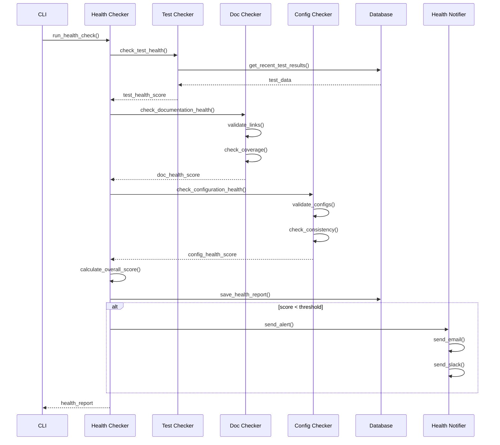

### 2. Test Execution Flow

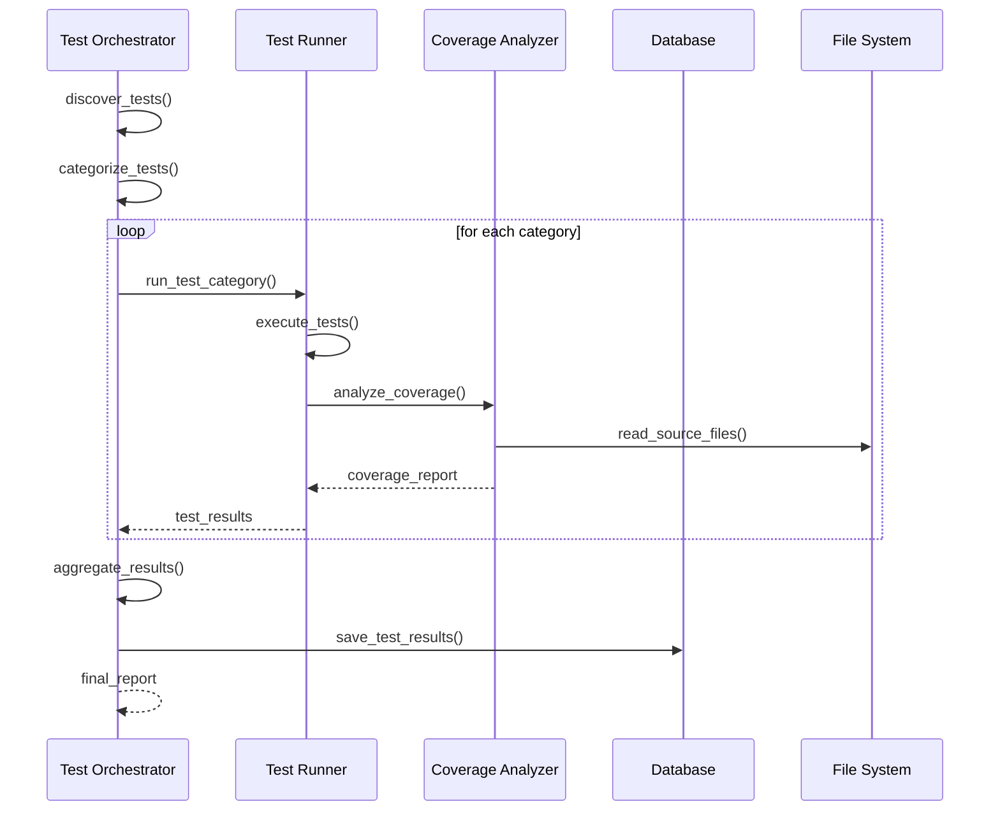

### 3. Configuration Management Flow

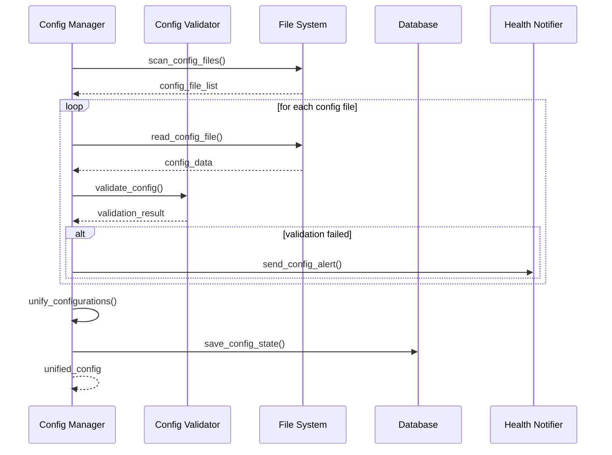

## Deployment Architecture

### Single Server Deployment

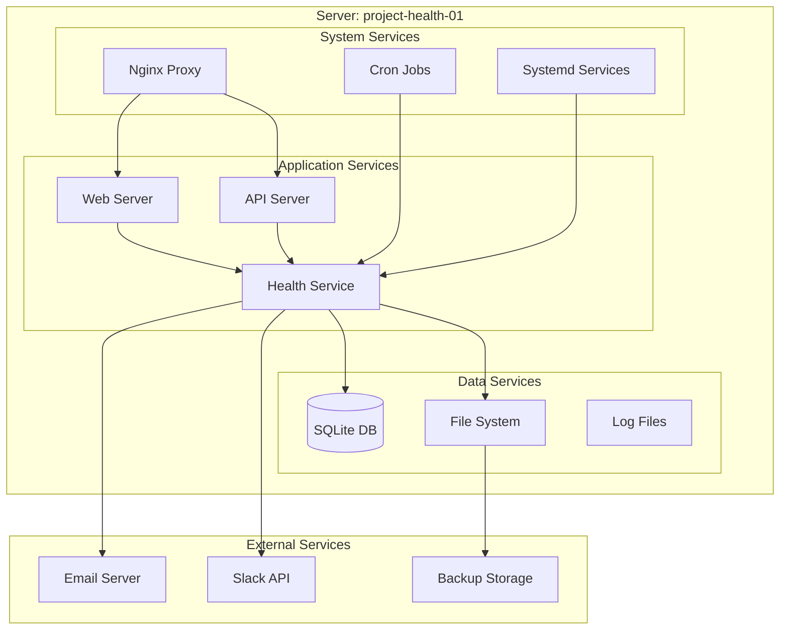

### High Availability Deployment

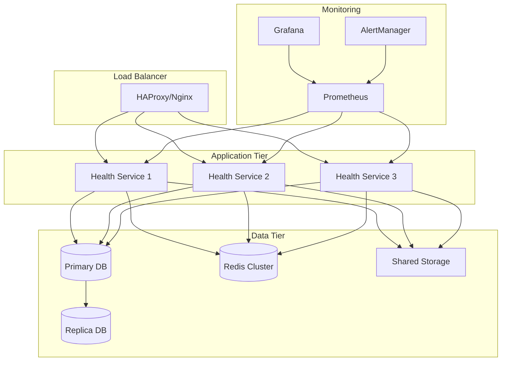

## Security Architecture

### Authentication and Authorization

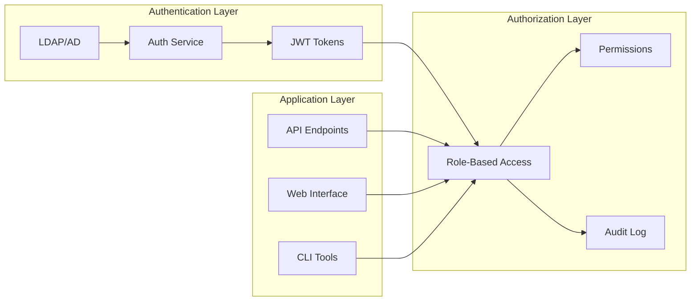

### Security Controls

1. **Network Security**

   - TLS encryption for all communications
   - Firewall rules restricting access
   - VPN access for remote administration

2. **Application Security**

   - Input validation and sanitization
   - SQL injection prevention
   - XSS protection
   - CSRF tokens

3. **Data Security**
   - Encryption at rest for sensitive data
   - Secure key management
   - Regular security updates
   - Access logging and monitoring

## Performance Architecture

### Caching Strategy

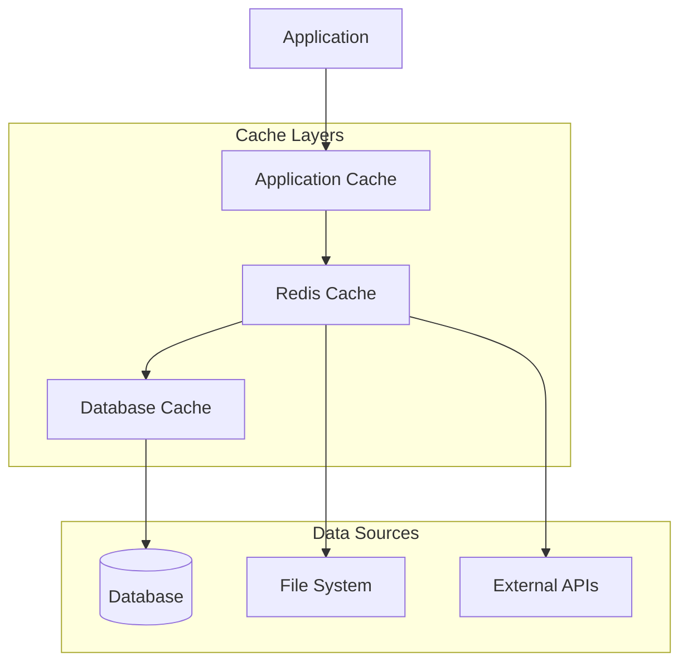

### Performance Optimization

1. **Database Optimization**

   - Proper indexing strategy
   - Query optimization
   - Connection pooling
   - WAL mode for SQLite

2. **Application Optimization**

   - Asynchronous processing
   - Parallel execution
   - Memory management
   - CPU optimization

3. **I/O Optimization**
   - Efficient file handling
   - Batch operations
   - Compression for large data
   - SSD storage for performance-critical data

## Monitoring and Observability

### Metrics Collection

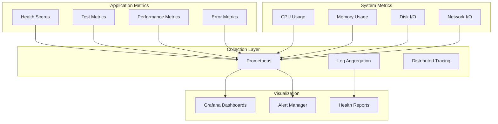

### Key Performance Indicators (KPIs)

1. **Health Metrics**

   - Overall health score (target: >85)
   - Component health scores
   - Health trend analysis
   - Issue resolution time

2. **Performance Metrics**

   - Health check execution time (target: <30s)
   - Test execution time (target: <15min)
   - API response time (target: <2s)
   - System resource utilization

3. **Reliability Metrics**
   - System uptime (target: >99.9%)
   - Error rate (target: <1%)
   - Recovery time (target: <5min)
   - Backup success rate (target: 100%)

## Disaster Recovery Architecture

### Backup Strategy

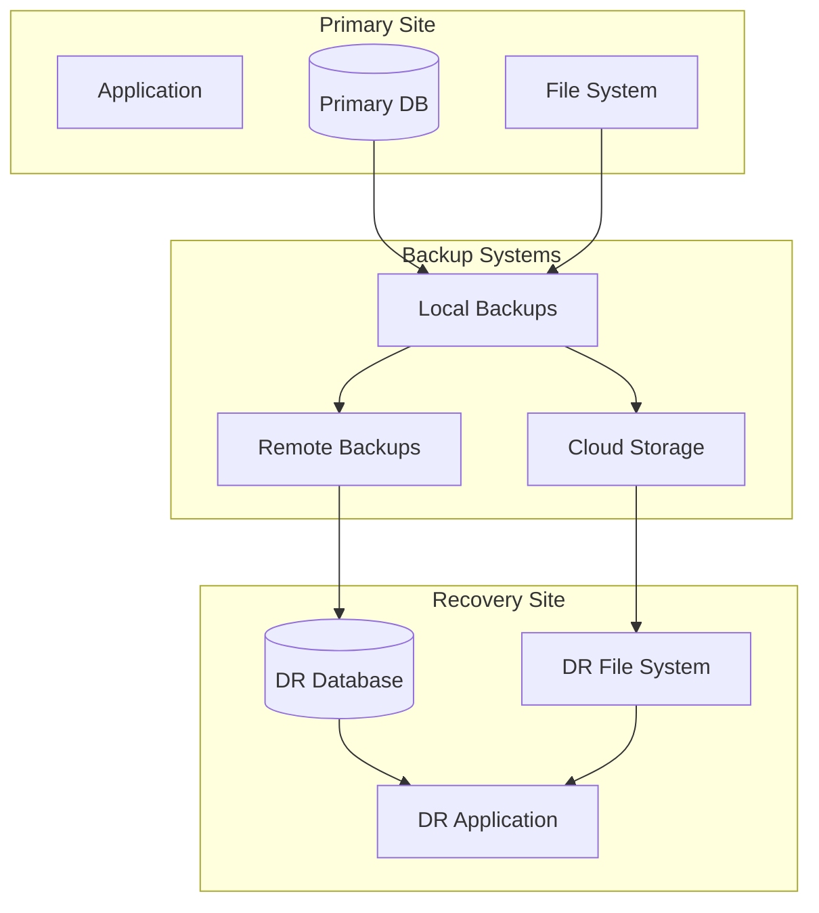

### Recovery Procedures

1. **Data Recovery**

   - Automated daily backups
   - Point-in-time recovery capability
   - Cross-region backup replication
   - Backup integrity verification

2. **Service Recovery**

   - Automated failover procedures
   - Health check validation
   - Service dependency management
   - Rollback capabilities

3. **Business Continuity**
   - Recovery time objective (RTO): 4 hours
   - Recovery point objective (RPO): 1 hour
   - Communication procedures
   - Stakeholder notification

## Integration Architecture

### CI/CD Integration

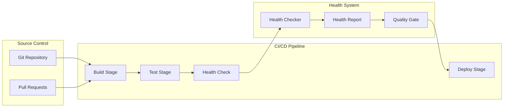

### External Integrations

1. **Version Control**

   - Git hooks for health checks
   - Commit message analysis
   - Branch protection rules
   - Automated quality gates

2. **Communication**

   - Slack notifications
   - Email alerts
   - Webhook integrations
   - Dashboard embedding

3. **Monitoring**
   - Prometheus metrics export
   - Grafana dashboard integration
   - Log aggregation systems
   - APM tool integration

## Scalability Considerations

### Horizontal Scaling

1. **Application Scaling**

   - Stateless application design
   - Load balancer configuration
   - Session management
   - Cache distribution

2. **Data Scaling**
   - Database sharding strategies
   - Read replica configuration
   - Cache clustering
   - File system distribution

### Vertical Scaling

1. **Resource Optimization**

   - CPU and memory tuning
   - I/O optimization
   - Network bandwidth management
   - Storage performance tuning

2. **Capacity Planning**
   - Growth trend analysis
   - Resource utilization monitoring
   - Performance benchmarking
   - Predictive scaling

This architecture documentation provides a comprehensive view of the project health system design, enabling effective deployment, maintenance, and scaling of the solution.
