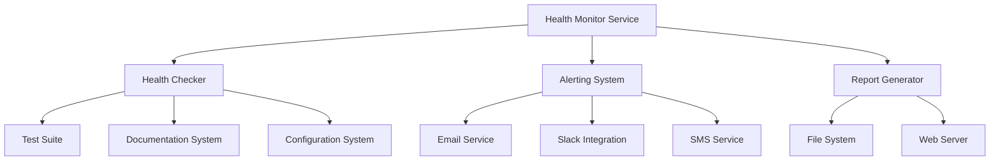

# Health Monitoring Operations Guide

## Overview

This guide provides comprehensive operational procedures for managing the WAN22 project health monitoring system in production environments. It covers daily operations, maintenance tasks, troubleshooting procedures, and emergency response protocols.

## Table of Contents

1. [System Architecture](#system-architecture)
2. [Daily Operations](#daily-operations)
3. [Monitoring and Alerting](#monitoring-and-alerting)
4. [Maintenance Procedures](#maintenance-procedures)
5. [Troubleshooting](#troubleshooting)
6. [Emergency Response](#emergency-response)
7. [Performance Optimization](#performance-optimization)
8. [Security Considerations](#security-considerations)

## System Architecture

### Components Overview

The health monitoring system consists of several key components:

- **Health Checker**: Core monitoring engine that evaluates project health
- **Alerting System**: Automated notification and escalation system
- **Reporting Engine**: Generates daily, weekly, and on-demand reports
- **Dashboard**: Web-based interface for real-time monitoring
- **Configuration Manager**: Centralized configuration management
- **Data Storage**: Health metrics, logs, and historical data

### Service Dependencies



### File System Layout

```
/project-root/
├── config/
│   ├── production-health.yaml      # Production health config
│   ├── alerting-config.yaml        # Alert rules and policies
│   └── unified-config.yaml         # Main system config
├── logs/
│   ├── health-monitoring/          # Health check logs
│   ├── alerting/                   # Alert system logs
│   └── incidents/                  # Critical incident reports
├── reports/
│   ├── daily/                      # Daily health reports
│   ├── weekly/                     # Weekly trend reports
│   └── alerting/                   # Alert dashboard
├── tools/health-checker/           # Health monitoring tools
└── scripts/                       # Operational scripts
```

## Daily Operations

### Morning Health Check Routine

**Time**: 08:00 UTC (or configured time)
**Frequency**: Daily
**Automated**: Yes

1. **Review Daily Health Report**

   ```bash
   # Check latest daily report
   ls -la reports/daily/

   # View today's report
   open reports/daily/health_report_$(date +%Y%m%d).html
   ```

2. **Check Active Alerts**

   ```bash
   # List active alerts
   python scripts/manage_alerts.py list

   # Check alert logs
   tail -f logs/alerting/alerting_$(date +%Y%m%d).log
   ```

3. **Verify System Health**

   ```bash
   # Run manual health check
   python -m tools.health_checker.production_deployment_simple

   # Check service status (Linux)
   systemctl status wan22-health-monitor
   ```

### Weekly Review Process

**Time**: Monday 08:00 UTC
**Frequency**: Weekly
**Automated**: Partially

1. **Review Weekly Trends**

   - Analyze weekly health report
   - Identify degradation patterns
   - Review improvement progress

2. **Update Health Baselines**

   ```bash
   # Update baseline metrics
   python tools/health-checker/establish_baseline.py --update
   ```

3. **Review Alert Effectiveness**
   - Check alert response times
   - Review false positive rates
   - Update alert thresholds if needed

### Monthly Maintenance

**Frequency**: First Saturday of each month
**Automated**: Partially

1. **System Cleanup**

   ```bash
   # Clean old reports and logs
   python -c "
   from tools.health_checker.production_deployment_simple import ProductionHealthMonitor
   import asyncio
   monitor = ProductionHealthMonitor()
   asyncio.run(monitor.cleanup_old_reports())
   "
   ```

2. **Configuration Review**

   - Review and update health thresholds
   - Update notification channels
   - Review escalation policies

3. **Performance Analysis**
   - Analyze system performance trends
   - Identify optimization opportunities
   - Update resource allocations

## Monitoring and Alerting

### Alert Levels and Response Times

| Alert Level | Response Time | Escalation Time | Channels          |
| ----------- | ------------- | --------------- | ----------------- |
| Info        | 4 hours       | None            | Slack             |
| Warning     | 1 hour        | 2 hours         | Slack             |
| Critical    | 15 minutes    | 30 minutes      | Email, Slack      |
| Emergency   | Immediate     | 15 minutes      | Email, Slack, SMS |

### Alert Response Procedures

#### Critical Health Score Alert

**Trigger**: Overall health score < 70
**Response Time**: 15 minutes

1. **Immediate Actions**

   ```bash
   # Check current health status
   python -m tools.health_checker.health_checker --quick

   # Review recent changes
   git log --oneline -10

   # Check system resources
   python tools/health_checker/production_health_checks.py
   ```

2. **Investigation Steps**

   - Identify failing components
   - Check recent deployments
   - Review error logs
   - Verify system resources

3. **Resolution Actions**
   - Fix identified issues
   - Acknowledge alert when investigation starts
   - Resolve alert when issue is fixed

#### Test Failure Alert

**Trigger**: Critical test failures detected
**Response Time**: 30 minutes

1. **Check Test Status**

   ```bash
   # Run test suite
   python -m pytest tests/ -v --tb=short

   # Check test health
   python tools/health_checker/checkers/test_health_checker.py
   ```

2. **Common Resolutions**
   - Fix failing tests
   - Update test configurations
   - Resolve dependency issues

#### Security Alert

**Trigger**: High/Critical security issues
**Response Time**: 10 minutes

1. **Immediate Assessment**

   ```bash
   # Check security status
   python tools/health_checker/checkers/security_checker.py

   # Review recent security scans
   cat logs/health-monitoring/security_scan_*.log
   ```

2. **Security Response**
   - Assess threat level
   - Apply security patches
   - Update vulnerable dependencies
   - Review access controls

### Alert Management Commands

```bash
# List all active alerts
python scripts/manage_alerts.py list

# Acknowledge an alert
python scripts/manage_alerts.py acknowledge critical_health_score --by "John Doe"

# Resolve an alert
python scripts/manage_alerts.py resolve critical_health_score --by "Jane Smith" --notes "Fixed configuration issue"

# Test alert system
python scripts/manage_alerts.py test critical_health_score
```

## Maintenance Procedures

### Regular Maintenance Tasks

#### Daily Tasks (Automated)

- Health check execution
- Report generation
- Log rotation
- Alert evaluation

#### Weekly Tasks

1. **Configuration Backup**

   ```bash
   # Backup configurations
   mkdir -p backups/config/$(date +%Y%m%d)
   cp config/*.yaml backups/config/$(date +%Y%m%d)/
   ```

2. **Performance Review**

   ```bash
   # Generate performance report
   python tools/health_checker/performance_optimizer.py --report
   ```

3. **Update Health Baselines**
   ```bash
   # Update baseline metrics
   python tools/health_checker/establish_baseline.py --update
   ```

#### Monthly Tasks

1. **System Health Assessment**

   ```bash
   # Comprehensive health analysis
   python tools/health_checker/health_analytics.py --comprehensive
   ```

2. **Configuration Optimization**

   - Review alert thresholds
   - Update notification settings
   - Optimize performance parameters

3. **Security Review**
   ```bash
   # Security audit
   python tools/health_checker/checkers/security_checker.py --audit
   ```

### Configuration Management

#### Updating Health Thresholds

1. **Edit Configuration**

   ```bash
   # Edit production health config
   nano config/production-health.yaml
   ```

2. **Validate Configuration**

   ```bash
   # Validate configuration
   python tools/config_manager/config_validator.py config/production-health.yaml
   ```

3. **Apply Changes**
   ```bash
   # Restart health monitoring service
   systemctl restart wan22-health-monitor
   ```

#### Managing Alert Rules

1. **Edit Alert Rules**

   ```bash
   # Edit alerting configuration
   nano config/alerting-config.yaml
   ```

2. **Test Alert Rules**

   ```bash
   # Test specific alert rule
   python scripts/manage_alerts.py test rule_name
   ```

3. **Deploy Changes**
   ```bash
   # Reload alerting configuration
   python -c "
   from tools.health_checker.automated_alerting import AutomatedAlertingSystem
   system = AutomatedAlertingSystem()
   system.save_configuration()
   "
   ```

## Troubleshooting

### Common Issues and Solutions

#### Health Monitoring Service Not Running

**Symptoms**: No health reports generated, alerts not firing

**Diagnosis**:

```bash
# Check service status
systemctl status wan22-health-monitor

# Check process
ps aux | grep health_monitor

# Check logs
tail -f logs/health-monitoring/health_monitor_$(date +%Y%m%d).log
```

**Solutions**:

```bash
# Restart service
systemctl restart wan22-health-monitor

# Check configuration
python tools/config_manager/config_validator.py config/production-health.yaml

# Manual start for debugging
python -m tools.health_checker.production_deployment_simple
```

#### High False Positive Alert Rate

**Symptoms**: Too many alerts for non-critical issues

**Diagnosis**:

```bash
# Review alert history
grep "Alert triggered" logs/alerting/alerting_*.log | tail -20

# Check alert thresholds
cat config/alerting-config.yaml | grep -A 5 "alert_rules"
```

**Solutions**:

1. Adjust alert thresholds in `config/alerting-config.yaml`
2. Increase cooldown periods
3. Add maintenance windows
4. Refine alert conditions

#### Health Checks Taking Too Long

**Symptoms**: Health checks timeout or take excessive time

**Diagnosis**:

```bash
# Check health check performance
python tools/health_checker/performance_optimizer.py --analyze

# Review system resources
python tools/health_checker/production_health_checks.py
```

**Solutions**:

1. Optimize health check queries
2. Increase timeout values
3. Enable parallel execution
4. Add resource monitoring

#### Missing Health Reports

**Symptoms**: Daily/weekly reports not generated

**Diagnosis**:

```bash
# Check report generation logs
grep "report" logs/health-monitoring/health_monitor_*.log

# Check file permissions
ls -la reports/daily/

# Check disk space
df -h
```

**Solutions**:

```bash
# Fix permissions
chmod 755 reports/daily/
chmod 755 reports/weekly/

# Manual report generation
python -c "
from tools.health_checker.production_deployment_simple import ProductionHealthMonitor
import asyncio
monitor = ProductionHealthMonitor()
asyncio.run(monitor.generate_daily_report())
"
```

### Diagnostic Commands

```bash
# System health overview
python tools/health_checker/health_checker.py --summary

# Performance diagnostics
python tools/health_checker/performance_optimizer.py --diagnose

# Configuration validation
python tools/config_manager/config_validator.py --all

# Alert system status
python scripts/manage_alerts.py list --verbose

# Log analysis
python tools/health_checker/health_analytics.py --logs
```

## Emergency Response

### Critical System Failure

**Definition**: Health score < 50 or system completely down

**Response Procedure**:

1. **Immediate Assessment** (0-5 minutes)

   ```bash
   # Quick system check
   python tools/health_checker/health_checker.py --emergency

   # Check system resources
   top
   df -h
   free -m
   ```

2. **Incident Declaration** (5-10 minutes)

   - Notify incident response team
   - Create incident ticket
   - Start incident log

3. **Investigation** (10-30 minutes)

   - Identify root cause
   - Assess impact scope
   - Determine recovery strategy

4. **Recovery Actions** (30+ minutes)
   - Implement fixes
   - Verify system recovery
   - Monitor for stability

### Service Degradation

**Definition**: Health score 50-70 or significant performance issues

**Response Procedure**:

1. **Assessment**

   ```bash
   # Detailed health analysis
   python tools/health_checker/health_analytics.py --detailed

   # Performance analysis
   python tools/health_checker/performance_optimizer.py --analyze
   ```

2. **Mitigation**

   - Apply temporary fixes
   - Scale resources if needed
   - Implement workarounds

3. **Resolution**
   - Identify permanent solution
   - Plan implementation
   - Execute fix during maintenance window

### Communication Procedures

#### Internal Communication

- **Slack**: #project-health-alerts channel
- **Email**: dev-team@company.com, ops-team@company.com
- **Incident Management**: Create ticket in issue tracking system

#### External Communication

- **Status Page**: Update system status
- **Customer Notifications**: If user-facing impact
- **Stakeholder Updates**: Regular progress updates

## Performance Optimization

### Monitoring Performance Metrics

```bash
# Health check execution time
python tools/health_checker/performance_optimizer.py --metrics

# System resource usage
python tools/health_checker/production_health_checks.py --resources

# Alert response times
python scripts/manage_alerts.py stats
```

### Optimization Strategies

#### Health Check Optimization

1. **Parallel Execution**

   ```yaml
   # config/production-health.yaml
   max_concurrent_checks: 5
   parallel_execution: true
   ```

2. **Caching**

   ```yaml
   # Enable result caching
   enable_caching: true
   cache_duration_minutes: 15
   ```

3. **Selective Checks**
   ```bash
   # Run only critical checks
   python tools/health_checker/health_checker.py --critical-only
   ```

#### Alert System Optimization

1. **Rate Limiting**

   ```yaml
   # config/alerting-config.yaml
   global_rate_limit:
     max_alerts_per_minute: 10
     max_alerts_per_hour: 50
   ```

2. **Alert Grouping**
   ```yaml
   # Group similar alerts
   grouping:
     enabled: true
     group_by: ["alert_level", "category"]
     group_window_minutes: 5
   ```

### Performance Baselines

| Metric                | Target  | Warning | Critical |
| --------------------- | ------- | ------- | -------- |
| Health Check Duration | < 60s   | > 120s  | > 300s   |
| Alert Response Time   | < 30s   | > 60s   | > 120s   |
| Report Generation     | < 30s   | > 60s   | > 120s   |
| Memory Usage          | < 512MB | > 1GB   | > 2GB    |
| CPU Usage             | < 50%   | > 80%   | > 95%    |

## Security Considerations

### Access Control

1. **File Permissions**

   ```bash
   # Set secure permissions
   chmod 600 config/*.yaml
   chmod 700 logs/
   chmod 755 scripts/
   ```

2. **Service Account**
   ```bash
   # Run service as dedicated user
   sudo useradd -r -s /bin/false healthmonitor
   sudo chown -R healthmonitor:healthmonitor /path/to/health-monitoring
   ```

### Sensitive Data Protection

1. **Environment Variables**

   ```bash
   # Store secrets in environment variables
   export SMTP_PASSWORD="secure_password"
   export SLACK_WEBHOOK_URL="https://hooks.slack.com/..."
   ```

2. **Configuration Encryption**
   ```bash
   # Encrypt sensitive configuration files
   gpg --symmetric --cipher-algo AES256 config/production-health.yaml
   ```

### Audit Logging

1. **Enable Audit Logs**

   ```yaml
   # config/production-health.yaml
   audit_logging:
     enabled: true
     log_file: "logs/audit/health_audit.log"
     log_level: "INFO"
   ```

2. **Review Audit Logs**

   ```bash
   # Review recent audit events
   tail -f logs/audit/health_audit.log

   # Search for specific events
   grep "configuration_change" logs/audit/health_audit.log
   ```

### Network Security

1. **Firewall Rules**

   ```bash
   # Allow only necessary ports
   ufw allow 8080/tcp  # Health dashboard
   ufw deny 22/tcp     # SSH (if not needed)
   ```

2. **TLS Configuration**
   ```yaml
   # Enable TLS for web interfaces
   dashboard:
     enable_tls: true
     cert_file: "/path/to/cert.pem"
     key_file: "/path/to/key.pem"
   ```

## Appendices

### A. Configuration Reference

See individual configuration files:

- `config/production-health.yaml`
- `config/alerting-config.yaml`
- `config/unified-config.yaml`

### B. API Reference

Health monitoring system provides REST API endpoints:

```
GET /health              # Current health status
GET /health/history      # Historical health data
GET /alerts              # Active alerts
POST /alerts/{id}/ack    # Acknowledge alert
POST /alerts/{id}/resolve # Resolve alert
```

### C. Log File Locations

| Component       | Log Location                                         |
| --------------- | ---------------------------------------------------- |
| Health Monitor  | `logs/health-monitoring/health_monitor_YYYYMMDD.log` |
| Alerting System | `logs/alerting/alerting_YYYYMMDD.log`                |
| Incidents       | `logs/incidents/incident_YYYYMMDD_HHMMSS.json`       |
| Audit           | `logs/audit/health_audit.log`                        |

### D. Contact Information

| Role              | Contact               | Escalation |
| ----------------- | --------------------- | ---------- |
| Primary On-Call   | dev-team@company.com  | 15 minutes |
| Secondary On-Call | ops-team@company.com  | 30 minutes |
| Manager           | manager@company.com   | 60 minutes |
| Emergency         | emergency@company.com | Immediate  |

---

**Document Version**: 1.0  
**Last Updated**: 2025-09-01  
**Next Review**: 2025-12-01
