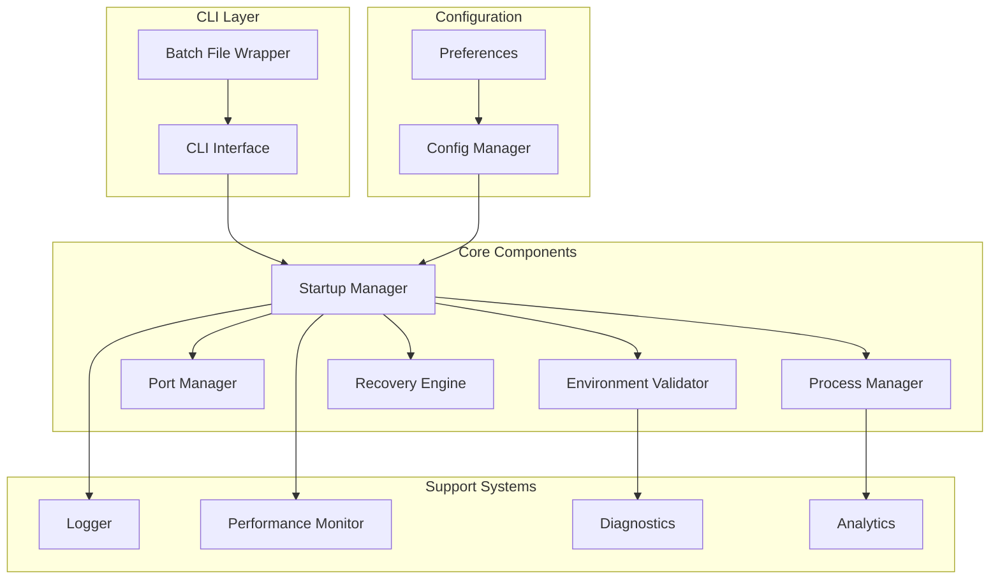

# WAN22 Startup Manager Developer Guide

## Table of Contents

1. [Architecture Overview](#architecture-overview)
2. [Component Details](#component-details)
3. [Extending the Startup Manager](#extending-the-startup-manager)
4. [Custom Validators](#custom-validators)
5. [Custom Recovery Strategies](#custom-recovery-strategies)
6. [Plugin Development](#plugin-development)
7. [Testing](#testing)
8. [Performance Optimization](#performance-optimization)
9. [Debugging](#debugging)
10. [API Reference](#api-reference)

## Architecture Overview

### System Architecture



### Component Responsibilities

| Component                 | Responsibility                         | Extensibility              |
| ------------------------- | -------------------------------------- | -------------------------- |
| **CLI Interface**         | User interaction, command parsing      | High - Custom commands     |
| **Environment Validator** | System validation, dependency checking | High - Custom validators   |
| **Port Manager**          | Port allocation, conflict resolution   | Medium - Custom strategies |
| **Process Manager**       | Server lifecycle, health monitoring    | High - Custom processes    |
| **Recovery Engine**       | Error handling, automatic recovery     | High - Custom strategies   |
| **Logger**                | Structured logging, output formatting  | Medium - Custom formatters |
| **Performance Monitor**   | Metrics collection, analysis           | High - Custom metrics      |
| **Diagnostics**           | System analysis, reporting             | High - Custom diagnostics  |

## Component Details

### Startup Manager Core

```python
# scripts/startup_manager/core.py
from typing import Dict, Any, Optional, List
from abc import ABC, abstractmethod

class StartupComponent(ABC):
    """Base class for all startup components"""

    def __init__(self, config: Dict[str, Any]):
        self.config = config
        self.logger = get_logger(self.__class__.__name__)

    @abstractmethod
    def initialize(self) -> bool:
        """Initialize the component"""
        pass

    @abstractmethod
    def validate(self) -> ValidationResult:
        """Validate component state"""
        pass

    @abstractmethod
    def cleanup(self) -> bool:
        """Clean up component resources"""
        pass

class StartupManager:
    """Main orchestrator for startup process"""

    def __init__(self, config: StartupConfig):
        self.config = config
        self.components: List[StartupComponent] = []
        self.hooks: Dict[str, List[callable]] = {}

    def register_component(self, component: StartupComponent):
        """Register a new startup component"""
        self.components.append(component)

    def register_hook(self, event: str, callback: callable):
        """Register event hook"""
        if event not in self.hooks:
            self.hooks[event] = []
        self.hooks[event].append(callback)

    def trigger_hooks(self, event: str, **kwargs):
        """Trigger event hooks"""
        for callback in self.hooks.get(event, []):
            try:
                callback(**kwargs)
            except Exception as e:
                self.logger.error(f"Hook error for {event}: {e}")
```

### Environment Validator

```python
# scripts/startup_manager/validators/base.py
from abc import ABC, abstractmethod
from typing import Dict, Any, List

class Validator(ABC):
    """Base validator class"""

    @abstractmethod
    def validate(self) -> ValidationResult:
        """Perform validation"""
        pass

    @abstractmethod
    def can_fix(self, issue: ValidationIssue) -> bool:
        """Check if validator can fix an issue"""
        pass

    @abstractmethod
    def fix(self, issue: ValidationIssue) -> FixResult:
        """Attempt to fix an issue"""
        pass

class EnvironmentValidator(StartupComponent):
    """Environment validation orchestrator"""

    def __init__(self, config: Dict[str, Any]):
        super().__init__(config)
        self.validators: List[Validator] = []

    def register_validator(self, validator: Validator):
        """Register a custom validator"""
        self.validators.append(validator)

    def validate_all(self) -> ValidationResult:
        """Run all validators"""
        results = []
        for validator in self.validators:
            result = validator.validate()
            results.append(result)

        return self._combine_results(results)
```

### Port Manager

```python
# scripts/startup_manager/port_manager.py
from typing import Dict, List, Optional, Protocol

class PortStrategy(Protocol):
    """Protocol for port allocation strategies"""

    def find_available_port(self, start_port: int, max_attempts: int) -> Optional[int]:
        """Find an available port"""
        pass

    def resolve_conflict(self, port: int, process_info: Dict) -> ConflictResolution:
        """Resolve port conflict"""
        pass

class PortManager(StartupComponent):
    """Port management with pluggable strategies"""

    def __init__(self, config: Dict[str, Any]):
        super().__init__(config)
        self.strategies: Dict[str, PortStrategy] = {}
        self.default_strategy = "sequential"

    def register_strategy(self, name: str, strategy: PortStrategy):
        """Register a port allocation strategy"""
        self.strategies[name] = strategy

    def find_available_port(self, start_port: int, strategy: str = None) -> Optional[int]:
        """Find available port using specified strategy"""
        strategy_name = strategy or self.default_strategy
        strategy_impl = self.strategies.get(strategy_name)

        if not strategy_impl:
            raise ValueError(f"Unknown port strategy: {strategy_name}")

        return strategy_impl.find_available_port(start_port, 100)
```

### Process Manager

```python
# scripts/startup_manager/process_manager.py
from typing import Dict, Any, Optional, List
from abc import ABC, abstractmethod

class ProcessHandler(ABC):
    """Base class for process handlers"""

    @abstractmethod
    def start(self, config: Dict[str, Any]) -> ProcessResult:
        """Start the process"""
        pass

    @abstractmethod
    def stop(self, process_id: str) -> bool:
        """Stop the process"""
        pass

    @abstractmethod
    def check_health(self, process_id: str) -> HealthStatus:
        """Check process health"""
        pass

class ProcessManager(StartupComponent):
    """Process lifecycle management"""

    def __init__(self, config: Dict[str, Any]):
        super().__init__(config)
        self.handlers: Dict[str, ProcessHandler] = {}
        self.processes: Dict[str, ProcessInfo] = {}

    def register_handler(self, process_type: str, handler: ProcessHandler):
        """Register a process handler"""
        self.handlers[process_type] = handler

    def start_process(self, process_type: str, config: Dict[str, Any]) -> ProcessResult:
        """Start a process using registered handler"""
        handler = self.handlers.get(process_type)
        if not handler:
            raise ValueError(f"No handler registered for process type: {process_type}")

        result = handler.start(config)
        if result.success:
            self.processes[result.process_id] = ProcessInfo(
                id=result.process_id,
                type=process_type,
                config=config,
                start_time=datetime.now()
            )

        return result
```

## Extending the Startup Manager

### Adding Custom Components

```python
# custom_components/database_validator.py
from scripts.startup_manager.validators.base import Validator
from scripts.startup_manager.core import ValidationResult, ValidationIssue

class DatabaseValidator(Validator):
    """Custom validator for database connectivity"""

    def __init__(self, db_config: Dict[str, Any]):
        self.db_config = db_config

    def validate(self) -> ValidationResult:
        """Validate database connection"""
        try:
            # Test database connection
            connection = self._test_connection()
            if connection:
                return ValidationResult(
                    valid=True,
                    message="Database connection successful"
                )
            else:
                return ValidationResult(
                    valid=False,
                    issues=[ValidationIssue(
                        type="database_connection",
                        message="Cannot connect to database",
                        severity="error",
                        fixable=True
                    )]
                )
        except Exception as e:
            return ValidationResult(
                valid=False,
                issues=[ValidationIssue(
                    type="database_error",
                    message=f"Database error: {str(e)}",
                    severity="error",
                    fixable=False
                )]
            )

    def can_fix(self, issue: ValidationIssue) -> bool:
        """Check if we can fix database issues"""
        return issue.type == "database_connection"

    def fix(self, issue: ValidationIssue) -> FixResult:
        """Attempt to fix database issues"""
        if issue.type == "database_connection":
            # Try to start database service
            return self._start_database_service()

        return FixResult(success=False, message="Cannot fix this issue")

# Register the custom validator
def register_custom_validators(startup_manager):
    """Register custom validators with startup manager"""
    db_validator = DatabaseValidator(startup_manager.config.get("database", {}))
    startup_manager.environment_validator.register_validator(db_validator)
```

### Custom Port Strategies

```python
# custom_components/smart_port_strategy.py
from scripts.startup_manager.port_manager import PortStrategy
import socket
import psutil

class SmartPortStrategy:
    """Intelligent port allocation strategy"""

    def __init__(self, preferred_ranges: List[tuple]):
        self.preferred_ranges = preferred_ranges

    def find_available_port(self, start_port: int, max_attempts: int) -> Optional[int]:
        """Find port using intelligent strategy"""

        # First, try the requested port
        if self._is_port_available(start_port):
            return start_port

        # Then try preferred ranges
        for range_start, range_end in self.preferred_ranges:
            for port in range(range_start, range_end + 1):
                if self._is_port_available(port):
                    return port

        # Finally, try sequential from start_port
        for i in range(max_attempts):
            port = start_port + i
            if self._is_port_available(port):
                return port

        return None

    def resolve_conflict(self, port: int, process_info: Dict) -> ConflictResolution:
        """Resolve port conflicts intelligently"""

        # Check if process is a development server we can safely restart
        if self._is_development_process(process_info):
            return ConflictResolution(
                action="restart_process",
                message=f"Restarting development process on port {port}"
            )

        # Check if we can use a nearby port
        alternative = self.find_available_port(port + 1, 10)
        if alternative:
            return ConflictResolution(
                action="use_alternative",
                alternative_port=alternative,
                message=f"Using alternative port {alternative}"
            )

        # Default to manual resolution
        return ConflictResolution(
            action="manual",
            message=f"Manual intervention required for port {port}"
        )

# Register the custom strategy
def register_custom_strategies(startup_manager):
    """Register custom port strategies"""
    smart_strategy = SmartPortStrategy([
        (8000, 8010),  # Backend range
        (3000, 3010),  # Frontend range
        (9000, 9010)   # Alternative range
    ])

    startup_manager.port_manager.register_strategy("smart", smart_strategy)
    startup_manager.port_manager.default_strategy = "smart"
```

### Custom Process Handlers

```python
# custom_components/docker_handler.py
from scripts.startup_manager.process_manager import ProcessHandler
import docker

class DockerProcessHandler(ProcessHandler):
    """Handler for Docker-based processes"""

    def __init__(self):
        self.client = docker.from_env()

    def start(self, config: Dict[str, Any]) -> ProcessResult:
        """Start process in Docker container"""
        try:
            container = self.client.containers.run(
                image=config["image"],
                ports=config.get("ports", {}),
                environment=config.get("environment", {}),
                detach=True,
                name=config.get("name", "wan22-service")
            )

            return ProcessResult(
                success=True,
                process_id=container.id,
                message=f"Container {container.name} started successfully"
            )

        except Exception as e:
            return ProcessResult(
                success=False,
                error=str(e),
                message=f"Failed to start Docker container: {str(e)}"
            )

    def stop(self, process_id: str) -> bool:
        """Stop Docker container"""
        try:
            container = self.client.containers.get(process_id)
            container.stop()
            container.remove()
            return True
        except Exception as e:
            self.logger.error(f"Failed to stop container {process_id}: {e}")
            return False

    def check_health(self, process_id: str) -> HealthStatus:
        """Check container health"""
        try:
            container = self.client.containers.get(process_id)
            if container.status == "running":
                return HealthStatus(healthy=True, message="Container running")
            else:
                return HealthStatus(healthy=False, message=f"Container status: {container.status}")
        except Exception as e:
            return HealthStatus(healthy=False, message=f"Container check failed: {e}")

# Register the Docker handler
def register_docker_handler(startup_manager):
    """Register Docker process handler"""
    docker_handler = DockerProcessHandler()
    startup_manager.process_manager.register_handler("docker", docker_handler)
```

## Custom Validators

### Creating Validation Rules

```python
# custom_validators/security_validator.py
from scripts.startup_manager.validators.base import Validator

class SecurityValidator(Validator):
    """Validate security configuration"""

    def __init__(self, security_config: Dict[str, Any]):
        self.config = security_config

    def validate(self) -> ValidationResult:
        """Validate security settings"""
        issues = []

        # Check for HTTPS configuration
        if not self.config.get("https_enabled", False):
            issues.append(ValidationIssue(
                type="security_https",
                message="HTTPS not enabled for production",
                severity="warning",
                fixable=True
            ))

        # Check for secure headers
        if not self.config.get("security_headers", False):
            issues.append(ValidationIssue(
                type="security_headers",
                message="Security headers not configured",
                severity="warning",
                fixable=True
            ))

        # Check for authentication
        if not self.config.get("authentication", False):
            issues.append(ValidationIssue(
                type="security_auth",
                message="Authentication not configured",
                severity="error",
                fixable=False
            ))

        return ValidationResult(
            valid=len(issues) == 0,
            issues=issues
        )

    def can_fix(self, issue: ValidationIssue) -> bool:
        """Check if security issue can be auto-fixed"""
        return issue.type in ["security_https", "security_headers"]

    def fix(self, issue: ValidationIssue) -> FixResult:
        """Auto-fix security issues"""
        if issue.type == "security_https":
            return self._enable_https()
        elif issue.type == "security_headers":
            return self._configure_security_headers()

        return FixResult(success=False, message="Cannot auto-fix this security issue")
```

### Validation Chains

```python
# custom_validators/validation_chain.py
class ValidationChain:
    """Chain multiple validators with dependencies"""

    def __init__(self):
        self.validators = []
        self.dependencies = {}

    def add_validator(self, validator: Validator, depends_on: List[str] = None):
        """Add validator with optional dependencies"""
        self.validators.append(validator)
        if depends_on:
            self.dependencies[validator.__class__.__name__] = depends_on

    def validate_all(self) -> ValidationResult:
        """Run validators in dependency order"""
        results = []
        completed = set()

        for validator in self._get_execution_order():
            # Check if dependencies are satisfied
            deps = self.dependencies.get(validator.__class__.__name__, [])
            if all(dep in completed for dep in deps):
                result = validator.validate()
                results.append(result)
                completed.add(validator.__class__.__name__)
            else:
                # Skip validator due to unmet dependencies
                results.append(ValidationResult(
                    valid=False,
                    issues=[ValidationIssue(
                        type="dependency_error",
                        message=f"Dependencies not met for {validator.__class__.__name__}",
                        severity="error"
                    )]
                ))

        return self._combine_results(results)
```

## Custom Recovery Strategies

### Error Pattern Matching

```python
# custom_recovery/pattern_matcher.py
import re
from typing import Dict, List, Optional

class ErrorPattern:
    """Define error patterns and recovery strategies"""

    def __init__(self, pattern: str, error_type: str, recovery_strategy: str):
        self.pattern = re.compile(pattern, re.IGNORECASE)
        self.error_type = error_type
        self.recovery_strategy = recovery_strategy

    def matches(self, error_message: str) -> bool:
        """Check if error message matches pattern"""
        return bool(self.pattern.search(error_message))

class CustomRecoveryEngine:
    """Extended recovery engine with custom patterns"""

    def __init__(self):
        self.patterns: List[ErrorPattern] = []
        self.strategies: Dict[str, callable] = {}

    def register_pattern(self, pattern: ErrorPattern):
        """Register error pattern"""
        self.patterns.append(pattern)

    def register_strategy(self, name: str, strategy: callable):
        """Register recovery strategy"""
        self.strategies[name] = strategy

    def recover_from_error(self, error: Exception) -> RecoveryResult:
        """Attempt recovery using custom patterns"""
        error_message = str(error)

        for pattern in self.patterns:
            if pattern.matches(error_message):
                strategy = self.strategies.get(pattern.recovery_strategy)
                if strategy:
                    return strategy(error, pattern.error_type)

        # Fallback to default recovery
        return self._default_recovery(error)

# Example custom recovery strategies
def network_timeout_recovery(error: Exception, error_type: str) -> RecoveryResult:
    """Recovery strategy for network timeouts"""
    return RecoveryResult(
        success=True,
        action="retry_with_backoff",
        message="Retrying with exponential backoff",
        retry_delay=5.0
    )

def permission_denied_recovery(error: Exception, error_type: str) -> RecoveryResult:
    """Recovery strategy for permission errors"""
    return RecoveryResult(
        success=True,
        action="elevate_permissions",
        message="Requesting administrator privileges",
        requires_user_action=True
    )

# Register custom patterns and strategies
def setup_custom_recovery(recovery_engine):
    """Set up custom recovery patterns"""

    # Network timeout patterns
    recovery_engine.register_pattern(ErrorPattern(
        r"timeout|timed out|connection timeout",
        "network_timeout",
        "network_timeout_recovery"
    ))

    # Permission error patterns
    recovery_engine.register_pattern(ErrorPattern(
        r"permission denied|access denied|winerror 10013",
        "permission_denied",
        "permission_denied_recovery"
    ))

    # Register strategies
    recovery_engine.register_strategy("network_timeout_recovery", network_timeout_recovery)
    recovery_engine.register_strategy("permission_denied_recovery", permission_denied_recovery)
```

### Adaptive Recovery

```python
# custom_recovery/adaptive_recovery.py
class AdaptiveRecoveryEngine:
    """Recovery engine that learns from success/failure patterns"""

    def __init__(self):
        self.success_history: Dict[str, List[bool]] = {}
        self.strategy_effectiveness: Dict[str, float] = {}

    def record_recovery_attempt(self, error_type: str, strategy: str, success: bool):
        """Record recovery attempt outcome"""
        key = f"{error_type}:{strategy}"

        if key not in self.success_history:
            self.success_history[key] = []

        self.success_history[key].append(success)

        # Update effectiveness score
        recent_attempts = self.success_history[key][-10:]  # Last 10 attempts
        self.strategy_effectiveness[key] = sum(recent_attempts) / len(recent_attempts)

    def get_best_strategy(self, error_type: str, available_strategies: List[str]) -> str:
        """Get most effective strategy for error type"""
        best_strategy = available_strategies[0]
        best_score = 0.0

        for strategy in available_strategies:
            key = f"{error_type}:{strategy}"
            score = self.strategy_effectiveness.get(key, 0.5)  # Default 50%

            if score > best_score:
                best_score = score
                best_strategy = strategy

        return best_strategy

    def should_try_strategy(self, error_type: str, strategy: str) -> bool:
        """Determine if strategy is worth trying"""
        key = f"{error_type}:{strategy}"
        effectiveness = self.strategy_effectiveness.get(key, 0.5)

        # Don't try strategies with very low success rates
        return effectiveness > 0.2
```

## Plugin Development

### Plugin Architecture

```python
# plugins/base.py
from abc import ABC, abstractmethod
from typing import Dict, Any, List

class StartupPlugin(ABC):
    """Base class for startup manager plugins"""

    def __init__(self, config: Dict[str, Any]):
        self.config = config
        self.enabled = config.get("enabled", True)

    @abstractmethod
    def get_name(self) -> str:
        """Get plugin name"""
        pass

    @abstractmethod
    def get_version(self) -> str:
        """Get plugin version"""
        pass

    @abstractmethod
    def initialize(self, startup_manager) -> bool:
        """Initialize plugin with startup manager"""
        pass

    @abstractmethod
    def cleanup(self) -> bool:
        """Clean up plugin resources"""
        pass

    def get_dependencies(self) -> List[str]:
        """Get list of required dependencies"""
        return []

    def get_hooks(self) -> Dict[str, callable]:
        """Get event hooks provided by plugin"""
        return {}

class PluginManager:
    """Manage startup manager plugins"""

    def __init__(self, startup_manager):
        self.startup_manager = startup_manager
        self.plugins: Dict[str, StartupPlugin] = {}
        self.plugin_order: List[str] = []

    def register_plugin(self, plugin: StartupPlugin) -> bool:
        """Register a plugin"""
        name = plugin.get_name()

        if name in self.plugins:
            return False

        # Check dependencies
        if not self._check_dependencies(plugin):
            return False

        # Initialize plugin
        if plugin.initialize(self.startup_manager):
            self.plugins[name] = plugin
            self.plugin_order.append(name)

            # Register plugin hooks
            for event, callback in plugin.get_hooks().items():
                self.startup_manager.register_hook(event, callback)

            return True

        return False

    def unregister_plugin(self, name: str) -> bool:
        """Unregister a plugin"""
        if name in self.plugins:
            plugin = self.plugins[name]
            plugin.cleanup()
            del self.plugins[name]
            self.plugin_order.remove(name)
            return True
        return False
```

### Example Plugin

```python
# plugins/slack_notifications.py
import requests
from plugins.base import StartupPlugin

class SlackNotificationPlugin(StartupPlugin):
    """Plugin to send Slack notifications on startup events"""

    def get_name(self) -> str:
        return "slack_notifications"

    def get_version(self) -> str:
        return "1.0.0"

    def initialize(self, startup_manager) -> bool:
        """Initialize Slack plugin"""
        self.webhook_url = self.config.get("webhook_url")
        if not self.webhook_url:
            return False

        self.channel = self.config.get("channel", "#development")
        self.username = self.config.get("username", "WAN22 Startup Manager")

        return True

    def cleanup(self) -> bool:
        """Clean up plugin resources"""
        return True

    def get_hooks(self) -> Dict[str, callable]:
        """Register event hooks"""
        return {
            "startup_success": self._on_startup_success,
            "startup_failure": self._on_startup_failure,
            "port_conflict": self._on_port_conflict
        }

    def _on_startup_success(self, **kwargs):
        """Handle successful startup"""
        ports = kwargs.get("ports", {})
        message = f"✅ WAN22 servers started successfully!\n"
        message += f"Backend: http://localhost:{ports.get('backend', 'unknown')}\n"
        message += f"Frontend: http://localhost:{ports.get('frontend', 'unknown')}"

        self._send_message(message)

    def _on_startup_failure(self, **kwargs):
        """Handle startup failure"""
        error = kwargs.get("error", "Unknown error")
        message = f"❌ WAN22 startup failed: {error}"

        self._send_message(message)

    def _on_port_conflict(self, **kwargs):
        """Handle port conflict"""
        port = kwargs.get("port")
        resolution = kwargs.get("resolution")
        message = f"⚠️ Port conflict on {port}, resolved by {resolution}"

        self._send_message(message)

    def _send_message(self, message: str):
        """Send message to Slack"""
        if not self.enabled:
            return

        payload = {
            "channel": self.channel,
            "username": self.username,
            "text": message
        }

        try:
            requests.post(self.webhook_url, json=payload, timeout=5)
        except Exception as e:
            # Don't fail startup due to notification issues
            pass
```

## Testing

### Unit Testing Components

```python
# tests/test_custom_components.py
import pytest
from unittest.mock import Mock, patch
from custom_components.database_validator import DatabaseValidator

class TestDatabaseValidator:

    def setup_method(self):
        """Set up test fixtures"""
        self.config = {
            "host": "localhost",
            "port": 5432,
            "database": "test_db"
        }
        self.validator = DatabaseValidator(self.config)

    def test_successful_validation(self):
        """Test successful database validation"""
        with patch.object(self.validator, '_test_connection', return_value=True):
            result = self.validator.validate()

            assert result.valid is True
            assert "successful" in result.message.lower()

    def test_connection_failure(self):
        """Test database connection failure"""
        with patch.object(self.validator, '_test_connection', return_value=False):
            result = self.validator.validate()

            assert result.valid is False
            assert len(result.issues) == 1
            assert result.issues[0].type == "database_connection"

    def test_fix_capability(self):
        """Test fix capability detection"""
        issue = ValidationIssue(type="database_connection", message="Test")
        assert self.validator.can_fix(issue) is True

        issue = ValidationIssue(type="database_error", message="Test")
        assert self.validator.can_fix(issue) is False

# Integration testing
class TestStartupManagerIntegration:

    def setup_method(self):
        """Set up integration test environment"""
        self.config = StartupConfig()
        self.startup_manager = StartupManager(self.config)

    def test_custom_validator_registration(self):
        """Test registering custom validators"""
        validator = DatabaseValidator({})
        self.startup_manager.environment_validator.register_validator(validator)

        assert validator in self.startup_manager.environment_validator.validators

    def test_plugin_registration(self):
        """Test plugin registration"""
        plugin = SlackNotificationPlugin({"enabled": True, "webhook_url": "test"})
        plugin_manager = PluginManager(self.startup_manager)

        result = plugin_manager.register_plugin(plugin)
        assert result is True
        assert plugin.get_name() in plugin_manager.plugins
```

### Performance Testing

```python
# tests/test_performance.py
import time
import pytest
from scripts.startup_manager import StartupManager

class TestStartupPerformance:

    def test_startup_time_benchmark(self):
        """Benchmark startup time"""
        startup_manager = StartupManager(test_config)

        start_time = time.time()
        result = startup_manager.run_startup_sequence()
        end_time = time.time()

        startup_time = end_time - start_time

        # Assert startup completes within reasonable time
        assert startup_time < 30.0  # 30 seconds max
        assert result is True

    def test_memory_usage(self):
        """Test memory usage during startup"""
        import psutil
        import os

        process = psutil.Process(os.getpid())
        initial_memory = process.memory_info().rss

        startup_manager = StartupManager(test_config)
        startup_manager.run_startup_sequence()

        final_memory = process.memory_info().rss
        memory_increase = final_memory - initial_memory

        # Assert memory usage is reasonable (less than 100MB increase)
        assert memory_increase < 100 * 1024 * 1024
```

## Performance Optimization

### Profiling Startup Performance

```python
# performance/profiler.py
import cProfile
import pstats
from functools import wraps

def profile_startup(func):
    """Decorator to profile startup functions"""
    @wraps(func)
    def wrapper(*args, **kwargs):
        profiler = cProfile.Profile()
        profiler.enable()

        try:
            result = func(*args, **kwargs)
        finally:
            profiler.disable()

            # Save profile data
            stats = pstats.Stats(profiler)
            stats.sort_stats('cumulative')
            stats.dump_stats(f'startup_profile_{func.__name__}.prof')

        return result
    return wrapper

# Usage
@profile_startup
def run_startup_sequence(self):
    # Startup logic here
    pass
```

### Optimization Strategies

```python
# performance/optimization.py
class StartupOptimizer:
    """Optimize startup performance"""

    def __init__(self, startup_manager):
        self.startup_manager = startup_manager
        self.optimizations = []

    def register_optimization(self, optimization: callable):
        """Register optimization strategy"""
        self.optimizations.append(optimization)

    def apply_optimizations(self):
        """Apply all registered optimizations"""
        for optimization in self.optimizations:
            try:
                optimization(self.startup_manager)
            except Exception as e:
                # Log optimization failure but continue
                pass

# Example optimizations
def enable_parallel_validation(startup_manager):
    """Enable parallel environment validation"""
    startup_manager.environment_validator.parallel_mode = True

def cache_dependency_checks(startup_manager):
    """Cache dependency validation results"""
    startup_manager.environment_validator.enable_caching = True

def optimize_port_scanning(startup_manager):
    """Optimize port availability scanning"""
    startup_manager.port_manager.scan_batch_size = 10
```

## Debugging

### Debug Mode Implementation

```python
# debugging/debug_mode.py
import logging
import traceback
from contextlib import contextmanager

class DebugManager:
    """Manage debug mode functionality"""

    def __init__(self, startup_manager):
        self.startup_manager = startup_manager
        self.debug_enabled = False
        self.trace_calls = False

    def enable_debug(self, trace_calls: bool = False):
        """Enable debug mode"""
        self.debug_enabled = True
        self.trace_calls = trace_calls

        # Set up debug logging
        logging.getLogger().setLevel(logging.DEBUG)

        if trace_calls:
            self._enable_call_tracing()

    @contextmanager
    def debug_context(self, operation: str):
        """Debug context manager"""
        if self.debug_enabled:
            print(f"DEBUG: Starting {operation}")
            start_time = time.time()

        try:
            yield
        except Exception as e:
            if self.debug_enabled:
                print(f"DEBUG: Error in {operation}: {e}")
                traceback.print_exc()
            raise
        finally:
            if self.debug_enabled:
                duration = time.time() - start_time
                print(f"DEBUG: Completed {operation} in {duration:.2f}s")

    def _enable_call_tracing(self):
        """Enable function call tracing"""
        import sys

        def trace_calls(frame, event, arg):
            if event == 'call':
                filename = frame.f_code.co_filename
                if 'startup_manager' in filename:
                    func_name = frame.f_code.co_name
                    print(f"TRACE: Calling {func_name} in {filename}")
            return trace_calls

        sys.settrace(trace_calls)
```

### Diagnostic Tools

```python
# debugging/diagnostics.py
class DiagnosticCollector:
    """Collect diagnostic information"""

    def __init__(self):
        self.diagnostics = {}

    def collect_system_info(self):
        """Collect system information"""
        import platform
        import psutil

        self.diagnostics['system'] = {
            'platform': platform.platform(),
            'python_version': platform.python_version(),
            'cpu_count': psutil.cpu_count(),
            'memory_total': psutil.virtual_memory().total,
            'disk_usage': psutil.disk_usage('/').percent
        }

    def collect_network_info(self):
        """Collect network information"""
        import socket

        self.diagnostics['network'] = {
            'hostname': socket.gethostname(),
            'ip_address': socket.gethostbyname(socket.gethostname()),
            'open_ports': self._scan_open_ports()
        }

    def collect_process_info(self):
        """Collect process information"""
        import psutil

        processes = []
        for proc in psutil.process_iter(['pid', 'name', 'cpu_percent']):
            if 'python' in proc.info['name'].lower():
                processes.append(proc.info)

        self.diagnostics['processes'] = processes

    def generate_report(self) -> str:
        """Generate diagnostic report"""
        report = "WAN22 Startup Manager Diagnostic Report\n"
        report += "=" * 50 + "\n\n"

        for category, data in self.diagnostics.items():
            report += f"{category.upper()}:\n"
            for key, value in data.items():
                report += f"  {key}: {value}\n"
            report += "\n"

        return report
```

## API Reference

### Core Classes

#### StartupManager

```python
class StartupManager:
    def __init__(self, config: StartupConfig)
    def register_component(self, component: StartupComponent)
    def register_hook(self, event: str, callback: callable)
    def run_startup_sequence(self, **kwargs) -> bool
```

#### StartupComponent

```python
class StartupComponent(ABC):
    def initialize(self) -> bool
    def validate(self) -> ValidationResult
    def cleanup(self) -> bool
```

### Configuration Classes

#### StartupConfig

```python
class StartupConfig:
    backend: BackendConfig
    frontend: FrontendConfig
    retry_attempts: int
    verbose_logging: bool
    auto_fix_issues: bool
```

### Result Classes

#### ValidationResult

```python
class ValidationResult:
    valid: bool
    issues: List[ValidationIssue]
    message: str
```

#### ProcessResult

```python
class ProcessResult:
    success: bool
    process_id: str
    error: Optional[str]
    message: str
```

### Event Hooks

Available events for hook registration:

- `startup_begin`
- `environment_validation_complete`
- `port_management_complete`
- `process_startup_complete`
- `health_verification_complete`
- `startup_success`
- `startup_failure`
- `port_conflict`
- `recovery_attempt`

### Extension Points

1. **Custom Validators**: Extend `Validator` base class
2. **Port Strategies**: Implement `PortStrategy` protocol
3. **Process Handlers**: Extend `ProcessHandler` base class
4. **Recovery Strategies**: Register with `RecoveryEngine`
5. **Plugins**: Extend `StartupPlugin` base class

This developer guide provides comprehensive information for extending and customizing the WAN22 Startup Manager. For specific implementation examples, refer to the existing codebase and test files.
