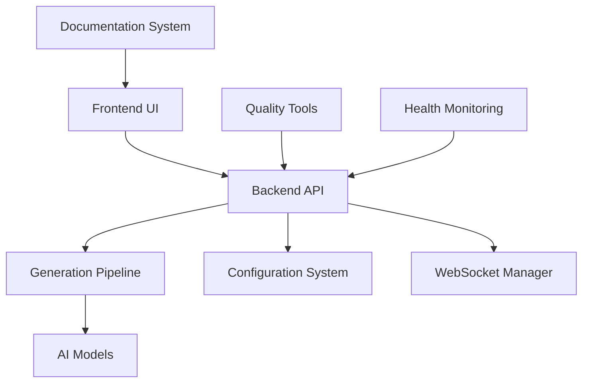

# WAN22 Project Overview

## What is WAN22?

WAN22 is a comprehensive AI-powered video generation system that transforms text prompts into high-quality videos. The project consists of multiple components working together to provide a seamless user experience.

## Project Architecture



## Core Components

### 1. Frontend (React + TypeScript)

- **Location**: `frontend/`
- **Purpose**: User interface for video generation
- **Key Features**:
  - Interactive video generation interface
  - Real-time progress monitoring
  - Configuration management
  - Error recovery system

### 2. Backend (FastAPI + Python)

- **Location**: `backend/`
- **Purpose**: API server and business logic
- **Key Features**:
  - RESTful API endpoints
  - Model management
  - Generation pipeline orchestration
  - WebSocket communication

### 3. AI Models and Pipeline

- **Location**: `backend/core/`, `backend/services/`
- **Purpose**: Video generation using AI models
- **Key Features**:
  - Multiple model support
  - Intelligent fallback system
  - Performance optimization
  - Resource management

### 4. Quality and Maintenance Tools

- **Location**: `tools/`
- **Purpose**: Code quality, testing, and maintenance
- **Key Features**:
  - Test suite management
  - Code quality enforcement
  - Configuration consolidation
  - Documentation generation

## Current State and Challenges

### What We're Improving

1. **Test Suite Reliability**

   - Many tests are broken or flaky
   - Inconsistent test execution
   - Poor test isolation

2. **Configuration Management**

   - Scattered configuration files
   - Inconsistent settings
   - Environment-specific issues

3. **Project Documentation**

   - Unclear component relationships
   - Missing developer guides
   - Outdated documentation

4. **Code Quality**
   - Inconsistent coding standards
   - Duplicate code
   - Technical debt accumulation

### Our Solution: Cleanup and Quality Improvement System

We've built a comprehensive system of tools to address these challenges:

- **Test Auditing and Repair**: Automatically fix broken tests
- **Configuration Consolidation**: Unified configuration management
- **Documentation Generation**: Automated, up-to-date documentation
- **Code Quality Enforcement**: Automated quality checks and improvements

## Key Concepts

### 1. Tool-Based Architecture

Each improvement area has dedicated tools:

- `tools/test-auditor/`: Test suite analysis and repair
- `tools/config-manager/`: Configuration management
- `tools/doc-generator/`: Documentation generation
- `tools/code-quality/`: Code quality enforcement

### 2. Unified CLI

All tools are accessible through a single command-line interface:

```bash
python tools/unified-cli/cli.py [command] [options]
```

### 3. Automated Workflows

Tools integrate into development workflows:

- Pre-commit hooks for quality checks
- CI/CD integration for automated testing
- Scheduled maintenance tasks

### 4. Progressive Enhancement

Improvements are applied incrementally:

- Non-breaking changes first
- Gradual migration to new systems
- Rollback capabilities for safety

## Development Workflow

### Daily Development

1. **Start**: Run health check
2. **Code**: Use quality tools for real-time feedback
3. **Test**: Run relevant test suites
4. **Commit**: Pre-commit hooks ensure quality
5. **Review**: Automated code review suggestions

### Weekly Maintenance

1. **Audit**: Run comprehensive tool audits
2. **Clean**: Execute cleanup and optimization
3. **Update**: Refresh documentation
4. **Monitor**: Review quality metrics

### Release Preparation

1. **Validate**: Full system validation
2. **Document**: Update release documentation
3. **Test**: Comprehensive test suite execution
4. **Deploy**: Automated deployment with monitoring

## Success Metrics

### Test Quality

- Test pass rate: Target 100%
- Test execution time: Under 5 minutes
- Flaky test rate: Under 1%

### Code Quality

- Code coverage: Above 80%
- Quality score: Above 8.5/10
- Technical debt: Decreasing trend

### Documentation

- Documentation coverage: Above 90%
- Link validity: 100%
- Freshness: Updated within 30 days

### Configuration

- Configuration consistency: 100%
- Environment parity: No configuration drift
- Validation coverage: All settings validated

## Getting Started

Now that you understand the project overview, continue with:

1. [Development Environment Setup](development-setup.md)
2. [Tool Installation Guide](tool-installation.md)
3. [Hands-on Exercises](hands-on-exercises.md)

## Questions?

- **Technical Questions**: Check [FAQ](../troubleshooting/faq.md)
- **Setup Issues**: See [Troubleshooting Guide](../troubleshooting/common-issues.md)
- **General Help**: Visit [Getting Support](../troubleshooting/getting-support.md)
