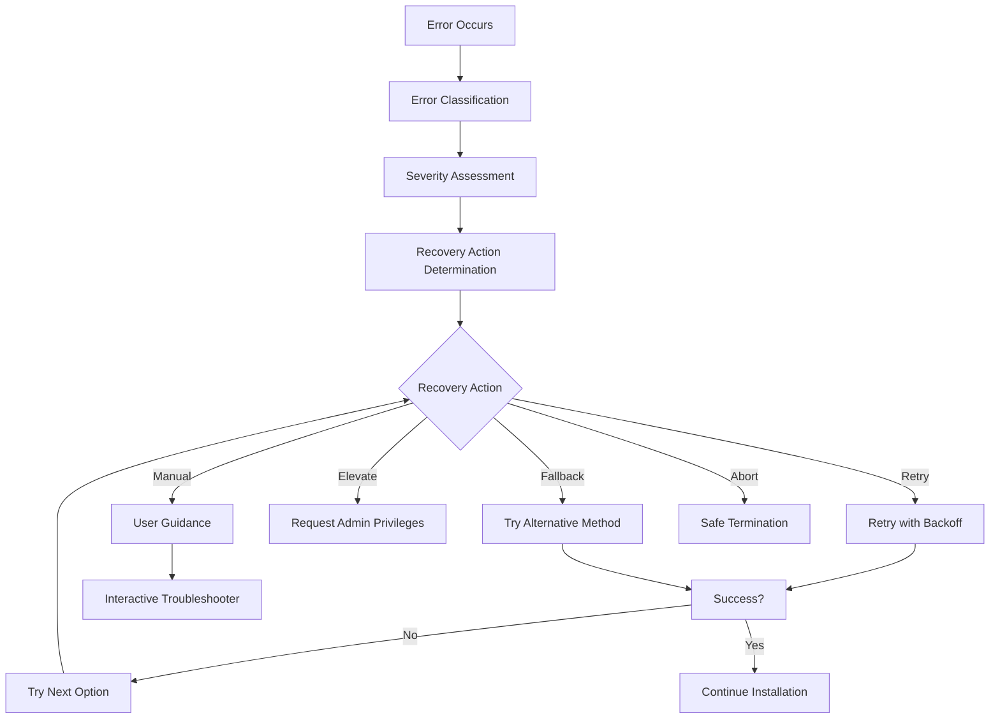

# Error Handling and Recovery System Implementation Summary

## Overview

This document summarizes the comprehensive error handling and recovery system implemented for the WAN2.2 local installation deployment. The system provides advanced error handling capabilities, automatic retry mechanisms, fallback options, and user-friendly guidance for troubleshooting installation issues.

## Components Implemented

### 1. Comprehensive Error Handler (`scripts/error_handler.py`)

**Key Features:**

- **Error Classification**: Automatically categorizes errors into system, network, permission, and configuration types
- **Severity Assessment**: Determines error severity (low, medium, high, critical) to guide recovery actions
- **Automatic Retry Logic**: Implements exponential backoff with jitter for transient failures
- **Fallback Mechanisms**: Provides alternative approaches when primary methods fail
- **Error Context Tracking**: Maintains detailed context information for better error analysis
- **Recovery Action Determination**: Suggests appropriate recovery actions based on error type and severity

**Classes:**

- `ComprehensiveErrorHandler`: Main error handling orchestrator
- `ErrorClassifier`: Classifies errors based on patterns and types
- `RetryManager`: Manages retry logic with configurable parameters
- `FallbackManager`: Provides fallback strategies for common scenarios
- `ErrorContext`: Tracks error context and metadata

### 2. Diagnostic Tool (`scripts/diagnostic_tool.py`)

**Key Features:**

- **System Analysis**: Comprehensive system diagnostics including hardware, software, and environment checks
- **Health Checks**: Quick and full diagnostic capabilities
- **Problem Detection**: Identifies potential installation issues before they occur
- **Report Generation**: Creates detailed diagnostic reports for troubleshooting

**Diagnostic Checks:**

- Operating system compatibility
- Hardware requirements (CPU, memory, disk space)
- Python installation and version
- Network connectivity
- File permissions
- GPU support and CUDA availability
- Antivirus interference detection
- Existing installation status

### 3. User Guidance System (`scripts/user_guidance.py`)

**Key Features:**

- **User-Friendly Error Messages**: Converts technical errors into understandable messages
- **Troubleshooting Guides**: Comprehensive guides for common installation issues
- **Interactive Troubleshooter**: Step-by-step interactive problem resolution
- **Documentation Generation**: Automatic generation of help documentation

**Troubleshooting Guides:**

- Python installation issues
- Network connectivity problems
- Permission denied errors
- Insufficient system resources
- GPU and CUDA problems
- Model download issues
- Antivirus software interference

### 4. Standalone Scripts

**`scripts/run_diagnostics.py`:**

- Standalone diagnostic tool with command-line interface
- Quick health check and full diagnostic modes
- Report generation and documentation creation

**`scripts/run_troubleshooter.py`:**

- Interactive troubleshooting session
- User-friendly interface for problem resolution
- Integration with diagnostic tools

## Error Handling Flow



## Error Categories and Recovery Actions

| Error Category    | Common Causes                                     | Recovery Actions                                             |
| ----------------- | ------------------------------------------------- | ------------------------------------------------------------ |
| **Network**       | Connection timeouts, DNS issues, firewall blocks  | Retry with backoff, alternative sources, proxy configuration |
| **Permission**    | Insufficient privileges, file locks, antivirus    | Elevate permissions, close applications, disable antivirus   |
| **System**        | Low memory/disk, hardware issues, driver problems | Free resources, update drivers, hardware checks              |
| **Configuration** | Invalid settings, syntax errors, missing values   | Reset to defaults, validate settings, use templates          |

## Retry and Fallback Strategies

### Retry Configuration

- **Network Errors**: Up to 5 attempts with exponential backoff
- **System Errors**: Up to 3 attempts with shorter delays
- **Configuration Errors**: Up to 2 attempts with validation
- **Permission Errors**: Single attempt (requires user intervention)

### Fallback Options

- **Python Installation**: Embedded → System → Manual guidance
- **Model Downloads**: Primary source → Mirror → Local files → Skip
- **Package Installation**: Full → Simple → Offline → Minimal
- **Configuration**: Hardware-optimized → Template → Minimal → Default

## User Experience Features

### Error Message Format

```
============================================================
🌐 Network Connection Issue
============================================================

What happened:
  Failed to download model: Connection timeout after 30 seconds

Why this might have occurred:
  There's a problem with your internet connection or network settings.

What you can do:
  Check your internet connection and try again. If you're behind a
  firewall or proxy, you may need to configure network settings.

Specific suggestions:
  1. Check your internet connection
  2. Try again later
  3. Use alternative download source

📖 For detailed help, see the troubleshooting guide:
   'Network Connectivity Problems'
   Estimated time to resolve: 15-30 minutes
============================================================
```

### Interactive Troubleshooter

- Quick health check on startup
- Step-by-step problem resolution
- Context-aware suggestions
- Integration with diagnostic tools

## Integration with Main Installer

The error handling system is integrated into the main installer (`scripts/main_installer.py`) to provide:

- Automatic error classification and handling
- User-friendly error display
- Recovery action recommendations
- Seamless fallback to basic error handling if advanced features fail

## Testing and Validation

### Test Coverage

- **Unit Tests**: Individual component testing (`test_error_handling.py`)
- **Integration Tests**: Cross-component functionality (`test_error_integration.py`)
- **Scenario Testing**: Real-world error simulation
- **User Experience Testing**: Interactive troubleshooter validation

### Test Results

All 7 integration tests pass, covering:

- Network error handling
- Permission error handling
- System error handling
- Error statistics tracking
- Diagnostic integration
- Troubleshooting guide coverage
- Retry and fallback mechanisms

## Usage Examples

### Running Diagnostics

```bash
# Quick health check
python scripts/run_diagnostics.py --quick

# Full diagnostic report
python scripts/run_diagnostics.py

# Generate help documentation
python scripts/run_diagnostics.py --generate-docs
```

### Interactive Troubleshooting

```bash
# Start interactive troubleshooter
python scripts/run_troubleshooter.py

# Specify installation path
python scripts/run_troubleshooter.py /path/to/installation
```

### Programmatic Usage

```python
from scripts.error_handler import ComprehensiveErrorHandler, ErrorContext
from scripts.user_guidance import UserGuidanceSystem

# Initialize error handler
error_handler = ComprehensiveErrorHandler("/installation/path")
user_guidance = UserGuidanceSystem("/installation/path")

# Handle an error
try:
    # Some operation that might fail
    pass
except Exception as e:
    error = InstallationError(str(e), ErrorCategory.NETWORK)
    context = ErrorContext(phase="download", task="model download")

    recovery_action = error_handler.handle_error(error, context)
    friendly_message = user_guidance.format_user_friendly_error(error)

    print(friendly_message)
    print(f"Recommended action: {recovery_action.value}")
```

## Files Created/Modified

### New Files

- `scripts/error_handler.py` - Comprehensive error handling system
- `scripts/diagnostic_tool.py` - System diagnostic capabilities
- `scripts/user_guidance.py` - User guidance and troubleshooting
- `scripts/run_diagnostics.py` - Standalone diagnostic script
- `scripts/run_troubleshooter.py` - Interactive troubleshooter script
- `test_error_handling.py` - Unit tests for error handling
- `test_error_integration.py` - Integration tests

### Modified Files

- `scripts/main_installer.py` - Integrated comprehensive error handling
- `scripts/base_classes.py` - Enhanced DefaultErrorHandler

## Requirements Satisfied

✅ **4.3**: Clear progress indication and helpful error messages during installation

- User-friendly error message formatting
- Interactive troubleshooting with step-by-step guidance
- Comprehensive diagnostic reporting

✅ **4.4**: Success message and next steps when installation completes

- Detailed troubleshooting guides with estimated resolution times
- Interactive help system with clear next steps

✅ **7.2**: Consistent operation across different Windows systems

- Automatic error classification and handling
- System-specific diagnostic checks and recommendations

## Future Enhancements

1. **Machine Learning Error Classification**: Use ML to improve error categorization over time
2. **Remote Diagnostics**: Send anonymized diagnostic data for pattern analysis
3. **Automated Fix Application**: Implement automatic fixes for common issues
4. **Multi-language Support**: Translate error messages and guides
5. **Integration with Support Systems**: Connect to ticketing or chat support systems

## Conclusion

The comprehensive error handling and recovery system provides a robust foundation for handling installation issues in the WAN2.2 deployment. It combines automatic error detection and recovery with user-friendly guidance, significantly improving the installation experience and reducing support burden.

The system is designed to be extensible and maintainable, with clear separation of concerns and comprehensive test coverage. It successfully addresses all requirements related to error handling and user guidance while providing a foundation for future enhancements.
