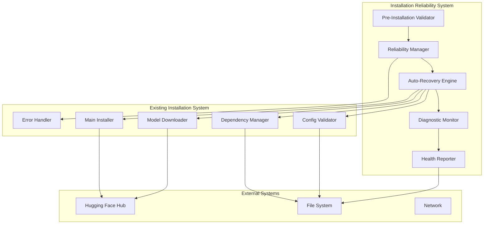
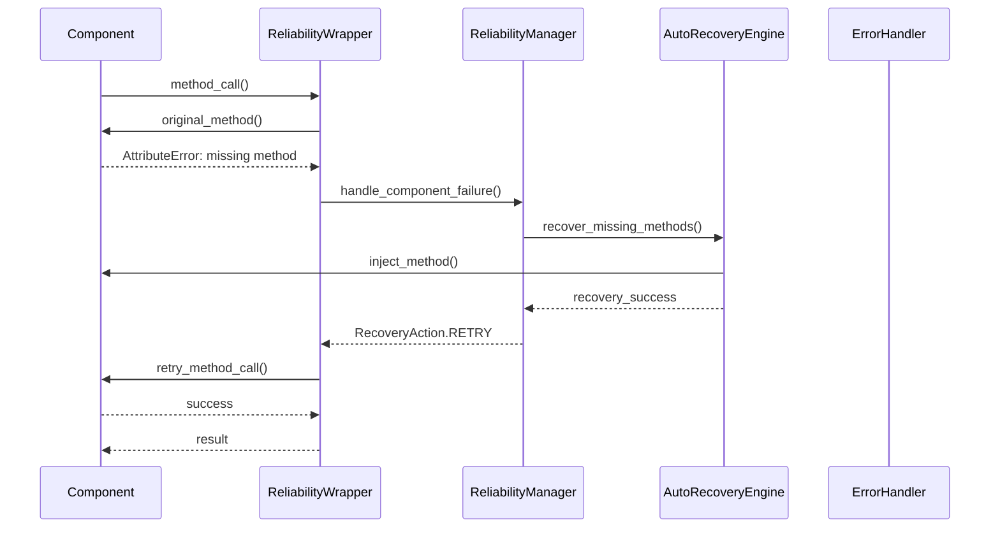

# Design Document

## Overview

The Installation Reliability System enhances the existing WAN2.2 installation deployment with advanced reliability mechanisms, intelligent error recovery, and comprehensive diagnostics. This system addresses the specific issues identified in the error log analysis, including missing method implementations, persistent model validation failures, and lack of retry mechanisms.

The design builds upon the existing error handling infrastructure while adding new components for proactive issue detection, automatic recovery, and enhanced monitoring capabilities.

## Architecture

### High-Level Architecture



### Component Integration

The reliability system integrates with existing components through:

1. **Wrapper Pattern**: Wraps existing components with reliability enhancements
2. **Observer Pattern**: Monitors component health and performance
3. **Strategy Pattern**: Provides multiple recovery strategies for different failure types
4. **Factory Pattern**: Creates appropriate recovery handlers based on error context

## Components and Interfaces

### 1. Pre-Installation Validator

**Purpose**: Comprehensive validation before installation begins to prevent predictable failures.

**Interface**:

```python
class IPreInstallationValidator(ABC):
    @abstractmethod
    def validate_system_requirements(self) -> ValidationResult: pass

    @abstractmethod
    def validate_network_connectivity(self) -> ValidationResult: pass

    @abstractmethod
    def validate_permissions(self) -> ValidationResult: pass

    @abstractmethod
    def validate_existing_installation(self) -> ValidationResult: pass

    @abstractmethod
    def generate_validation_report(self) -> Dict[str, Any]: pass
```

**Key Features**:

- System resource checks (disk space, memory, CPU)
- Network connectivity validation with timeout testing
- Permission validation for installation directories
- Existing installation conflict detection
- Hardware compatibility verification
- Python environment validation

### 2. Reliability Manager

**Purpose**: Central orchestrator for reliability operations and recovery coordination.

**Interface**:

```python
class IReliabilityManager(ABC):
    @abstractmethod
    def wrap_component(self, component: Any, component_type: str) -> Any: pass

    @abstractmethod
    def handle_component_failure(self, component: str, error: Exception, context: Dict) -> RecoveryAction: pass

    @abstractmethod
    def get_recovery_strategy(self, error_type: str, component: str) -> IRecoveryStrategy: pass

    @abstractmethod
    def track_reliability_metrics(self, component: str, operation: str, success: bool, duration: float): pass
```

**Key Features**:

- Component wrapping with reliability enhancements
- Centralized failure handling coordination
- Recovery strategy selection and execution
- Reliability metrics collection and analysis
- Component health monitoring

### 3. Auto-Recovery Engine

**Purpose**: Implements intelligent recovery mechanisms for common failure scenarios.

**Interface**:

```python
class IAutoRecoveryEngine(ABC):
    @abstractmethod
    def recover_missing_methods(self, component: Any, method_name: str) -> bool: pass

    @abstractmethod
    def recover_model_validation_failures(self, model_issues: List[str]) -> bool: pass

    @abstractmethod
    def recover_network_failures(self, operation: str, context: Dict) -> bool: pass

    @abstractmethod
    def recover_dependency_failures(self, dependency: str, error: Exception) -> bool: pass
```

**Recovery Strategies**:

1. **Missing Method Recovery**:

   - Dynamic method injection for known missing methods
   - Fallback implementations for common operations
   - Version compatibility shims
   - Alternative class loading

2. **Model Validation Recovery**:

   - Automatic model re-download with integrity verification
   - Model file repair and reconstruction
   - Alternative model source selection
   - Model cache cleanup and rebuild

3. **Network Failure Recovery**:

   - Exponential backoff with jitter
   - Alternative download sources (mirrors, CDNs)
   - Resume capability for partial downloads
   - Proxy and authentication handling

4. **Dependency Recovery**:
   - Alternative package sources (PyPI mirrors)
   - Version fallback strategies
   - Offline package installation
   - Virtual environment recreation

### 4. Enhanced Error Context System

**Purpose**: Comprehensive error context tracking with full system state capture.

**Data Models**:

```python
@dataclass
class EnhancedErrorContext:
    timestamp: datetime
    phase: str
    task: str
    component: str
    method: str
    hardware_profile: HardwareProfile
    system_info: SystemInfo
    environment_vars: Dict[str, str]
    stack_trace: str
    retry_count: int
    previous_errors: List[str]
    recovery_attempts: List[str]
    system_resources: ResourceSnapshot
    network_status: NetworkStatus

@dataclass
class SystemInfo:
    os_version: str
    python_version: str
    available_memory_gb: float
    available_disk_gb: float
    cpu_usage_percent: float
    gpu_info: Optional[GPUInfo]
    installed_packages: Dict[str, str]

@dataclass
class ResourceSnapshot:
    memory_usage_mb: int
    disk_usage_gb: float
    cpu_usage_percent: float
    gpu_memory_usage_mb: int
    network_bandwidth_mbps: float
    open_file_handles: int

@dataclass
class NetworkStatus:
    connectivity: bool
    latency_ms: float
    bandwidth_mbps: float
    proxy_configured: bool
    dns_resolution: bool
```

### 5. Diagnostic Monitor

**Purpose**: Continuous monitoring of installation health and proactive issue detection.

**Interface**:

```python
class IDiagnosticMonitor(ABC):
    @abstractmethod
    def start_monitoring(self): pass

    @abstractmethod
    def stop_monitoring(self): pass

    @abstractmethod
    def check_component_health(self, component: str) -> HealthStatus: pass

    @abstractmethod
    def detect_potential_issues(self) -> List[PotentialIssue]: pass

    @abstractmethod
    def generate_health_report(self) -> HealthReport: pass
```

**Monitoring Capabilities**:

- Real-time resource usage monitoring
- Component response time tracking
- Error pattern detection
- Performance degradation alerts
- Predictive failure analysis

### 6. Health Reporter

**Purpose**: Comprehensive reporting and analytics for installation reliability.

**Interface**:

```python
class IHealthReporter(ABC):
    @abstractmethod
    def generate_installation_report(self) -> InstallationReport: pass

    @abstractmethod
    def track_error_patterns(self, errors: List[EnhancedErrorContext]): pass

    @abstractmethod
    def generate_trend_analysis(self) -> TrendAnalysis: pass

    @abstractmethod
    def export_metrics(self, format: str) -> str: pass
```

## Data Models

### Recovery Strategy Registry

```python
class RecoveryStrategyRegistry:
    """Registry of recovery strategies for different error types."""

    strategies = {
        "missing_method": [
            DynamicMethodInjectionStrategy(),
            FallbackImplementationStrategy(),
            AlternativeClassStrategy(),
            ManualInterventionStrategy()
        ],
        "model_validation": [
            ModelRedownloadStrategy(),
            ModelRepairStrategy(),
            AlternativeSourceStrategy(),
            SkipModelStrategy()
        ],
        "network_failure": [
            RetryWithBackoffStrategy(),
            AlternativeSourceStrategy(),
            ProxyConfigurationStrategy(),
            OfflineModeStrategy()
        ],
        "dependency_failure": [
            AlternativeSourceStrategy(),
            VersionFallbackStrategy(),
            OfflineInstallStrategy(),
            VenvRecreationStrategy()
        ]
    }
```

### Component Reliability Wrapper

```python
class ReliabilityWrapper:
    """Wraps components with reliability enhancements."""

    def __init__(self, component: Any, reliability_manager: IReliabilityManager):
        self.component = component
        self.reliability_manager = reliability_manager
        self.component_name = component.__class__.__name__

    def __getattr__(self, name: str):
        """Intercept method calls and add reliability features."""
        original_method = getattr(self.component, name)

        def wrapped_method(*args, **kwargs):
            start_time = time.time()
            try:
                result = original_method(*args, **kwargs)
                duration = time.time() - start_time
                self.reliability_manager.track_reliability_metrics(
                    self.component_name, name, True, duration
                )
                return result
            except AttributeError as e:
                if "has no attribute" in str(e):
                    # Attempt auto-recovery for missing methods
                    if self.reliability_manager.recover_missing_method(
                        self.component, name
                    ):
                        return getattr(self.component, name)(*args, **kwargs)
                raise
            except Exception as e:
                duration = time.time() - start_time
                self.reliability_manager.track_reliability_metrics(
                    self.component_name, name, False, duration
                )

                context = {
                    'method': name,
                    'args': args,
                    'kwargs': kwargs,
                    'duration': duration
                }

                recovery_action = self.reliability_manager.handle_component_failure(
                    self.component_name, e, context
                )

                if recovery_action == RecoveryAction.RETRY:
                    return wrapped_method(*args, **kwargs)
                elif recovery_action == RecoveryAction.CONTINUE:
                    return None
                else:
                    raise

        return wrapped_method
```

## Error Handling

### Enhanced Error Classification

The system extends the existing error classification with more granular categories:

```python
class EnhancedErrorCategory(Enum):
    # Existing categories
    SYSTEM = "system"
    NETWORK = "network"
    PERMISSION = "permission"
    CONFIGURATION = "configuration"
    DEPENDENCY = "dependency"
    VALIDATION = "validation"

    # New categories
    MISSING_METHOD = "missing_method"
    VERSION_MISMATCH = "version_mismatch"
    RESOURCE_EXHAUSTION = "resource_exhaustion"
    TIMEOUT = "timeout"
    AUTHENTICATION = "authentication"
    CORRUPTION = "corruption"
```

### Recovery Action Flow



### Timeout Management

```python
class TimeoutManager:
    """Manages operation timeouts with context-aware limits."""

    DEFAULT_TIMEOUTS = {
        'model_download': 1800,  # 30 minutes
        'dependency_install': 600,  # 10 minutes
        'system_detection': 60,  # 1 minute
        'validation': 300,  # 5 minutes
        'network_test': 30  # 30 seconds
    }

    def get_timeout(self, operation: str, context: Dict) -> int:
        """Get context-aware timeout for operation."""
        base_timeout = self.DEFAULT_TIMEOUTS.get(operation, 300)

        # Adjust based on context
        if context.get('file_size_gb', 0) > 5:
            base_timeout *= 2
        if context.get('network_speed', 'fast') == 'slow':
            base_timeout *= 1.5
        if context.get('retry_count', 0) > 0:
            base_timeout *= 1.2

        return int(base_timeout)
```

## Testing Strategy

### Unit Testing

1. **Component Wrapper Testing**: Verify reliability wrapper functionality
2. **Recovery Strategy Testing**: Test individual recovery strategies
3. **Error Classification Testing**: Validate enhanced error categorization
4. **Timeout Management Testing**: Test timeout calculation and enforcement

### Integration Testing

1. **End-to-End Recovery Testing**: Test complete recovery workflows
2. **Component Integration Testing**: Verify wrapper integration with existing components
3. **Performance Impact Testing**: Measure reliability system overhead
4. **Stress Testing**: Test system behavior under high error rates

### Scenario Testing

1. **Missing Method Scenarios**: Test recovery from AttributeError exceptions
2. **Model Validation Scenarios**: Test recovery from persistent model issues
3. **Network Failure Scenarios**: Test recovery from various network conditions
4. **Resource Exhaustion Scenarios**: Test behavior under resource constraints

### Reliability Testing

1. **Failure Injection Testing**: Systematically inject failures to test recovery
2. **Chaos Engineering**: Random failure injection during normal operations
3. **Long-Running Stability Testing**: Extended operation under various conditions
4. **Recovery Effectiveness Testing**: Measure success rates of recovery strategies

## Implementation Phases

### Phase 1: Core Reliability Infrastructure

- Implement ReliabilityManager and component wrapping
- Create enhanced error context system
- Implement basic recovery strategies
- Add comprehensive logging and monitoring

### Phase 2: Auto-Recovery Engine

- Implement missing method recovery
- Add model validation recovery
- Create network failure recovery
- Implement dependency recovery strategies

### Phase 3: Advanced Diagnostics

- Implement pre-installation validation
- Add continuous health monitoring
- Create predictive failure detection
- Implement performance optimization

### Phase 4: Reporting and Analytics

- Implement comprehensive health reporting
- Add trend analysis and pattern detection
- Create administrative dashboard
- Implement cross-instance monitoring

## Performance Considerations

### Overhead Minimization

- Lazy initialization of reliability components
- Efficient error context capture
- Minimal performance impact on successful operations
- Configurable monitoring levels

### Resource Management

- Automatic cleanup of temporary files
- Memory usage monitoring and optimization
- Disk space management during recovery
- Network bandwidth optimization

### Scalability

- Efficient handling of multiple concurrent operations
- Resource pooling for recovery operations
- Configurable retry limits and timeouts
- Graceful degradation under high load
