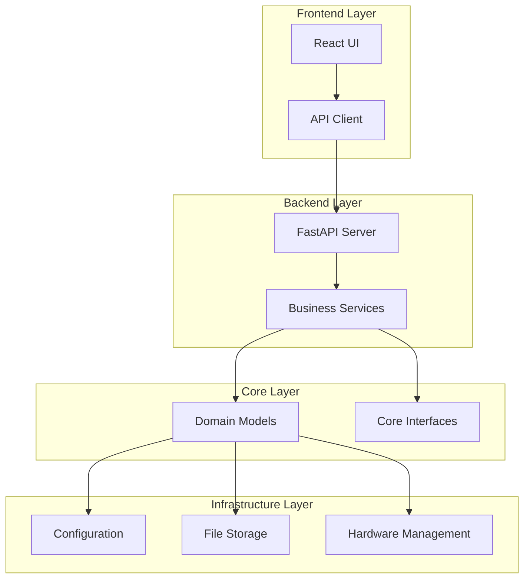
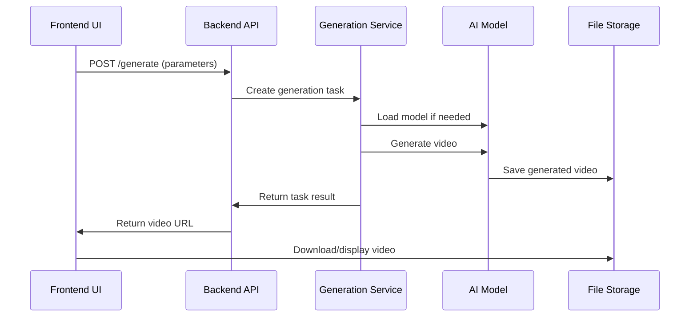
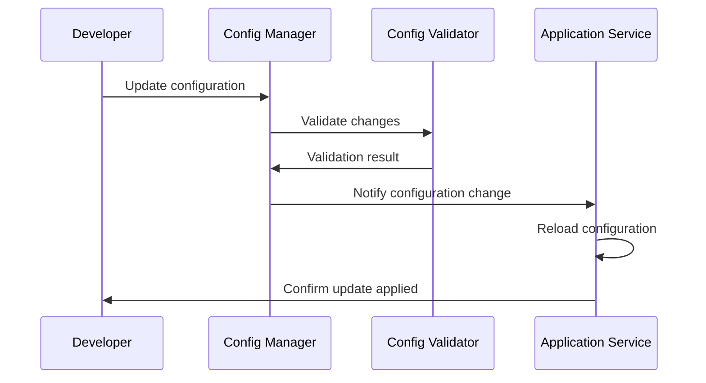

# WAN22 Project Overview

Welcome to WAN22, a modern video generation system built with FastAPI and React. This document provides a comprehensive overview of the project architecture, components, and development practices.

## 🎯 Project Mission

WAN22 is designed to provide high-quality video generation capabilities with:

- **Performance**: Optimized for modern hardware (GPU acceleration)
- **Usability**: Intuitive web interface for all skill levels
- **Reliability**: Robust error handling and recovery
- **Scalability**: Modular architecture for easy extension

## 🏗️ Architecture Overview

### High-Level Architecture



### Technology Stack

#### Backend

- **FastAPI**: Modern Python web framework
- **Pydantic**: Data validation and serialization
- **SQLAlchemy**: Database ORM (if using database)
- **Uvicorn**: ASGI server
- **PyTorch**: Machine learning framework
- **Pillow**: Image processing

#### Frontend

- **React 18**: UI framework
- **TypeScript**: Type-safe JavaScript
- **Vite**: Build tool and dev server
- **Tailwind CSS**: Utility-first CSS framework
- **React Query**: Server state management
- **Zustand**: Client state management
- **Framer Motion**: Animations

#### Development Tools

- **pytest**: Python testing
- **Vitest**: JavaScript/TypeScript testing
- **Black**: Python code formatting
- **Prettier**: JavaScript/TypeScript formatting
- **ESLint**: JavaScript/TypeScript linting
- **MyPy**: Python type checking

## 📁 Project Structure

### Directory Organization

```
wan22/
├── backend/                 # Backend application
│   ├── api/                # API endpoints and routes
│   │   ├── v1/            # API version 1
│   │   └── middleware/    # Custom middleware
│   ├── repositories/      # Data access layer
│   ├── schemas/          # Pydantic models for API
│   ├── services/         # Business logic services
│   ├── tests/           # Backend tests
│   ├── app.py           # FastAPI application
│   └── start_server.py  # Server startup script
├── frontend/               # Frontend application
│   ├── src/              # Source code
│   │   ├── components/   # React components
│   │   ├── lib/         # Utility libraries
│   │   ├── tests/       # Frontend tests
│   │   └── App.tsx      # Main application component
│   ├── public/          # Static assets
│   └── package.json     # Node.js dependencies
├── core/                  # Core business logic
│   ├── models/          # Domain models
│   ├── services/        # Core services
│   └── interfaces/      # Abstract interfaces
├── infrastructure/        # Infrastructure layer
│   ├── config/          # Configuration management
│   ├── storage/         # File and model storage
│   └── hardware/        # Hardware monitoring
├── tests/                # Shared tests and test utilities
│   ├── unit/           # Unit tests
│   ├── integration/    # Integration tests
│   ├── e2e/           # End-to-end tests
│   └── fixtures/      # Test fixtures
├── tools/                # Development tools
│   ├── health-checker/ # Project health monitoring
│   ├── test-runner/   # Test orchestration
│   ├── config-manager/ # Configuration management
│   ├── dev-environment/ # Environment setup
│   ├── dev-feedback/   # Development feedback tools
│   └── onboarding/     # Developer onboarding
├── docs/                 # Documentation
│   ├── api/            # API documentation
│   ├── user-guide/     # User guides
│   └── developer-guide/ # Developer documentation
├── config/              # Configuration files
│   ├── unified-config.yaml # Main configuration
│   └── schemas/        # Configuration schemas
└── scripts/             # Utility scripts
    └── startup_manager/ # Startup management
```

### Key Components

#### Backend Components

1. **API Layer** (`backend/api/`)

   - RESTful API endpoints
   - Request/response validation
   - Authentication and authorization
   - Error handling middleware

2. **Services Layer** (`backend/services/`)

   - Business logic implementation
   - Video generation pipeline
   - Model management
   - Queue processing

3. **Repositories Layer** (`backend/repositories/`)
   - Data access abstraction
   - File system operations
   - Model storage management

#### Frontend Components

1. **UI Components** (`frontend/src/components/`)

   - Reusable React components
   - Form handling
   - State management
   - Responsive design

2. **API Integration** (`frontend/src/lib/`)
   - HTTP client configuration
   - API type definitions
   - Error handling
   - Caching strategies

#### Core Components

1. **Domain Models** (`core/models/`)

   - Business entities
   - Value objects
   - Domain rules and validation

2. **Services** (`core/services/`)
   - Core business logic
   - Domain services
   - Integration interfaces

#### Infrastructure Components

1. **Configuration** (`infrastructure/config/`)

   - Environment management
   - Settings validation
   - Feature flags

2. **Storage** (`infrastructure/storage/`)

   - File management
   - Model storage
   - Caching layer

3. **Hardware** (`infrastructure/hardware/`)
   - GPU monitoring
   - Performance optimization
   - Resource management

## 🔄 Data Flow

### Video Generation Flow



### Configuration Management Flow



## 🧩 Key Features

### Video Generation

- **Text-to-Video**: Generate videos from text descriptions
- **Image-to-Video**: Animate static images
- **Text+Image-to-Video**: Combine text and image inputs
- **Multiple Models**: Support for various AI models
- **Quality Control**: Configurable output quality and resolution

### User Interface

- **Intuitive Design**: Clean, modern interface
- **Real-time Preview**: Live preview of generation progress
- **Batch Processing**: Queue multiple generation tasks
- **History Management**: Track and manage previous generations
- **Responsive Design**: Works on desktop and mobile

### Performance Optimization

- **GPU Acceleration**: Automatic GPU detection and usage
- **Memory Management**: Efficient VRAM usage
- **Caching**: Intelligent model and result caching
- **Background Processing**: Non-blocking generation pipeline

### Developer Experience

- **Hot Reloading**: Automatic restart on code changes
- **Comprehensive Testing**: Unit, integration, and E2E tests
- **Health Monitoring**: Continuous project health checks
- **Debug Tools**: Advanced debugging and profiling
- **Documentation**: Comprehensive guides and API docs

## 🔧 Development Practices

### Code Organization

1. **Functional Organization**: Code organized by feature/function
2. **Separation of Concerns**: Clear layer boundaries
3. **Dependency Injection**: Loose coupling between components
4. **Interface Segregation**: Small, focused interfaces

### Testing Strategy

1. **Test Pyramid**: Unit tests (70%), Integration tests (20%), E2E tests (10%)
2. **Test-Driven Development**: Write tests before implementation
3. **Continuous Testing**: Automated test execution on changes
4. **Coverage Goals**: Minimum 70% code coverage

### Quality Assurance

1. **Code Reviews**: All changes reviewed by peers
2. **Automated Checks**: Pre-commit hooks and CI/CD
3. **Static Analysis**: Type checking and linting
4. **Performance Monitoring**: Regular performance benchmarks

### Documentation

1. **Code Documentation**: Inline comments and docstrings
2. **API Documentation**: Auto-generated from code
3. **User Guides**: Step-by-step instructions
4. **Architecture Docs**: High-level design documentation

## 🚀 Deployment Architecture

### Development Environment

- Local development servers
- Hot reloading and file watching
- Debug tools and logging
- Test data and fixtures

### Staging Environment

- Production-like configuration
- Integration testing
- Performance benchmarking
- User acceptance testing

### Production Environment

- Optimized builds
- Load balancing
- Monitoring and alerting
- Backup and recovery

## 🔐 Security Considerations

### Input Validation

- All user inputs validated
- File upload restrictions
- SQL injection prevention
- XSS protection

### Authentication & Authorization

- Secure session management
- Role-based access control
- API key management
- Rate limiting

### Data Protection

- Sensitive data encryption
- Secure file storage
- Privacy compliance
- Audit logging

## 📈 Performance Characteristics

### Scalability

- Horizontal scaling support
- Stateless service design
- Efficient resource utilization
- Load balancing ready

### Performance Metrics

- Video generation time: 30-120 seconds (depending on complexity)
- API response time: <200ms for most endpoints
- Memory usage: Optimized for available VRAM
- Concurrent users: Designed for 10-100 concurrent users

## 🔮 Future Roadmap

### Short Term (Next 3 months)

- Enhanced model support
- Improved UI/UX
- Performance optimizations
- Additional output formats

### Medium Term (3-6 months)

- Cloud deployment options
- Advanced editing features
- API rate limiting
- Multi-language support

### Long Term (6+ months)

- Real-time collaboration
- Plugin architecture
- Advanced AI models
- Enterprise features

## 🤝 Contributing

### Getting Started

1. Complete the onboarding process
2. Read the coding standards
3. Set up your development environment
4. Pick a starter issue

### Development Workflow

1. Create feature branch
2. Implement changes with tests
3. Run quality checks
4. Submit pull request
5. Address review feedback

### Best Practices

- Follow coding standards
- Write comprehensive tests
- Document your changes
- Keep commits atomic and descriptive

## 📚 Learning Resources

### Internal Resources

- [Coding Standards](coding-standards.md)
- [Development Setup](development-setup.md)
- [Troubleshooting Guide](troubleshooting.md)
- API Documentation (http://localhost:8000/docs)

### External Resources

- [FastAPI Documentation](https://fastapi.tiangolo.com/)
- [React Documentation](https://react.dev/)
- [TypeScript Handbook](https://www.typescriptlang.org/docs/)
- [Tailwind CSS Documentation](https://tailwindcss.com/docs)

## 🎉 Welcome to WAN22!

You're now ready to start contributing to this exciting project. Remember:

- **Ask questions** - The team is here to help
- **Start small** - Begin with simple tasks to learn the codebase
- **Follow standards** - Consistency makes everyone's life easier
- **Have fun** - Building great software should be enjoyable!

Happy coding! 🚀
