# Project Structure Diagrams

This directory contains Mermaid diagrams visualizing the project structure.

## Project Structure Overview

High-level overview of main project components

**File:** `project_structure_overview.mmd`

```mermaid
graph TD
    %% Project Structure Overview

    Root["🏠 Project Root"]

    C0["📁 utils_new"]
    Root --> C0
    C1["📁 local_installation"]
    Root --> C1
    C2["📁 docs"]
    Root --> C2
    C3["🧪 wan"]
    Root --> C3
    C4["🧪 tests"]
    Root --> C4
    C5["📜 scripts"]
    Root --> C5
    C6["🔧 backend"]
    Root --> C6
    C7["🎨 frontend"]
    Root --> C7
    C8["🔄 services"]
    Root --> C8
    C9["📁 hardware"]
    Root --> C9

    %% Styling
    classDef default fill:#f9f9f9,stroke:#333,stroke-width:2px
    classDef root fill:#e1f5fe,stroke:#01579b,stroke-width:3px
    classDef component fill:#f3e5f5,stroke:#4a148c,stroke-width:2px

    class Root root
    class C0,C1,C2,C3,C4,C5,C6,C7,C8,C9 component
```

## Component Dependencies

Dependencies between project components

**File:** `component_dependencies.mmd`

## Complexity Heatmap

Visual representation of component complexity levels

**File:** `complexity_heatmap.mmd`

```mermaid
graph TD
    %% Complexity Heatmap

    COMP0["🔥 deployment\n(92)"]
    COMP1["🔥 scripts\n(92)"]
    COMP2["🔥 scripts\n(92)"]
    COMP3["🔥 scripts\n(92)"]
    COMP4["🔥 scripts\n(92)"]
    COMP5["🔥 scripts\n(92)"]
    COMP6["🔥 core\n(89)"]
    COMP7["🔥 hardware\n(87)"]
    COMP8["🔥 local_testing_framework\n(86)"]
    COMP9["🔥 startup_manager\n(86)"]
    COMP10["🔥 scripts\n(85)"]
    COMP11["🔥 onboarding\n(84)"]

    %% Complexity Styling
    classDef very-high fill:#ff1744,color:#fff,stroke:#d50000,stroke-width:3px
    classDef high fill:#ff9800,color:#fff,stroke:#e65100,stroke-width:3px
    classDef medium fill:#ffc107,color:#000,stroke:#ff8f00,stroke-width:2px
    classDef low fill:#4caf50,color:#fff,stroke:#2e7d32,stroke-width:2px
    class COMP0 very-high
    class COMP1 very-high
    class COMP2 very-high
    class COMP3 very-high
    class COMP4 very-high
    class COMP5 very-high
    class COMP6 very-high
    class COMP7 very-high
    class COMP8 very-high
    class COMP9 very-high
    class COMP10 very-high
    class COMP11 very-high
```

